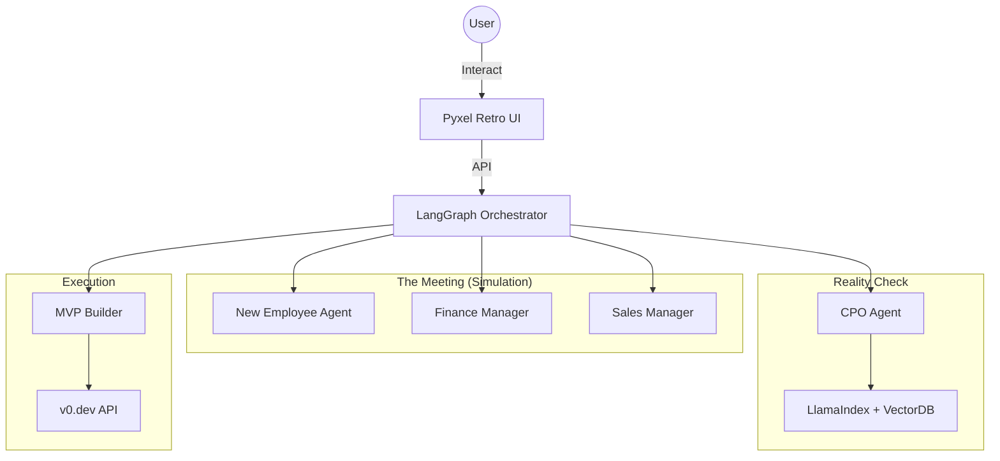

# The JTC 2.0: Enterprise Business Accelerator


**The JTC 2.0** is a paradigm-shifting multi-agent system that fuses the rigorous methodology of **"Startup Science"** with the complex organizational dynamics of **Traditional Japanese Companies (JTCs)**. It is not just a chatbot; it is a role-playing simulation where your business ideas are subjected to "Gekizume" (harsh feedback) by AI agents, validated against real customer interviews, and automatically built into MVPs.

## 🚀 Key Features

-   **Multi-Agent Simulation**: Pitch your idea to a conservative Finance Manager and an aggressive Sales Manager in a retro RPG-style meeting room.
-   **Reality Injection (RAG)**: Ingest real customer interview transcripts to ground your business plan in primary data (The "Mom Test").
-   **Nemawashi Engine**: Simulate organizational politics using the French-DeGroot mathematical model to identify key influencers and build consensus.
-   **Automated MVP**: Generate a deployable React/Tailwind frontend for your solution in minutes using the v0.dev API.
-   **Psychological Safety**: Use a "New Employee" proxy avatar to receive harsh feedback, protecting your mental health ("De-identification").

## 🏗 Architecture Overview

The system is orchestrated by **LangGraph**, combining stateful agent workflows with external tools.



## 📋 Prerequisites

-   **Python 3.12+**
-   **uv** (recommended for package management)
-   **Docker** (optional, for vector DB)
-   **API Keys**: OpenAI, Tavily, Vercel (v0.dev)

## 🛠 Installation & Setup

1.  **Clone the repository**
    ```bash
    git clone https://github.com/your-org/jtc2-0.git
    cd jtc2-0
    ```

2.  **Install dependencies**
    ```bash
    uv sync
    ```

3.  **Configure Environment**
    ```bash
    cp .env.example .env
    # Edit .env with your API keys
    ```

## 🚀 Usage

### Quick Start (Ideation)
Generate 10 business ideas based on a topic.

```bash
uv run src/main.py --mode ideation --topic "AI for Agriculture"
```

### Run the Simulation (The Meeting)
Launch the Pyxel UI to watch the debate.

```bash
uv run src/main.py --mode simulation
```

## 💻 Development Workflow

This project follows the **AC-CDD (Architecture-Centric Cycle-Driven Development)** methodology.

-   **Run Tests**: `uv run pytest`
-   **Linting**: `uv run ruff check`
-   **Type Checking**: `uv run mypy .`

### Cycle Roadmap
-   **Cycle 1**: Foundation & Ideation
-   **Cycle 2**: JTC Simulation (Proxy & Meeting)
-   **Cycle 3**: Real World Connection (RAG)
-   **Cycle 4**: Consensus Building (Nemawashi)
-   **Cycle 5**: MVP Generation
-   **Cycle 6**: Governance & Finalization

## 📂 Project Structure

```ascii
.
├── dev_documents/          # Specs & Architecture
├── src/
│   ├── agents/             # Persona Definitions
│   ├── core/               # LangGraph & State
│   ├── data/               # RAG & Vector Store
│   ├── domain/             # Business Logic
│   ├── ui/                 # Pyxel Interface
│   └── tools/              # API Wrappers
├── tests/                  # Unit & Integration Tests
└── pyproject.toml          # Dependencies & Config
```

## 📄 License

MIT License. See [LICENSE](LICENSE) for details.
