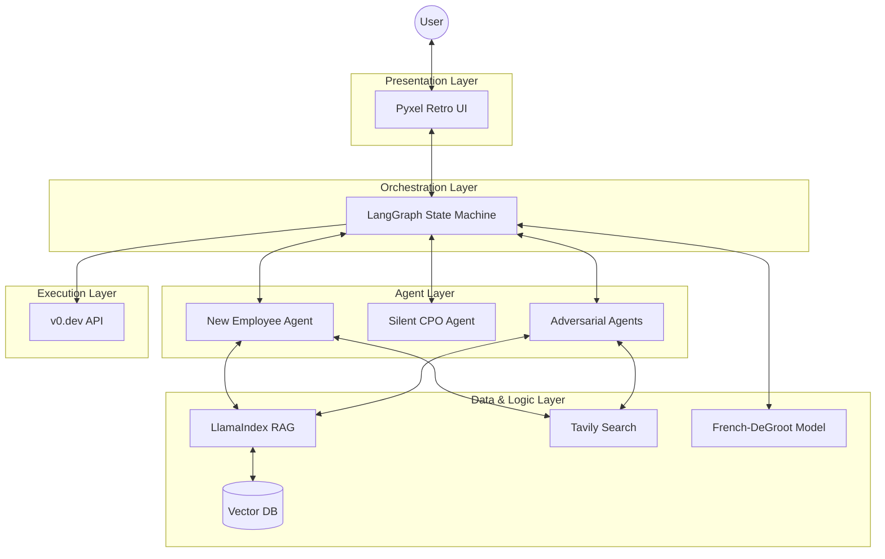

# The JTC 2.0: Autonomous Enterprise Accelerator


## 🌟 Elevator Pitch
**The JTC 2.0** is an AI-powered role-playing environment that gamifies the process of launching a startup within a traditional Japanese corporation (JTC). By simulating the harsh reality of "Hell Meetings", "Nemawashi" (lobbying), and data-driven pivots, it transforms the "Science of Entrepreneurship" into a repeatable, automated workflow. It turns rejection into data and ideas into deployed MVPs.

## 🚀 Key Features

*   **Proxy Model Validation**: Your idea is defended by a digital avatar ("New Employee Agent") against hostile "Department Head Agents" (Finance, Sales), protecting your psychological safety.
*   **The "Hell Meeting" Simulation**: A rigorous, adversarial stress-test of your business plan using real-time market data (Tavily).
*   **Primary Info Enforcement**: The system blocks progress until you upload real customer interview transcripts (e.g., from PLAUD), preventing "desk research" hallucinations.
*   **Nemawashi Dynamics**: A mathematical simulation (French-DeGroot Model) of corporate politics where you must build consensus to unlock budget.
*   **Instant MVP**: One-click generation of a live React/Next.js prototype using the `v0.dev` API.

## 🏗️ Architecture Overview

The system is built on a loosely coupled multi-agent architecture orchestrated by **LangGraph**.



## 🛠️ Prerequisites

*   **Python 3.12+**
*   **uv** (Fast Python package installer)
*   **API Keys**:
    *   OpenAI (`OPENAI_API_KEY`)
    *   Tavily (`TAVILY_API_KEY`)
    *   v0.dev (Optional, for Cycle 05)

## 📦 Installation & Setup

1.  **Clone the repository**
    ```bash
    git clone https://github.com/your-org/jtc2-0.git
    cd jtc2-0
    ```

2.  **Install dependencies**
    ```bash
    uv sync
    ```

3.  **Configure Environment**
    ```bash
    cp .env.example .env
    # Edit .env and add your API keys
    ```

## 🎮 Usage

### Quick Start (Tutorial)
The best way to learn is to play the tutorial scenario.
```bash
marimo edit tutorials/UAT_AND_TUTORIAL.py
```
This opens an interactive notebook that guides you through Cycle 01 to Cycle 05.

### Running the Core System
To run the main CLI/Pyxel application (once implemented):
```bash
uv run python src/main.py
```

## 💻 Development Workflow

This project follows a strict 5-Cycle implementation plan.

### Running Tests
We use `pytest` for unit and integration testing.
```bash
uv run pytest
```

### Code Quality
We enforce strict typing and style rules.
```bash
uv run ruff check .
uv run mypy .
```

## 📂 Project Structure

```ascii
.
├── dev_documents/          # Specs & UAT Plans
│   ├── system_prompts/     # Detailed Cycle Specs
│   └── USER_TEST_SCENARIO.md
├── src/
│   ├── agents/             # LLM Agent Logic
│   ├── core/               # LangGraph State & Config
│   ├── data/               # RAG & Pydantic Models
│   ├── simulation/         # Math Models (DeGroot)
│   ├── tools/              # Tavily & v0 Clients
│   └── ui/                 # Pyxel / Console UI
├── tests/                  # Pytest Suite
└── tutorials/              # Marimo Notebooks
```

## 📄 License

This project is licensed under the MIT License.
