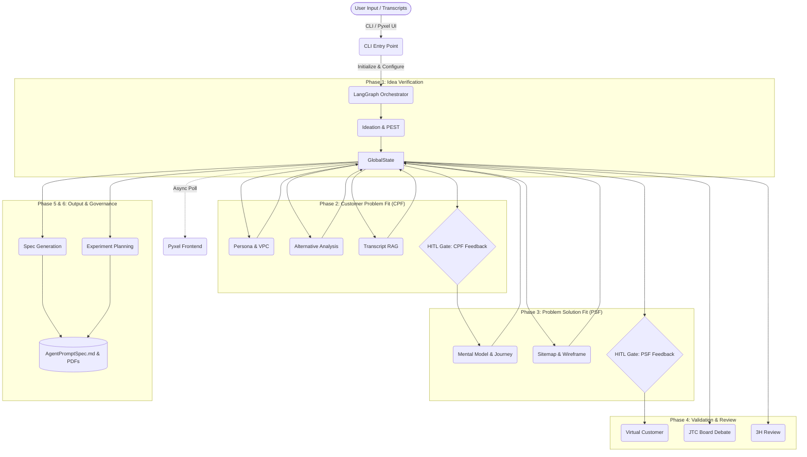

# The JTC 2.0: Enterprise Business Accelerator (Remastered Edition)


**The JTC 2.0 (Remastered Edition)** is a paradigm-shifting multi-agent system designed to accelerate the business creation process within Traditional Japanese Companies (JTC). By fusing the rigorous principles of "Startup Science" (Customer-Problem Fit & Problem-Solution Fit) with the nuanced realities of corporate politics, this system offers an unprecedented simulation platform for intrapreneurs.

Instead of relying on fragile, direct API UI generation, the Remastered Edition acts as the ultimate "Requirements Engineering Engine." It systematically eradicates AI hallucinations through a strict Pydantic-driven "Chain of Thought" pipeline, guiding your nebulous ideas through grueling virtual corporate validation to produce a flawless, universally compatible `AgentPromptSpec.md`—ready for instant execution by Cursor, Windsurf, or any modern autonomous coding agent.

## 🚀 Key Features

*   **Hallucination-Free Schema Engine:** Uses strict Pydantic models (`extra="forbid"`) to force AI agents to construct business logic step-by-step. It demands a validated `ValuePropositionCanvas` before a `CustomerJourney`, and a `MentalModelDiagram` before a single line of `Sitemap` is drawn.
*   **The "Gekizume" Simulation (JTC Board & 3H Review):** Subject your ideas to harsh, simulated corporate pushback. Your "New Employee" proxy defends the concept against skeptical Finance and Sales agents, while the Hacker, Hipster, and Hustler (3H) reviewers ruthlessly critique your technical debt, UX friction, and unit economics.
*   **Secure Customer Interview RAG:** Ground the simulation in reality. Ingest raw customer interview transcripts (via PLAUD or similar) securely. The CPO agent uses this local vector data to enforce "The Mom Test," ensuring features are built on facts, not AI assumptions.
*   **Decoupled "Retro RPG" UI (Pyxel):** Maintain psychological safety through "De-identification." Experience brutal corporate feedback and earn dynamic "Approval" stamps within a gamified 16-color Pyxel interface, completely separated from the complex LangGraph backend.
*   **Universal Output Generation:** Bypasses proprietary UI lock-in. Outputs a comprehensive `AgentPromptSpec.md` and `ExperimentPlan.md` (AARRR metrics), ready to be handed off to any AI development workflow.

## 🏗 Architecture Overview

The system is architected as an event-driven state machine orchestrated by LangGraph. It strictly separates complex LLM reasoning from deterministic data validation. The `GlobalState` is sequentially populated with complex Pydantic models through 6 strict phases, pausing at Human-in-the-Loop (HITL) gates for user intervention.


```mermaid
graph TD
    User([User Input / Transcripts]) -->|CLI / Pyxel UI| CLI(CLI Entry Point)
    CLI -->|Initialize & Configure| Graph(LangGraph Orchestrator)

    subgraph "Phase 1: Idea Verification"
        Graph --> Node1(Ideation & PEST)
        Node1 --> State[GlobalState]
    end

    subgraph "Phase 2: Customer Problem Fit (CPF)"
        State --> Node2(Persona & VPC)
        State --> Node3(Alternative Analysis)
        State --> Node5(Transcript RAG)
        Node2 & Node3 & Node5 --> State
        State --> HITL15{HITL Gate: CPF Feedback}
    end

    subgraph "Phase 3: Problem Solution Fit (PSF)"
        HITL15 --> Node6(Mental Model & Journey)
        State --> Node7(Sitemap & Wireframe)
        Node6 & Node7 --> State
        State --> HITL18{HITL Gate: PSF Feedback}
    end

    subgraph "Phase 4: Validation & Review"
        HITL18 --> Node8(Virtual Customer)
        State --> Node9(JTC Board Debate)
        State --> Node10(3H Review)
    end

    subgraph "Phase 5 & 6: Output & Governance"
        State --> Node11(Spec Generation)
        State --> Node12(Experiment Planning)
        Node11 & Node12 --> Output[(AgentPromptSpec.md & PDFs)]
    end

    State -.->|Async Poll| UI(Pyxel Frontend)
```

## 📋 Prerequisites

-   **Python 3.12+**
-   **uv** (The extremely fast Python package and project manager)
-   **API Keys**:
    -   `OPENAI_API_KEY` (GPT-4o required for complex schema generation)
    -   `TAVILY_API_KEY` (Required for Phase 1 Market Research)

## 🛠 Installation & Setup

We strictly use `uv` for dependency management to guarantee reproducible environments.

1.  **Clone the repository**
    ```bash
    git clone https://github.com/your-org/jtc2-0.git
    cd jtc2-0
    ```

2.  **Install dependencies**
    ```bash
    uv sync
    ```

3.  **Configure Environment**
    Create a `.env` file in the root directory and add your keys. Add the `UV_PROJECT_ENVIRONMENT` to prevent permission issues in automated environments.
    ```bash
    cp .env.example .env
    # Edit .env to add:
    # OPENAI_API_KEY=sk-...
    # TAVILY_API_KEY=tvly-...
    # UV_PROJECT_ENVIRONMENT=".venv"
    ```

## 🚀 Usage

**1. Ground the System with Real Data (Optional but Recommended):**
Feed the RAG pipeline with your raw customer interview notes to give the CPO agent factual context.
```bash
uv run main.py --ingest ./path/to/customer_interviews.txt
```

**2. Start the Simulation & Ideation:**
Launch the main engine with your target business domain.
```bash
uv run main.py "AI solutions for independent plumbers"
```
*The Pyxel UI will launch. Follow the on-screen prompts to select an idea, navigate the HITL gates, survive the Board review, and collect your final `AgentPromptSpec.md`.*

**3. Interactive Tutorial & UAT (Marimo):**
To understand the "Chain of Thought" or verify the system locally without Pyxel, run the interactive notebook:
```bash
uv run marimo edit tutorials/UAT_AND_TUTORIAL.py
```

## 🧪 Development Workflow

The project enforces strict quality standards to prevent AI-generated technical debt.

**Run the Validation Suite:**
This command executes tests with coverage, runs the strict `ruff` linter (enforcing a max-complexity of 10), and performs `mypy` strict type checking. **This must pass before any commit.**
```bash
uv run pytest && uv run ruff check . && uv run mypy .
```

**"Mock Mode" Execution:**
For CI pipelines or offline development, bypass all LLM API calls and test the LangGraph orchestrator deterministically using local fixtures:
```bash
MOCK_MODE=true uv run pytest
```

## 📂 Project Structure

```ascii
.
├── src/
│   ├── agents/             # Persona definitions (Ideator, CPO, Hacker, etc.)
│   ├── core/               # LangGraph orchestration, Config, and LLM wrappers
│   ├── data/               # LlamaIndex RAG implementation and parsers
│   ├── domain_models/      # Strict Pydantic schemas (LeanCanvas, VPC, MentalModel)
│   ├── ui/                 # Pyxel "Retro RPG" rendering engine
│   └── main.py             # CLI Entry Point
├── tests/                  # Unit, Integration, and Mock Mode E2E tests
├── dev_documents/          # Architectural Specifications and UAT Plans
├── tutorials/              # Marimo notebooks for interactive validation
└── pyproject.toml          # Strict dependency and linter configurations
```

## 📄 License

MIT License. See [LICENSE](LICENSE) for details.