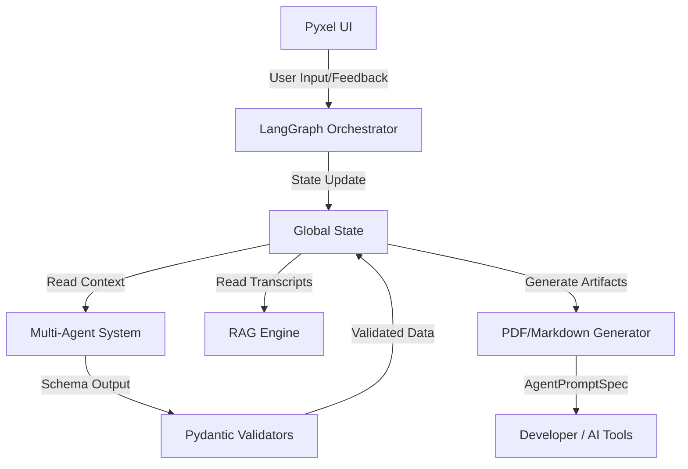

# The JTC 2.0 (Remastered Edition): Enterprise Business Accelerator


The JTC 2.0 Remastered Edition is a paradigm-shifting multi-agent platform designed to accelerate new business creation within Traditional Japanese Companies (JTCs). By strictly enforcing Pydantic schemas across a sequential "Chain of Thought" workflow, it completely eliminates AI hallucination, guiding your raw ideas through rigorous validation (from Customer-Problem Fit to Problem-Solution Fit) and culminating in a perfect, determinist prompt specification for any autonomous AI coding agent.

## Key Features

-   **Zero Hallucination Generation**: Employs Pydantic with `extra="forbid"` to force a deterministic, step-by-step reasoning process, ensuring every feature is firmly rooted in customer pain points. Supports rich data models like `ValuePropositionCanvas`, `CustomerJourney`, and `ExperimentPlan`.
-   **Multi-Agent Orchestration**: Utilizes LangGraph to simulate intensive internal approvals ("The JTC Board"), virtual market testing, and rigorous multi-faceted product reviews (Hacker, Hipster, Hustler).
-   **Human-in-the-Loop (HITL) Governance**: Pauses the AI workflow at critical junctions, generating beautiful PDF artifacts and allowing users to inject human insights and course corrections.
-   **Universal MVP Prompt Output**: Outputs a comprehensive `AgentPromptSpec.md` and `ExperimentPlan.md` ready to be ingested by modern AI coding tools like Cursor, Windsurf, or Google Antigravity.
-   **De-identification UI**: Features a Pyxel-based 16-color retro RPG interface that transforms harsh AI criticism into game events, protecting the user's psychological safety and rewarding progress with dynamic "Approval" Hanko stamps.

## Architecture Overview

The system architecture separates the interactive frontend from the complex backend logic, using LangGraph as the orchestrator and Pydantic as the strict data contract.


```mermaid
graph TD
    UI[Pyxel UI] -->|User Input/Feedback| Orchestrator[LangGraph Orchestrator]
    Orchestrator -->|State Update| State[Global State]
    State -->|Read Context| Agents[Multi-Agent System]
    Agents -->|Schema Output| Validators[Pydantic Validators]
    Validators -->|Validated Data| State
    State -->|Read Transcripts| RAG[RAG Engine]
    State -->|Generate Artifacts| Outputs[PDF/Markdown Generator]
    Outputs -->|AgentPromptSpec| EndUser[Developer / AI Tools]
```

## Prerequisites

-   Python 3.12+
-   `uv` (Modern Python package manager)
-   API Keys: `OPENAI_API_KEY` and `TAVILY_API_KEY`

## Installation & Setup

1.  **Clone the Repository:**
    ```bash
    git clone https://github.com/your-org/jtc2-0.git
    cd jtc2-0
    ```

2.  **Install Dependencies using `uv`:**
    ```bash
    uv sync
    ```

3.  **Configure Environment Variables:**
    Create a `.env` file in the root directory:
    ```bash
    cp .env.example .env
    # Edit .env and add your OPENAI_API_KEY and TAVILY_API_KEY
    ```

## Usage

**Quick Start: Run the Interactive Simulation**

Start the ideation and simulation process by providing a topic:

```bash
uv run main.py "AI for Agriculture"
```

The system will:
1.  Research the topic and generate initial Lean Canvases.
2.  Launch the retro Pyxel UI and ask you to select a plan.
3.  Guide you through the CPF and PSF validation phases, prompting for feedback at HITL gates.
4.  Output the final `AgentPromptSpec.md` and `ExperimentPlan.md` to your local directory.

## Development Workflow

The project is structured around 6 continuous implementation cycles. To ensure code quality:

**Run Linters:**
```bash
uv run ruff check .
```

**Run Formatters:**
```bash
uv run ruff format .
```

**Run Tests with Coverage:**
```bash
uv run pytest
```

**Run Type Checking:**
```bash
uv run mypy .
```

## Project Structure

```ascii
.
├── src/
│   ├── agents/             # Logic for specialized agents (Virtual Customer, 3H)
│   ├── core/               # LangGraph orchestration, settings, nodes
│   ├── data/               # RAG ingestion and vector store management
│   ├── domain_models/      # Strict Pydantic schemas (ValuePropositionCanvas, etc.)
│   ├── tools/              # External integrations (Tavily, etc.)
│   ├── ui/                 # Pyxel interfaces and visual effects
│   └── main.py             # Application entry point
├── tests/                  # Unit and Integration Tests
├── dev_documents/          # Architecture Specs, PRDs, and Scenarios
│   ├── system_prompts/     # SYSTEM_ARCHITECTURE.md
│   ├── ALL_SPEC.md         # Master Specification Document
│   └── USER_TEST_SCENARIO.md # Master Test Plan
├── tutorials/              # Marimo Notebooks for UAT and Interactive Tutorials
└── pyproject.toml          # Project configuration and linter settings
```

## License

This project is licensed under the MIT License. See the `LICENSE` file for details.
