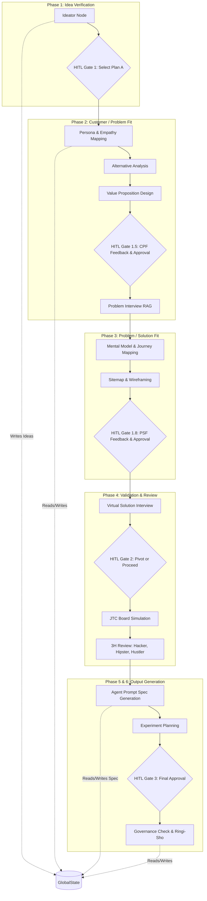

# The JTC 2.0: Enterprise Business Accelerator (Remastered Edition)


**The JTC 2.0 (Remastered Edition)** is a paradigm-shifting multi-agent simulation platform designed to radically streamline the new business creation process within Traditional Japanese Companies (JTCs). By mapping the "Startup Science" validation process from Customer-Problem Fit to Problem-Solution Fit with strict, schema-driven Pydantic models, it entirely eliminates AI hallucinations. The system outputs a flawless "Perfect Prompt Specification Document" ready for any modern AI coding agent.

## 🚀 Key Features

*   **Zero-Hallucination "Chain of Thought"**: Forces AI agents to proceed logically step-by-step through rigorous Pydantic schemas (Value Proposition Canvas, Mental Model Diagram, Alternative Analysis, Customer Journey, Sitemap and Story, Experiment Plan, Agent Prompt Spec), ensuring no context is lost or imagined.
*   **Multi-Agent "Gekizume" Simulation**: Subjects your business idea to the harsh reality of corporate politics and market viability via the JTC Board (Finance, Sales), Virtual Customers, and the 3H Review (Hacker, Hipster, Hustler).
*   **Universal Agent Prompt Specification**: Abandons proprietary UI API lock-ins. Generates a comprehensive `AgentPromptSpec.md` and `EXPERIMENT_PLAN.md` that can be fed directly into Cursor, Windsurf, or Google Antigravity.
*   **De-identified Pyxel UI & Hanko "Approval" Effect**: Maintains psychological safety using a retro 16-color RPG interface. Rewards progression through rigorous validation gates with a dynamic, digital Japanese "Hanko" approval stamp.

## 🏗 Architecture Overview

The system utilizes LangGraph to orchestrate a directed acyclic workflow, unified by a central `GlobalState` object. It strictly decouples business logic from presentation and enforces "Schema-First Data Boundaries" to guarantee predictable and auditable transitions between entrepreneurial validation phases.


```mermaid
graph TD
    subgraph Phase 1: Idea Verification
        A[Ideator Node] --> B{HITL Gate 1: Select Plan A}
    end

    subgraph Phase 2: Customer / Problem Fit
        B --> C[Persona & Empathy Mapping]
        C --> D[Alternative Analysis]
        D --> E[Value Proposition Design]
        E --> F{HITL Gate 1.5: CPF Feedback & Approval}
        F --> G[Problem Interview RAG]
    end

    subgraph Phase 3: Problem / Solution Fit
        G --> H[Mental Model & Journey Mapping]
        H --> I[Sitemap & Wireframing]
        I --> J{HITL Gate 1.8: PSF Feedback & Approval}
    end

    subgraph Phase 4: Validation & Review
        J --> K[Virtual Solution Interview]
        K --> L{HITL Gate 2: Pivot or Proceed}
        L --> M[JTC Board Simulation]
        M --> N[3H Review: Hacker, Hipster, Hustler]
    end

    subgraph Phase 5 & 6: Output Generation
        N --> O[Agent Prompt Spec Generation]
        O --> P[Experiment Planning]
        P --> Q{HITL Gate 3: Final Approval}
        Q --> R[Governance Check & Ringi-Sho]
    end

    State[(GlobalState)]

    A -.->|Writes Ideas| State
    C -.->|Reads/Writes| State
    O -.->|Reads/Writes Spec| State
    R -.->|Reads/Writes| State
```

## 📋 Prerequisites

*   **Python 3.12+**
*   **uv** (Modern Python package manager)
*   **API Keys**:
    *   `OPENAI_API_KEY` (Required for LLM orchestration)
    *   `TAVILY_API_KEY` (Required for market research)

## 🛠 Installation & Setup

1.  **Clone the repository**
    ```bash
    git clone https://github.com/your-org/jtc2-0.git
    cd jtc2-0
    ```

2.  **Install dependencies using `uv`**
    ```bash
    uv sync
    ```

3.  **Configure Environment Variables**
    Create a `.env` file in the root directory:
    ```bash
    cp .env.example .env
    # Edit .env to add your OPENAI_API_KEY and TAVILY_API_KEY
    ```

## 🚀 Usage

**Start the Simulation Workflow:**

Initiate the Ideation and Discovery phase from the command line:

```bash
uv run main.py "AI for Agriculture"
```

**Workflow Execution:**
1.  The system generates 10 "Good Crazy" Lean Canvas ideas.
2.  You will be prompted to select "Plan A".
3.  The system builds the Value Proposition and Mental Models, stopping at HITL Gates for your feedback and rewarding you with PDF exports and "Approval" stamp effects.
4.  Virtual Agents (Customers, JTC Board, 3H Review) ruthlessly test the viability of your application.
5.  Upon successful navigation, check your output directory for `AgentPromptSpec.md` and `EXPERIMENT_PLAN.md`.

## 🧑‍💻 Development Workflow

This project adheres to strict coding standards to ensure AI-generated code remains maintainable and secure.

**Run Linters (Ruff):**
```bash
uv run ruff check .
```

**Run Type Checking (Mypy):**
```bash
uv run mypy .
```

**Run Unit & Integration Tests (Pytest):**
```bash
uv run pytest
```

## 🗺 Implementation Roadmap

The Remastered Edition is being built across 6 structured cycles:

*   [x] **Cycle 01:** Foundational Schema and State Extension
*   [ ] **Cycle 02:** Core Verification Nodes and HITL Gates (Phase 1 & 2)
*   [ ] **Cycle 03:** RAG Integration and Problem/Solution Fit (Phase 3)
*   [ ] **Cycle 04:** Advanced Agent Validation and Review (Phase 4)
*   [ ] **Cycle 05:** Output Specification Generation (Phase 5)
*   [ ] **Cycle 06:** Experiment Planning, Governance, and Final UI Polish (Phase 6)

## 🏗 Project Structure

```ascii
.
├── src/
│   ├── agents/             # Agent Logic (Ideator, Virtual Customer, Builder)
│   ├── core/               # Orchestration, Config, & LangGraph Nodes
│   ├── data/               # RAG Engine & Data Ingestion
│   ├── domain_models/      # Strict Pydantic Schemas (The Core Domain)
│   ├── tools/              # External API Wrappers
│   ├── ui/                 # Pyxel Renderer
│   └── main.py             # CLI Entry Point
├── tests/                  # Pytest Unit & Integration Tests
├── tutorials/              # Interactive Marimo UAT & Tutorials
├── dev_documents/          # Specs & Architectural Documents
└── pyproject.toml          # uv Configuration & Strict Linter Rules
```

## 📄 License

MIT License. See [LICENSE](LICENSE) for details.