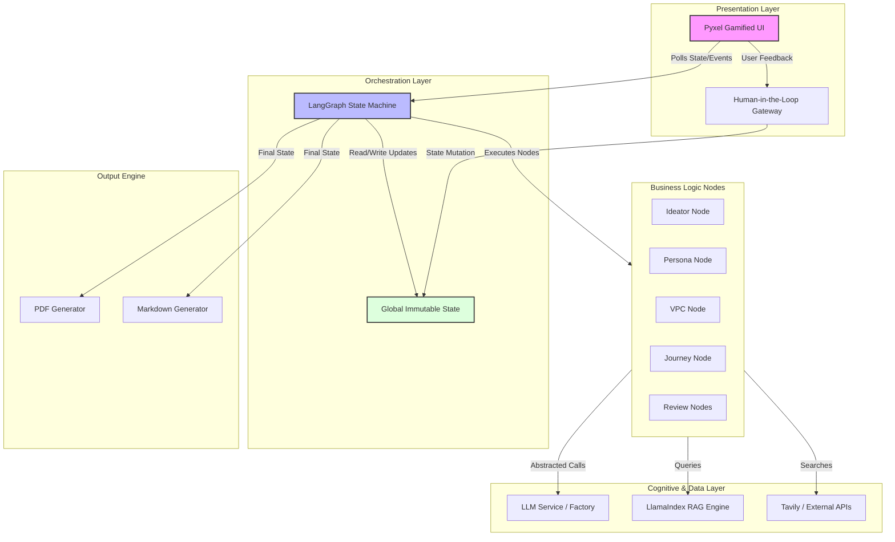

# The JTC 2.0 (Remastered Edition): Enterprise Business Accelerator


**The JTC 2.0 (Remastered Edition)** is an autonomous, multi-agent simulation platform designed to bridge the gap between "Startup Science" and the realities of Traditional Japanese Companies (JTCs). It acts as an interactive, role-playing co-founder, putting your ideas through rigorous "Gekizume" (harsh feedback) by AI stakeholders, validating them against real customer data via RAG, and ultimately outputting perfectly structured requirements designed for any autonomous AI coding agent.

## 🚀 Key Features

*   **Hallucination-Free Schema-Driven Generation:** Utilizing strict Pydantic V2 models (`extra="forbid"`), the system enforces a "Chain of Thought" methodology. It mathematically guarantees the generation of problem definitions (Value Proposition Canvas, Mental Models) before formulating solutions, entirely eradicating AI logical leaps.
*   **The "Perfect Prompt" Generator:** Moving beyond rigid API lock-ins, the final output is a universally applicable `AgentPromptSpec.md` and an `EXPERIMENT_PLAN.md`. These structured documents serve as the ultimate input for AI coding tools like Cursor or Windsurf, transforming validated requirements into MVPs instantly.
*   **De-identified Gamified Experience:** Enterprise innovation is stressful. The backend's rigorous, highly complex AI debates are presented through a retro 16-color RPG-style Pyxel UI. This "de-identification" strategy lowers psychological barriers, turning harsh corporate feedback into harmless game events, complete with "Approval" stamps upon successful validation.
*   **RAG-Powered Reality Checks:** The "CPO Mentor Agent" isn't just a chatbot; it grounds its critique in reality by ingesting and vectorizing real customer interview transcripts via LlamaIndex, enforcing the "Mom Test" against your assumptions.

## 🏗 Architecture Overview

The system is built on a modern, robust architecture leveraging LangGraph as the core orchestrator, ensuring deterministic, sequential execution across 6 distinct phases. All data flowing between LLM inference and the application state is strictly validated via Pydantic domain models.


```mermaid
graph TD
    subgraph Presentation Layer
        UI[Pyxel Gamified UI]
        HITL[Human-in-the-Loop Gateway]
    end

    subgraph Orchestration Layer
        LG[LangGraph State Machine]
        State[Global Immutable State]
    end

    subgraph Cognitive & Data Layer
        LLM[LLM Service / Factory]
        RAG[LlamaIndex RAG Engine]
        Tools[Tavily / External APIs]
    end

    subgraph Output Engine
        PDF[PDF Generator]
        MD[Markdown Generator]
    end

    UI -->|Polls State/Events| LG
    UI -->|User Feedback| HITL
    HITL -->|State Mutation| State

    LG -->|Read/Write Updates| State
    LG -->|Executes Nodes| Nodes

    subgraph Nodes [Business Logic Nodes]
        N1[Ideator Node]
        N2[Persona Node]
        N3[VPC Node]
        N4[Journey Node]
        N5[Review Nodes]
    end

    Nodes -->|Abstracted Calls| LLM
    Nodes -->|Queries| RAG
    Nodes -->|Searches| Tools

    LG -->|Final State| PDF
    LG -->|Final State| MD

    style UI fill:#f9f,stroke:#333,stroke-width:2px
    style LG fill:#bbf,stroke:#333,stroke-width:2px
    style State fill:#dfd,stroke:#333,stroke-width:2px
```

## 📋 Prerequisites

*   **Python 3.12+**
*   **uv** (Modern Python package manager)
*   **Docker** (Optional, for isolated execution environments)
*   **API Keys**:
    *   `OPENAI_API_KEY` (Required for LLM inference)
    *   `TAVILY_API_KEY` (Required for market research)

## 🛠 Installation & Setup

1.  **Clone the repository**
    ```bash
    git clone https://github.com/your-org/jtc2-0.git
    cd jtc2-0
    ```

2.  **Install dependencies using `uv`**
    ```bash
    uv sync
    ```

3.  **Configure Environment Variables**
    Create a `.env` file in the root directory and add your API keys. A sample is provided in `.env.example`.
    ```bash
    cp .env.example .env
    # Edit the .env file with your specific keys
    # OPENAI_API_KEY=sk-...
    # TAVILY_API_KEY=tvly-...
    # MOCK_MODE=false # Set to true to run offline/CI tests without API keys
    ```

## 🚀 Usage

**The Marimo UAT & Tutorial:**
The easiest way to understand and verify the system's capabilities is to run the unified User Acceptance Testing (UAT) tutorial using Marimo.

```bash
uv run marimo edit tutorials/UAT_AND_TUTORIAL.py
```
This interactive notebook will guide you through running the system in both offline "Mock Mode" and full execution.

**CLI Execution:**
To run the main simulation directly from the command line:

```bash
uv run main.py "Automated gardening for urban apartments"
```
During execution, the Pyxel UI will launch, and you will be prompted at critical "Human-In-The-Loop" (HITL) gates to review the generated PDFs and provide feedback.

## 💻 Development Workflow

The project enforces strict code quality standards to maintain the integrity of the complex LangGraph state machine.

*   **Run Linter (Ruff):** Enforces style, complexity limits, and security checks.
    ```bash
    uv run ruff check .
    ```
*   **Run Type Checker (MyPy):** Ensures strict typing across the Pydantic models and node implementations.
    ```bash
    uv run mypy .
    ```
*   **Run Tests (Pytest):** Executes the full test suite with coverage reporting.
    ```bash
    uv run pytest
    ```

The development of this remastered edition is meticulously planned across **6 implementation cycles**, ensuring incremental, verifiable delivery of the `ALL_SPEC.md` requirements.

## 📂 Project Structure

```ascii
.
├── src/
│   ├── agents/             # Logic for specialized agents (Ideator, CPO, 3H Reviewers)
│   ├── core/               # LangGraph configuration, configuration, and dependencies
│   ├── data/               # RAG ingestion and processing
│   ├── domain_models/      # Strict Pydantic schemas (VPC, Mental Models, etc.)
│   ├── services/           # Decoupled utility services (File, PDF)
│   └── ui/                 # Pyxel frontend rendering logic
├── tests/                  # Pytest unit, integration, and E2E suites
├── dev_documents/          # Architectural specifications, UAT scenarios, and logs
├── tutorials/              # Executable Marimo tutorials
└── pyproject.toml          # Project configuration, dependencies, and strict linter rules
```

## 📄 License

This project is licensed under the MIT License. See the `LICENSE` file for details.
