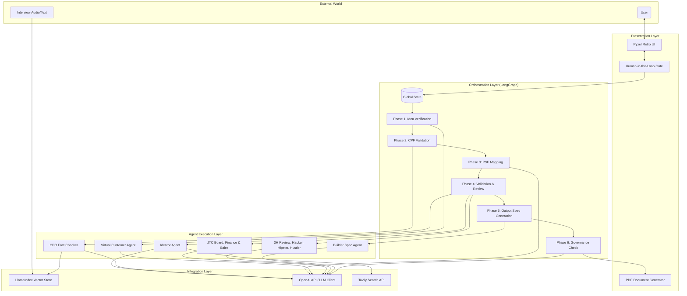

# The JTC 2.0: Enterprise Business Accelerator (Remastered Edition)


**The JTC 2.0 (Remastered Edition)** is a paradigm-shifting multi-agent platform designed to ruthlessly validate new business ideas within the context of Traditional Japanese Companies (JTC). Evolving beyond a simple chatbot or single UI generator, the Remastered Edition acts as an autonomous requirements engineering pipeline. It employs strict "Chain of Thought" reasoning and rigorously typed Pydantic models to eliminate AI hallucinations, transforming raw concepts into comprehensive, universally compatible Markdown specifications (`AgentPromptSpec.md`) and precise Go-To-Market strategies (`EXPERIMENT_PLAN.md`).

## ✨ Key Features

-   **Zero-Hallucination Pipeline**: Enforces a mathematically sound progression from Customer Problem Fit (CPF) to Problem Solution Fit (PSF). LLMs are strictly confined to generating predefined Pydantic schemas (e.g., Value Proposition Canvas, Mental Model Diagrams, Customer Journey) with `extra="forbid"`, completely eliminating logic leaps.
-   **Universal Output Generation**: Generates an `MVP_PROMPT_SPEC.md` ready to be instantly ingested by any modern AI coding assistant (Cursor, Windsurf, Google Antigravity), avoiding vendor lock-in.
-   **"De-identified" Retro UI & Gamification**: Employs a 16-color Pyxel interface to emotionally detach the user from harsh AI critiques. Features an animated "Approval Stamp" (Hanko) and PDF generation during Human-in-the-Loop (HITL) feedback gates.
-   **Multi-Agent Validation (The 3H Review)**: Subjects your validated wireframes to a grueling critique by Hacker (Tech), Hipster (UX), and Hustler (Business) agents to ensure absolute viability before any code is written.
-   **Real-World Grounding (Secure RAG)**: Validates assumptions against actual customer interview transcripts via an integrated LlamaIndex vector store.

## 🏗 Architecture Overview

The system utilizes LangGraph to orchestrate a complex 6-phase workflow. The architecture strictly separates the Orchestration Layer (Graph), the Agent Execution Layer, and the Presentation Layer.


```mermaid
graph TD
    subgraph "External World"
        User(User)
        Transcripts[Interview Audio/Text]
    end

    subgraph "Presentation Layer"
        PyxelUI[Pyxel Retro UI]
        PDFGen[PDF Document Generator]
        HITLGate[Human-in-the-Loop Gate]
    end

    subgraph "Integration Layer"
        RAG[LlamaIndex Vector Store]
        LLM[OpenAI API / LLM Client]
        Search[Tavily Search API]
    end

    subgraph "Orchestration Layer (LangGraph)"
        GlobalState[(Global State)]
        Phase1[Phase 1: Idea Verification]
        Phase2[Phase 2: CPF Validation]
        Phase3[Phase 3: PSF Mapping]
        Phase4[Phase 4: Validation & Review]
        Phase5[Phase 5: Output Spec Generation]
        Phase6[Phase 6: Governance Check]
    end

    subgraph "Agent Execution Layer"
        IdeatorAgent[Ideator Agent]
        CPOAgent[CPO Fact Checker]
        VirtualCustomer[Virtual Customer Agent]
        JTCBoard[JTC Board: Finance & Sales]
        Review3H[3H Review: Hacker, Hipster, Hustler]
        BuilderAgent[Builder Spec Agent]
    end

    User <--> PyxelUI
    PyxelUI <--> HITLGate
    HITLGate --> GlobalState
    Transcripts --> RAG

    GlobalState --> Phase1
    Phase1 --> IdeatorAgent
    IdeatorAgent --> Search
    IdeatorAgent --> LLM

    Phase1 --> Phase2
    Phase2 --> CPOAgent
    CPOAgent --> RAG
    CPOAgent --> LLM

    Phase2 --> Phase3
    Phase3 --> LLM

    Phase3 --> Phase4
    Phase4 --> VirtualCustomer
    Phase4 --> JTCBoard
    Phase4 --> Review3H
    VirtualCustomer --> LLM
    JTCBoard --> LLM
    Review3H --> LLM

    Phase4 --> Phase5
    Phase5 --> BuilderAgent
    BuilderAgent --> LLM

    Phase5 --> Phase6
    Phase6 --> PDFGen
    Phase6 --> LLM
```

## 📋 Prerequisites

-   **Python 3.12+**
-   **uv** (Modern Python package manager)
-   **API Keys**:
    -   `OPENAI_API_KEY` (Required for Core LLM functions)
    -   `TAVILY_API_KEY` (Required for Market Research)
    -   `LANGCHAIN_API_KEY` (Required for Tracing & Observability)

## 🛠 Installation & Setup

1.  **Clone the repository**
    ```bash
    git clone https://github.com/your-org/jtc2-0.git
    cd jtc2-0
    ```

2.  **Install dependencies using uv**
    ```bash
    uv sync
    ```

3.  **Configure Environment**
    Copy the example configuration file and set your private keys.
    ```bash
    cp .env.example .env
    ```
    Ensure your `.env` contains:
    ```bash
    OPENAI_API_KEY=sk-...
    TAVILY_API_KEY=tvly-...
    LANGCHAIN_TRACING_V2=true
    LANGCHAIN_API_KEY=ls__...
    ```

## 🚀 Usage

**Quick Start via Marimo Tutorials:**

The easiest way to understand the system is to run the interactive Marimo notebook, which provides a visual, step-by-step walkthrough of the pipeline.

```bash
uv run marimo edit tutorials/UAT_AND_TUTORIAL.py
```

**Command Line Execution (Legacy/Headless):**

You can also run the underlying simulation engine directly from the command line by providing a target topic.

```bash
uv run main.py "AI for Agriculture"
```

## 🔄 Development Workflow

This project strictly adheres to AI-optimized code quality standards. Ensure you run the following commands before submitting any changes:

*   **Type Checking**: Enforces strict typing logic.
    ```bash
    uv run mypy src
    ```
*   **Linting & Complexity**: Prevents unmaintainable AI-generated spaghetti code. Maximum function complexity is tightly capped.
    ```bash
    uv run ruff check .
    ```
*   **Unit & Integration Tests**: Ensures no regressions in the multi-agent graph logic.
    ```bash
    uv run pytest
    ```

## 📂 Project Structure

```ascii
.
├── src/
│   ├── agents/             # Agent Execution Layer (Ideator, Builder, Virtual Customer)
│   ├── core/               # Orchestration Layer (LangGraph logic, Pydantic settings)
│   ├── data/               # Integration Layer (RAG pipelines)
│   ├── domain_models/      # Strict Pydantic Validation Schemas
│   ├── tools/              # External API Clients
│   └── ui/                 # Presentation Layer (Pyxel Renderers)
├── tests/                  # Unit and E2E Testing Suite
├── tutorials/              # Interactive Marimo Notebooks
├── dev_documents/          # Architecture Specs & Documentation
└── pyproject.toml          # Strict Ruff/MyPy configurations
```

## 📄 License

This project is licensed under the MIT License. See [LICENSE](LICENSE) for details.
