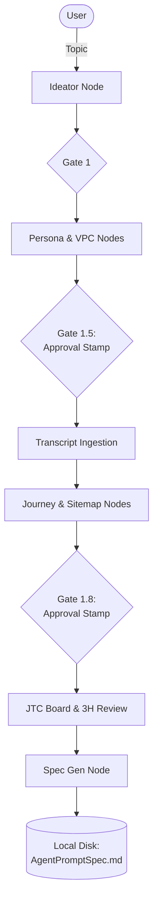

# The JTC 2.0 (Remastered Edition): Enterprise Business Accelerator


**The JTC 2.0 (Remastered Edition)** is an advanced, multi-agent simulation platform designed to radically streamline the new business creation process within Traditional Japanese Companies (JTCs). By enforcing a strict "Chain of Thought" through Pydantic schemas, it eliminates AI hallucinations and generates perfect, obsolescence-proof Prompt Specifications (`AgentPromptSpec.md`) that can drive any modern AI coding agent (e.g., Cursor, Windsurf) to build exactly what your customers need.

## 🚀 Key Features

-   **Schema-Driven Generation**: Completely eliminates AI hallucinations by enforcing a strict Pydantic model chain from Empathy Maps to Final Specifications.
-   **Universal Output**: Escapes vendor lock-in by generating a universal `AgentPromptSpec.md` containing site maps, state machines, and Mermaid flowcharts instead of just a URL.
-   **Human-in-the-Loop (HITL) & Gamification**: Review complex AI outputs comfortably via "Approval Stamp" (赤いハンコ) animations on a 16-color Pyxel retro UI, ensuring psychological safety.
-   **Real-World Data Ingestion**: Utilize RAG to ingest actual customer interview transcripts, allowing the CPO Agent to fact-check your business model against "The Mom Test."
-   **JTC Board Simulation & Nemawashi**: Simulate harsh internal reviews and map the hidden influence network to build consensus before writing a single line of code.

## 🏗 Architecture Overview

The system orchestrates specialized agents via LangGraph, maintaining a central `GlobalState` populated by strictly validated Pydantic models. It follows a "Fitness Journey" workflow, proceeding from Customer/Problem Fit to Problem/Solution Fit.


```mermaid
graph TD
    User([User]) --> |Topic| Ideator[Ideator Node]
    Ideator --> HITL1{Gate 1}
    HITL1 --> Persona[Persona & VPC Nodes]
    Persona --> HITL1_5{Gate 1.5:<br>Approval Stamp}
    HITL1_5 --> RAG[Transcript Ingestion]
    RAG --> Journey[Journey & Sitemap Nodes]
    Journey --> HITL1_8{Gate 1.8:<br>Approval Stamp}
    HITL1_8 --> JTC[JTC Board & 3H Review]
    JTC --> SpecGen[Spec Gen Node]
    SpecGen --> FileSystem[(Local Disk:<br>AgentPromptSpec.md)]
```

## 📋 Prerequisites

-   **Python 3.12+**
-   **uv** (Modern Python package manager)
-   **API Keys**:
    -   `OPENAI_API_KEY` (GPT-4o recommended)
    -   `TAVILY_API_KEY` (For market research)

## 🛠 Installation & Setup

1.  **Clone the repository**
    ```bash
    git clone https://github.com/your-org/jtc2-0.git
    cd jtc2-0
    ```

2.  **Install dependencies using uv**
    ```bash
    uv sync
    ```

3.  **Configure Environment Variables**
    Create a `.env` file in the root directory and add your API keys:
    ```bash
    cp .env.example .env
    # Edit .env to add OPENAI_API_KEY and TAVILY_API_KEY
    ```

## 🚀 Usage

**Start the Remastered Workflow:**

```bash
uv run main.py "AI for Agriculture"
```

The system will:
1.  Generate Lean Canvas ideas and prompt you to select one.
2.  Generate a Value Proposition Canvas and pause for your review (producing a PDF and a Pyxel Stamp).
3.  Ingest real-world transcripts if provided.
4.  Construct a Mental Model Diagram and Customer Journey, pausing again for review.
5.  Simulate a Virtual Customer interview and the JTC Board Gekizume.
6.  Finally, output `AgentPromptSpec.md` and `ExperimentPlan.md` into your local directory.

**Ingest Transcripts (RAG):**
```bash
uv run main.py --ingest ./path/to/interview.txt
```

**Run Interactive Tutorials / UAT:**
```bash
uv run marimo edit tutorials/UAT_AND_TUTORIAL.py
```

## 💻 Development Workflow

This project enforces strict code quality to ensure the maintainability of AI-generated and orchestrated logic.

-   **Run Linters:**
    ```bash
    uv run ruff check .
    ```
-   **Run Type Checking:**
    ```bash
    uv run mypy .
    ```
-   **Run Tests & Coverage:**
    ```bash
    uv run pytest
    ```

## 📁 Project Structure

```ascii
.
├── src/
│   ├── agents/             # Logic for specialized agents (Virtual Customer, 3H Review, Builder)
│   ├── core/               # State orchestration (LangGraph), Services, Configs
│   ├── data/               # RAG ingestion logic
│   ├── domain_models/      # Strict Pydantic schemas (VPC, Journey, AgentPromptSpec)
│   └── ui/                 # Pyxel Retro UI and Stamp animations
├── tests/                  # Unit and Integration Tests
├── tutorials/              # Marimo UAT and Tutorial Notebooks
├── dev_documents/          # PRDs, System Architectures, and Test Scenarios
└── pyproject.toml          # Dependency and strict linter configurations
```

## 📄 License

This project is licensed under the MIT License - see the [LICENSE](LICENSE) file for details.
