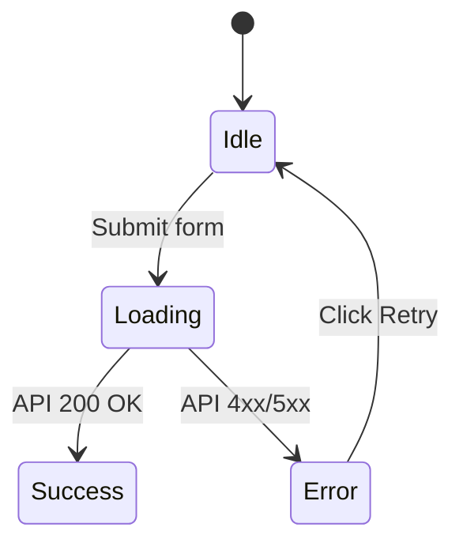

# The JTC 2.0 Next Generation Specification Document (Remastered Edition)

**Version:** 2.0.6
**Last Updated:** 2026-03-08
**Document Classification:** System Architecture / Product Requirements Document (PRD)

## 1. Introduction

### 1.1 Project Background and Objectives
"The JTC 2.0" is a simulation platform designed to radically streamline and enhance the new business creation process within Traditional Japanese Companies (JTCs) using Large Language Models (LLMs) and multi-agent systems.

In its initial version, the system successfully simulated office politics ("Gekizume" or intense grilling meetings) and automated the generation of Minimum Viable Products (MVPs) using v0.dev. However, it revealed challenges specific to AI, such as "contextual leaps (hallucinations)" and "vendor lock-in to specific AI tools."

In this Remastered Edition, we map the entire validation process—from "Customer/Problem Fit (CPF)" to "Problem/Solution Fit (PSF)" as advocated in Masayuki Tadokoro's *Startup Science*—onto the system without any logical leaps. By enforcing strict "Schemas" onto the LLM using Pydantic and sub-dividing the thought process (Chain of Thought), we completely eliminate hallucinations.

### 1.2 Redefinition of the Final Deliverable (System Output)
This system abandons the approach of directly executing specific UI generation APIs (such as v0.dev). Instead, the ultimate output of the system is redefined as **"the generation of a 'Perfect Prompt Specification (AgentPromptSpec.md)' and an 'MVP Experiment Plan' that can be directly input into any autonomous AI coding agent, such as Cursor, Windsurf, or Google Antigravity."**

Through this change, the system functions as a universal, obsolescence-proof "Ultimate Requirements Definition Engine."

## 2. Core Architecture and Design Philosophy

### 2.1 Schema-Driven Generation and Hallucination Elimination
To prevent the loss of context during the AI's inference process, the output of every LangGraph node is strictly structured using `pydantic.BaseModel` and `extra="forbid"`. This is a system-level enforcement and visualization of the "Chain of Thought" approach in AI prompt engineering.

The AI is absolutely forbidden from making logical leaps, such as deriving "Features (Solutions)" directly from an "Empathy Map." It is compelled to sequentially fill out step-by-step schemas (canvases): "Alternative Analysis" → "Value Proposition" → "Mental Model Diagram" → "Customer Journey" → "Sitemap and User Story."

By linking the output canvas of the previous step as the input for the next step, the resolution of the product is gradually increased. This meticulous flow is designed to completely eliminate any room for "plausible lies based on generalizations (hallucinations)," which are characteristic of AIs.

### 2.2 Multi-Agent Orchestration (LangGraph)
Using LangGraph, the system orchestrates the following three main sub-graphs (meeting bodies):
1. **The JTC Board (Internal Approval Simulation):** Intense scrutiny of the business model and feasibility by the Finance Manager, Sales Manager, and CPO.
2. **Virtual Market (Virtual Market Test):** Harsh reviews and commitment judgments on the solution by Virtual Customer Agents.
3. **The 3H Review (Product Polish):** Multi-faceted validation of the wireframes by the Hacker (Technology), Hipster (UX), and Hustler (Business).

### 2.3 De-identified UI (Pyxel) and "Approval" Direction
While highly sophisticated business logic proceeds in the system's backend, the frontend UI facing the user maintains a 16-color retro RPG-style screen using "Pyxel." This is an extremely important architectural decision to guarantee the psychological safety of the user by "de-identifying" harsh criticisms and idea rejections from the AI as mere "game events."

Furthermore, the system incorporates a direction where, every time the generation process of various canvases (Alternative Analysis, Customer Journey, etc.) is completed and passes the system's verification, a pixel-art "Approval" stamp (a red Hanko) is dynamically stamped on the Pyxel screen. By subverting the unique Hanko culture of JTCs, the design gives users a strong sense of accomplishment and progression of "breaking through a barrier."

## 3. The Entire Workflow (The Fitness Journey Workflow)

The system sequentially executes the following 6 phases and a total of 14 major nodes (steps). After each canvas is generated, a "Human In the Loop (HITL) Feedback Gate" is inserted to accept course corrections from the user.

### Phase 1: Idea Verification
- **Step 1: Ideation & PEST Analysis (`ideator_node`)**
  Searches for inflection points in the macro environment (PEST) using the Tavily Search API. Generates 10 Good Crazy business ideas (`LeanCanvas` models).
  - **[HITL Gate 1]:** The user selects the "Plan A" to pursue.

### Phase 2: Customer / Problem Fit
- **Step 2: Persona & Empathy Mapping (`persona_node`)**
  Generates a high-resolution `Persona` and `EmpathyMap` from the selected idea.
- **Step 3: Alternative Analysis (`alternative_analysis_node`)**
  Identifies current alternative methods (e.g., Excel, existing SaaS) and infers a "10x Value" that outweighs the switching costs.
- **Step 4: Value Proposition Design (`vpc_node`)**
  Validates and structures how the "Pain Relievers" and "Gain Creators" provided by the solution fit the customer's "Customer Jobs" and "Pains/Gains".
  - **[HITL Gate 1.5 - CPF Feedback]:** The models generated in Steps 2-4 are output as PDFs, and an "Approval" stamp is pressed on Pyxel. The user reviews the PDFs and can input adjustment instructions (Feedback) for the Persona or VPC if necessary.
- **Step 5: Problem Interview RAG (`transcript_ingestion_node`)**
  Vectorises the audio transcripts (e.g., PLAUD) of customer interviews conducted by the user using LlamaIndex. The CPO agent conducts fact-checking based on "The Mom Test" criteria.

### Phase 3: Problem / Solution Fit
- **Step 6: Mental Model & Journey Mapping (`mental_model_journey_node`)**
  Visualises the "Towers of Thought (Beliefs/Values)" behind the user's actions as a `MentalModelDiagram`. Maps chronological actions based on that mental model to a `CustomerJourney`, and extracts a `UserStory` from the touchpoint with the strongest pain.
- **Step 7: Sitemap & Lo-Fi Wireframing (`sitemap_wireframe_node`)**
  Defines the entire URL structure and page transition overview of the app as a `Sitemap`. Based on the defined sitemap, it outputs the structure of specific screens required to achieve the user story as a pure text hierarchy `WireframeText` model, excluding design elements.
  - **[HITL Gate 1.8 - PSF Feedback]:** The Mental Model, Journey, and Sitemap are output as PDFs, and an "Approval" stamp is pressed on Pyxel. The user reviews the PDFs and provides instructions (Feedback) to trim features or modify stories.

### Phase 4: Validation & Review
- **Step 8: Virtual Solution Interview (`virtual_customer_node`)**
  Presents the wireframe and sitemap to a "Virtual Customer Agent" injected with the Persona and Mental Model prompts. The virtual customer provides feedback such as "How much would I pay for this?" and "Where would I drop off?"
  - **[HITL Gate 2]:** The user observes the virtual customer's reaction and decides whether to pivot or proceed with the idea.
- **Step 9: JTC Board Simulation (`jtc_simulation_node`)**
  Intense grilling by the Finance Manager (ROI/Cost) and Sales Manager (Cannibalization/Sellability). Rendered on the Pyxel UI.
- **Step 10: 3H Review (`3h_review_node`)**
  Final review and modification of the product specifications by the Hacker (Technical Feasibility), Hipster (UX Friction), and Hustler (Unit Economics).

### Phase 5 & 6: Output Generation
- **Step 11: Agent Prompt Spec Generation (`spec_generation_node`)**
  Aggregates all context up to this point and generates the `AgentPromptSpec`, a complete markdown prompt for AI coding tools.
- **Step 12: Experiment Planning (`experiment_planning_node`)**
  Generates an `ExperimentPlan` (AARRR-based KPI tree) defining "What and How to measure" using the generated MVP.
  - **[HITL Gate 3 - Final Output FB]:** Upon completion of the experiment plan and final specification generation, the final "Approval" stamp is pressed, and a series of final deliverables are converted into PDFs.
- **Step 13: Governance Check (`governance_node`)**
  Outputs the final report in the JTC "Ringi-Sho" (Approval Document) format.

## 4. Added and Modified Domain Models (Pydantic Schemas)

New data model definitions to prevent AI hallucinations and maintain context.

### 4.1 Value Proposition Canvas
```python
class CustomerProfile(BaseModel):
    customer_jobs: list[str] = Field(..., description="Jobs and social/emotional tasks the customer wants to get done")
    pains: list[str] = Field(..., description="Risks and negative emotions that hinder the execution of jobs")
    gains: list[str] = Field(..., description="Benefits and expectations the customer wants to achieve by executing the job")

class ValueMap(BaseModel):
    products_and_services: list[str] = Field(..., description="List of primary products/services offered")
    pain_relievers: list[str] = Field(..., description="How exactly to alleviate the customer's Pains")
    gain_creators: list[str] = Field(..., description="How exactly to create the customer's Gains")

class ValuePropositionCanvas(BaseModel):
    model_config = ConfigDict(extra="forbid")
    customer_profile: CustomerProfile
    value_map: ValueMap
    fit_evaluation: str = Field(..., description="Validation result of how logically Pain Relievers fit Pains, and Gain Creators fit Gains")
```

### 4.2 Mental Model Diagram
```python
class MentalTower(BaseModel):
    belief: str = Field(..., description="The underlying belief or value of the user (e.g., 'I do not want to waste time')")
    cognitive_tasks: list[str] = Field(..., description="Tasks and judgments performed in the mind based on that belief")

class MentalModelDiagram(BaseModel):
    model_config = ConfigDict(extra="forbid")
    towers: list[MentalTower] = Field(..., description="Multiple towers of thought that constitute the user's mental space")
    feature_alignment: str = Field(..., description="Mapping of how the provided features align with and support the defined thought towers")
```

### 4.3 Alternative Analysis Model
```python
class AlternativeTool(BaseModel):
    name: str = Field(..., description="Name of the alternative tool (e.g., Excel, manual work, existing SaaS)")
    financial_cost: str = Field(..., description="Financial cost")
    time_cost: str = Field(..., description="Time cost")
    ux_friction: str = Field(..., description="The biggest stress/friction the user feels")

class AlternativeAnalysis(BaseModel):
    model_config = ConfigDict(extra="forbid")
    current_alternatives: list[AlternativeTool]
    switching_cost: str = Field(..., description="Cost and effort incurred when the user switches")
    ten_x_value: str = Field(..., description="10x value of the alternative (UVP) that overwhelmingly surpasses the switching cost")
```

### 4.4 Customer Journey Model
```python
class JourneyPhase(BaseModel):
    phase_name: str = Field(..., description="Phase name (e.g., Awareness, Consideration, Using, Churn)")
    touchpoint: str = Field(..., description="Point of contact between the customer and the system/environment")
    customer_action: str = Field(..., description="Specific action of the customer")
    mental_tower_ref: str = Field(..., description="The belief in the MentalTower backing this action")
    pain_points: list[str] = Field(..., description="Pains or frustrations felt in this phase")
    emotion_score: int = Field(..., ge=-5, le=5, description="Emotional fluctuation (-5 to 5)")

class CustomerJourney(BaseModel):
    model_config = ConfigDict(extra="forbid")
    phases: list[JourneyPhase] = Field(..., min_length=3, max_length=7)
    worst_pain_phase: str = Field(..., description="Name of the phase where the Pain is the deepest (and must be solved)")
```

### 4.5 Sitemap & User Story Model
```python
class Route(BaseModel):
    path: str = Field(..., description="URL path (e.g., /, /dashboard, /login)")
    name: str = Field(..., description="Page name")
    purpose: str = Field(..., description="Purpose of this page")
    is_protected: bool = Field(..., description="Whether the page requires authentication")

class UserStory(BaseModel):
    model_config = ConfigDict(extra="forbid")
    as_a: str = Field(..., description="As a (Persona)")
    i_want_to: str = Field(..., description="I want to (Action)")
    so_that: str = Field(..., description="So that (Goal/Value)")
    acceptance_criteria: list[str] = Field(..., description="Acceptance criteria for this story to be considered satisfied")
    target_route: str = Field(..., description="URL path where this action primarily occurs")

class SitemapAndStory(BaseModel):
    model_config = ConfigDict(extra="forbid")
    sitemap: list[Route] = Field(..., description="Overall URL and routing structure of the application")
    core_story: UserStory = Field(..., description="The single most important story to be validated as an MVP")
```

### 4.6 Experiment Plan Model
```python
class MetricTarget(BaseModel):
    metric_name: str = Field(..., description="Metric name (e.g., Day7 Retention)")
    target_value: str = Field(..., description="Target value considered as achieving PMF (e.g., 40% or more)")
    measurement_method: str = Field(..., description="Measurement method")

class ExperimentPlan(BaseModel):
    model_config = ConfigDict(extra="forbid")
    riskiest_assumption: str = Field(..., description="The riskiest assumption to be tested this time")
    experiment_type: str = Field(..., description="Type of MVP (e.g., LP, Concierge, Wizard of Oz)")
    acquisition_channel: str = Field(..., description="Where to bring the initial 100 users from")
    aarrr_metrics: list[MetricTarget] = Field(..., description="Tracking metrics based on the AARRR framework")
    pivot_condition: str = Field(..., description="What results should trigger an immediate withdrawal (pivot)")
```

### 4.7 Agent Prompt Specification Model
```python
class StateMachine(BaseModel):
    success: str = Field(..., description="Complete layout when data is normal")
    loading: str = Field(..., description="Waiting UI using Skeleton components")
    error: str = Field(..., description="Placement of fallback UI and Retry button")
    empty: str = Field(..., description="Empty State including CTA when data is 0")

class AgentPromptSpec(BaseModel):
    model_config = ConfigDict(extra="forbid")
    sitemap: str = Field(..., description="Overall routing and information architecture of the app")
    routing_and_constraints: str = Field(..., description="Boundaries of SSR/Client Components, UI library specifications")
    core_user_story: UserStory
    state_machine: StateMachine
    validation_rules: str = Field(..., description="Zod schema and edge case requirements")
    mermaid_flowchart: str = Field(..., description="State transition and data flow diagram using Mermaid syntax")
```

## 5. Agents Definition

Prompt policies for the dedicated AI agents driving the LangGraph nodes.

### [Crucial Principle: Absolute Inheritance of Context]
All agents in this system must not propose ideas or features entirely from scratch (zero-based) relying solely on their own training data or intuition.

All structured data (Persona, Empathy Map, VPC, Mental Model Diagram, Customer Journey, Sitemap, etc.) generated sequentially through the Chain of Thought process in Phases 1 to 3 must be loaded into the prompt as "Absolute Prerequisites."

The agent groups are strictly controlled to perform effective product validation and specification building *only* based on these "Customer Understanding Canvas Groups."

### 5.1 Virtual Customer Agent
- **Role:** The target persona themselves.
- **Prompt System:** "You are [Persona Name]. At the root of your thinking are beliefs like [MentalModelDiagram.towers], and you currently use [AlternativeTool], but you are deeply troubled by [Pain]. Regarding the feature proposed to you now, without any flattery, strictly feedback whether you would pay to use it or if it's unnecessary. Please react particularly sensitively to 'hassle (switching costs)'."

### 5.2 The 3H Review Agents
- **Hacker Agent:** "While adhering to the prerequisite sitemap and functional requirements, review the wireframe from the perspectives of technical debt, scalability, and security. Avoid unnecessarily complex DB structures or real-time communication, and pursue whether they can be substituted with spreadsheets or mocks of existing APIs."
- **Hipster Agent:** "While adhering to the prerequisite mental model and persona, review the UX based on the user's 'Don't make me think' principle. Point out onboarding friction contrary to the mental model, excessive tap counts, and unfriendliness during errors."
- **Hustler Agent:** "While adhering to the prerequisite alternative analysis and VPC, review the business model from the perspective of unit economics (LTV > 3x CAC). Strictly interrogate who will find this, how, and why they will continue to pay money."

### 5.3 Builder Agent (Role Change)
- **Old Role:** Hit the v0.dev API to generate a URL.
- **New Role:** Loads all contexts generated so far (VPC, Mental Model, Journey, Story, Sitemap, 3H Review results) as an integrated prerequisite. After applying "subtractive thinking (removing unnecessary features that do not directly solve the user's Pain)," it generates the ultimate requirements definition document `AgentPromptSpec` that is applicable to any AI coding tool.

## 6. Output Specifications

When the system runs successfully to completion, the following files are output to the local directory.

### 6.1 `MVP_PROMPT_SPEC.md`
A file designed to be directly copied and pasted into the chat fields of AI editors/agents like Cursor, Windsurf, v0.dev, and Google Antigravity.

```markdown
# 🤖 System & Context
- Role: Expert Frontend Engineer & UI/UX Designer
- Stack: Next.js (App Router), React, TypeScript, Tailwind CSS, shadcn/ui, Lucide-react
- Principles: One Feature One Value, Mobile First, Accessible (WCAG 2.1)
- Routing & Components: [Strict constraints for SSR/Client boundaries, UI libraries]

# 🗺️ Sitemap & Information Architecture
- `/` : Landing Page (Unauthenticated) - Value proposition and registration flow
- `/login` : Authentication Page
- `/dashboard` : Main Function (Execution location of the Core User Story)
* Note for AI: Do not generate links to unnecessary pages (e.g., /settings, /profile) other than those defined above, and ensure they cannot be transitioned to.

# 🎯 Core User Story
- As a: [Persona]
- I want to: [Action]
- So that: [Value/Goal]
- Target Route: [Applicable URL, e.g., /dashboard]
- Acceptance Criteria:
  - [Acceptance Criteria 1]
  - [Acceptance Criteria 2]

# 📊 Data Schema & Flow
- TypeScript Interfaces:
  ```typescript
  // Strict type definitions and mock JSON structures defined to make AI generation easier
  ```
- Validation Rules: [Validation requirements using Zod (e.g., min 8 characters, symbol required)]

# 🔄 State Machine (Mermaid)


# 🖥️ UI Structure & States
- Success State: [Component layout/arrangement when data is normal]
- Loading State: [Skeleton placement instructions from shadcn/ui, not a spinner]
- Empty State: [Illustration and CTA button placement when there is no data]
- Error State: [Fallback UI and retry button]

# 🖱️ Interaction & A11y
- Interactions: [Toast notifications upon button clicks, etc.]
- Accessibility: [ARIA labels, keyboard operation requirements]
```

### 6.2 `EXPERIMENT_PLAN.md`
A sprint plan document showing how to conduct hypothesis validation in the real world using the generated MVP. It documents the acquisition channels to the landing page, manual policies for concierge services, and borderline AARRR metrics for determining "PMF Achievement."

### 6.3 PDF Output of Canvas Documents and Pyxel Approval Direction [NEW]
The system executes the following processes at the milestones of each inference phase to smoothly facilitate co-creation with humans (HITL).

1. **Target Documents:**
   - Value Proposition Canvas
   - Mental Model Diagram
   - Alternative Analysis Model
   - Customer Journey Model
   - Sitemap & User Story Model
   - Experiment Plan Model
2. **Approval Direction on Pyxel:** Immediately after each document is successfully generated as a Pydantic model, a sound effect and animation of a large red "Approval" hanko being stamped on the Pyxel retro UI screen is played.
3. **Simple High-Resolution PDF Output:** Simultaneously, in the background, the various canvases are visually organized and output as high-resolution PDF files to the local directory (e.g., `/outputs/canvas/`).
4. **Human In the Loop (HITL) Feedback:** The user can easily review the output PDFs and seamlessly intervene/input corrective feedback from a human perspective, such as "Narrow down the target a bit more" or "Increase the resolution of the Pain," via the Pyxel prompt input screen.

## 7. Non-Functional Requirements & Observability

### 7.1 Full Integration of LangSmith Tracing
LangSmith tracing, which was disabled in previous versions, is now a mandatory requirement by default (allowing environment variables via `extra="ignore"`, or explicit field definitions).

- **Purpose:**
  1. Monitoring infinite loops (deadlocks) and controlling token consumption during Virtual Customer tests and 3H reviews.
  2. Debugging context propagation (conversion loss of Pydantic models) between steps.

### 7.2 Circuit Breakers and Hard Limits
In multi-agent dialogues (especially Simulation and 3H Review), to prevent API waste, in addition to configuring `max_turns`, a moderator logic is inserted to detect specific string expressions (e.g., "I agree", "We are on parallel lines") and forcefully terminate the process.
