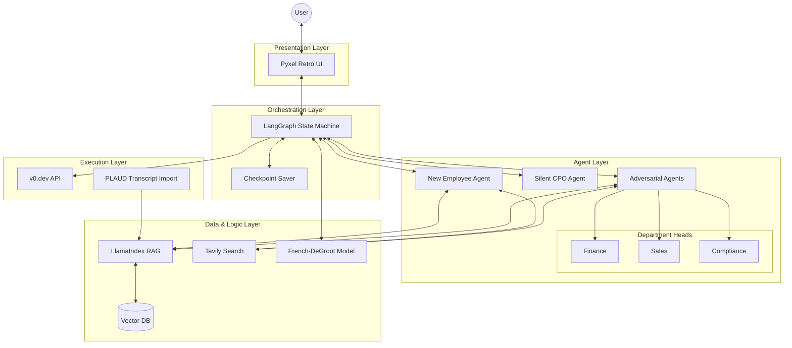

# System Architecture: The JTC 2.0

## 1. Summary

The JTC 2.0 is a groundbreaking Enterprise Architecture designed to bridge the chasm between the agile, rigorous methodology of "The Science of Entrepreneurship" (as advocated by Masayuki Tadokoro) and the complex, often rigid organisational dynamics of a Japanese Traditional Company (JTC). At its core, this system acts as an "Autonomous Enterprise Accelerator," a digital environment where the chaotic energy of innovation is disciplined by scientific frameworks and then navigated through the labyrinth of corporate politics using advanced multi-agent simulations.

The primary challenge in modern enterprise innovation is not a lack of ideas, but the structural inability to validate them effectively. Traditional digital transformation efforts often result in "theatre"—creating prototypes that look impressive but lack fundamental business viability or fail to survive internal stakeholder scrutiny. Conversely, pure startup methodologies often fail within established corporations because they ignore the necessary "Nemawashi" (consensus-building) and political manoeuvring required to secure resources.

The JTC 2.0 addresses this dichotomy by creating a "Safe Scaffolding" for intrapreneurs. It utilises a sophisticated stack of Generative AI technologies—including LangGraph for stateful multi-agent orchestration, LlamaIndex for Retrieval-Augmented Generation (RAG) using local knowledge, and Tavily for real-time market intelligence. Crucially, it introduces a "Proxy Model" where the user's business ideas are defended not by the user themselves, but by a digital "New Employee Agent." This agent faces a simulated "Hell Meeting" against "Department Head Agents" (Finance, Sales, Compliance), allowing the user to view the critique objectively from a third-person perspective, thus preserving psychological safety via "De-identification."

Furthermore, the system enforces "Continuous Human-in-the-Loop (HITL)" decision-making. It does not automate the entrepreneur out of the loop; rather, it forces them to make high-stakes decisions at four critical "Gates": Idea Verification, Customer-Problem Fit, Problem-Solution Fit, and Product-Market Fit. The system pauses at these gates, demanding primary information—such as actual customer interview transcripts recorded via PLAUD NOTE—before proceeding. This ensures that the system never hallucinates a market need, grounding every hypothesis in irrefutable fact.

Finally, the architecture culminates in the automated generation of Minimum Viable Products (MVPs) using v0.dev. By turning approved concepts into deployable React/Next.js interfaces instantly, the system closes the feedback loop, allowing for rapid market testing and data-driven pivoting. The JTC 2.0 is, therefore, not just a tool but a comprehensive ecosystem that industrialises the creation of successful new businesses within the constraints of a legacy organisation.

## 2. System Design Objectives

The design of The JTC 2.0 is governed by a set of rigorous objectives, constraints, and success criteria, ensuring it delivers value as both a learning platform and a production-grade business generator.

### Goals
1.  **Psychological Safety via De-identification:** The system must completely decouple the user's ego from their business idea during the validation phase. By using a "Proxy Agent" to take the "beating" in simulated meetings, the user can objectively analyse feedback without defensive emotional reactions. The goal is to transform "rejection" into "data."
2.  **Enforcement of Primary Information:** The system must actively reject "desk research" when "field research" is required. It is designed to be blocked until the user provides evidence of real-world customer interaction (e.g., uploading a transcript). This constraint forces the user to leave the building, adhering to the core tenet of "The Science of Entrepreneurship."
3.  **Organisational Physics Simulation:** Unlike standard business simulators that focus only on market economics, The JTC 2.0 must simulate *organisational behaviour*. It aims to model the irrationality, political friction, and consensus-building processes (Nemawashi) inherent in large companies, using the French-DeGroot model to calculate opinion dynamics mathematically.
4.  **End-to-End Automation from Idea to Code:** The system aims to reduce the "Time to MVP" from months to minutes. By integrating v0.dev, the objective is to allow a user to go from a validated "One Feature" concept to a live, testable URL without writing a single line of code manually.

### Constraints
1.  **Strict "Science of Entrepreneurship" Adherence:** The workflow cannot deviate from the frameworks defined by Masayuki Tadokoro. It must strictly follow the sequence of Lean Canvas -> Empathy Map -> Jacobi Board -> MVP -> PMF.
2.  **Local-First Knowledge Base:** Corporate data is sensitive. The RAG implementation using LlamaIndex must prioritise local document ingestion (PDFs, text files) over external API calls where proprietary data is concerned, ensuring data privacy and relevance.
3.  **Human-in-the-Loop Latency:** The system must handle long pauses (hours or days) between agent steps while waiting for user input (e.g., conducting an interview). The state management must be robust enough to persist context over these indefinite distinct periods.

### Success Criteria
1.  **Pivot Rate:** A successful outcome is not necessarily a launched product, but a *validated decision*. If the system leads a user to kill a bad idea quickly (Pivot) based on data, that is a success. We aim for a high "Bad Idea Kill Rate."
2.  **User Engagement (Retention):** Users should feel "hooked" by the gamified elements (Pyxel UI, RPG style). Success is measured by the user completing all four Gates without abandoning the difficult process of customer discovery.
3.  **MVP Viability:** The generated MVPs must be functional enough to conduct a "Solution Interview." They do not need to be production-ready backends, but the front-end fidelity must be high enough to elicit genuine customer feedback.

## 3. System Architecture

The architecture relies on a loosely coupled multi-agent system orchestrated by LangGraph. It separates the "Simulation Layer" (Agents & Workflow) from the "Presentation Layer" (Pyxel UI) and the "Execution Layer" (v0.dev, External Tools).

### Components
1.  **Orchestrator (LangGraph):** The brain of the system. It manages the state machine, defining the transitions between the four Gates. It handles `interrupt` signals for Human-in-the-Loop interactions.
2.  **Agent Swarm:**
    *   **New Employee Agent:** The protagonist proxy. Carries the user's context.
    *   **Department Head Agents (Finance, Sales, etc.):** Adversarial agents configured with specific "Persona Prompts" and "Blocker Logic."
    *   **Silent CPO Agent:** A mentor agent that operates in a separate "Informal" subgraph, providing advice based on accumulated state history.
3.  **Knowledge Engine (LlamaIndex):** Manages the ingestion of user documents (Business Plans) and raw interview data (PLAUD transcripts). It vectorises this data for retrieval by agents during arguments.
4.  **Intelligence Unit (Tavily):** Provides real-time market data to validate or debunk claims made by agents or the user.
5.  **Consensus Engine (NetworkX / NumPy):** Implements the French-DeGroot model to calculate the "Approval Probability" based on agent relationships and opinion weights.
6.  **Generator (v0.dev):** A tool-use interface that constructs prompts for the v0 API to generate UI code.

### Data Flow
1.  User inputs Idea -> **Orchestrator** initializes State.
2.  **Tavily** fetches market data -> **New Employee Agent** drafts Lean Canvas.
3.  **Orchestrator** pauses (Gate 1) -> User selects Plan A.
4.  **Department Head Agents** critique Plan A using **LlamaIndex** (Company Policy) and **Tavily** (Competitor Info).
5.  User conducts interview -> Uploads Transcript -> **LlamaIndex** updates Vector Store.
6.  **Silent CPO** reads Vector Store -> Advises User.
7.  **Consensus Engine** simulates vote -> If Pass, **Generator** calls v0.dev API -> Returns URL.

### Diagram



## 4. Design Architecture

The system uses a strict Pydantic-based design to ensure type safety and structured data exchange between agents. The file structure separates concerns logically.

### File Structure
```ascii
.
├── dev_documents/
│   ├── ALL_SPEC.md
│   ├── USER_TEST_SCENARIO.md
│   └── system_prompts/
│       ├── SYSTEM_ARCHITECTURE.md
│       └── CYCLE{01-05}/
├── src/
│   ├── agents/
│   │   ├── base.py           # Base Agent classes
│   │   ├── employee.py       # Proxy Agent logic
│   │   ├── opponents.py      # Dept Head Agents
│   │   └── cpo.py            # Mentor Agent
│   ├── core/
│   │   ├── config.py         # Env vars and settings
│   │   ├── state.py          # LangGraph State definitions
│   │   └── graph.py          # Main Workflow definition
│   ├── data/
│   │   ├── models.py         # Pydantic Domain Models
│   │   └── rag.py            # LlamaIndex setup
│   ├── simulation/
│   │   ├── degroot.py        # Math model for consensus
│   │   └── metrics.py        # AARRR & Score calculations
│   ├── tools/
│   │   ├── tavily_client.py  # Search tool
│   │   └── v0_client.py      # UI Gen tool
│   └── ui/
│       └── pyxel_app.py      # Retro UI entry point
├── tests/
├── pyproject.toml
└── README.md
```

### Domain Models (Overview)
We define strict schemas for the core business objects.
*   **`LeanCanvas`**: Validates the 9 blocks of the canvas.
*   **`InterviewTranscript`**: Structured representation of uploaded user research.
*   **`AgentState`**: The shared state object for LangGraph, containing the conversation history, current canvas, and metrics.
*   **`EvaluationScore`**: Pydantic model for the "Hell Meeting" output, containing scores for Planning, Communication, and Feasibility.
*   **`ConsensusMatrix`**: Represents the influence weights ($w_{ij}$) for the DeGroot model.

### Key Invariants
*   **State Immutability:** Agents consume state and return *updates*, never modifying state in place.
*   **Strict Typing:** All agent outputs must be structured (JSON/Pydantic), not free text, to allow for programmatic decision making by the Orchestrator.
*   **Persistence:** All "Gate" transitions trigger a checkpoint save to disk/database.

## 5. Implementation Plan

The project is divided into 5 distinct cycles, each building upon the previous one to evolve from a basic workflow to a full-fledged enterprise simulator.

### CYCLE 01: Core Framework & Idea Verification (Gate 1)
*   **Goal:** Establish the LangGraph skeleton and enable the generation and selection of the initial business idea.
*   **Features:**
    *   Setup project structure and dependencies (LangGraph, LlamaIndex, Tavily).
    *   Implement `New Employee Agent` capability to draft Lean Canvases using Tavily.
    *   Implement **Gate 1 (Idea Verification)**: User selects 1 out of 10 generated ideas.
    *   Basic Pyxel UI to display text and accept selection.
*   **Deliverables:** A CLI/Pyxel hybrid where a user inputs a topic, gets 10 ideas, and picks one. State is saved.

### CYCLE 02: The Hell Meeting & Proxy Model
*   **Goal:** Implement the adversarial simulation to stress-test the idea.
*   **Features:**
    *   Implement `Department Head Agents` (Finance, Sales) with "Blocker" personas.
    *   Implement the "Hell Meeting" workflow loop (Propose -> Critique -> Defend).
    *   Implement `Silent CPO Agent` (The "Roof" phase) to provide post-meeting advice.
    *   Enhance Pyxel UI to visualise the "Battle" (RPG style).
*   **Deliverables:** A simulation where the selected idea is ruthlessly critiqued. The user watches their proxy agent struggle and receives advice afterwards.

### CYCLE 03: Primary Info Injection (Gate 2)
*   **Goal:** Force the user to validate assumptions with real-world data (Gate 2).
*   **Features:**
    *   Implement **Gate 2 (Customer-Problem Fit)**: System pauses for interview data.
    *   Integrate PLAUD/Transcript ingestion pipeline using LlamaIndex.
    *   Implement RAG logic: Agents must cite the transcript in their arguments.
    *   Update `Empathy Map` based on injected facts.
*   **Deliverables:** The system refuses to proceed without "uploaded" interview text. Once uploaded, the "Department Heads" change their tune based on the new data.

### CYCLE 04: Nemawashi & Consensus Dynamics (Gate 3)
*   **Goal:** Model the political process of approval using mathematical models.
*   **Features:**
    *   Implement `French-DeGroot Model` in `src/simulation/degroot.py`.
    *   Implement "Nomikai" (Drinking Party) simulation to alter influence weights.
    *   Implement **Gate 3 (Problem-Solution Fit)**: "One Feature" selection.
    *   Visualise the "Consensus Map" in Pyxel.
*   **Deliverables:** A complex simulation where the user must strategically "lobby" agents (via the CPO) to reach the required consensus threshold for approval.

### CYCLE 05: MVP Generation & PMF (Gate 4)
*   **Goal:** Automate the build process and simulate market launch.
*   **Features:**
    *   Implement v0.dev API client for UI generation.
    *   Implement **Gate 4 (Product-Market Fit)**: MVP Launch & Metrics.
    *   Simulate AARRR metrics feedback loop.
    *   Final "Pivot vs. Persevere" decision logic.
*   **Deliverables:** The system generates a real URL for the idea. A dashboard displays simulated retention data, prompting the final strategic decision.

## 6. Test Strategy

Testing a non-deterministic AI system requires a blend of traditional software testing and "Model grading" techniques.

### Unit Testing
*   **Scope:** Pydantic models, Math functions (DeGroot), State transitions.
*   **Tools:** `pytest`, `pytest-cov`.
*   **Strategy:** Ensure that the state machine transitions correctly between nodes. Ensure that the French-DeGroot model converges correctly given a matrix. Verify that the RAG ingestor correctly chunks text files.

### Integration Testing
*   **Scope:** Agent-Tool interactions, Workflow continuity.
*   **Tools:** `pytest`, `vCR.py` (to mock API calls).
*   **Strategy:** Test that the `New Employee Agent` can successfully call the Tavily tool and parse the result. Test that the `v0_client` correctly formats the payload for the API. Verify that the Checkpointer correctly saves and reloads the graph state.

### User Acceptance Testing (UAT)
*   **Scope:** End-to-End User Experience.
*   **Tools:** `Marimo` (for reproducible scenarios).
*   **Strategy:**
    *   **Cycle 1:** Verify the quality of the 10 ideas. Are they distinct?
    *   **Cycle 2:** Verify the "Hell Meeting" logic. Do agents stay in character? Is the critique relevant to the specific idea?
    *   **Cycle 3:** Verify RAG injection. If I upload a transcript saying "Price is too high", does the Finance Agent quote that exact line?
    *   **Cycle 4:** Verify the Math Model. Does "Nemawashi" actually improve approval odds?
    *   **Cycle 5:** Verify v0 integration. Does the link work? Does it look like the prompt?

### Model Grading (AI-for-AI verification)
*   We will use a separate "Judge Agent" (in tests) to evaluate the output of the system agents.
*   *Example:* "Rate the logical consistency of the Finance Agent's objection on a scale of 1-5."
*   This ensures that we are not just testing "the code runs", but "the agents are smart."
