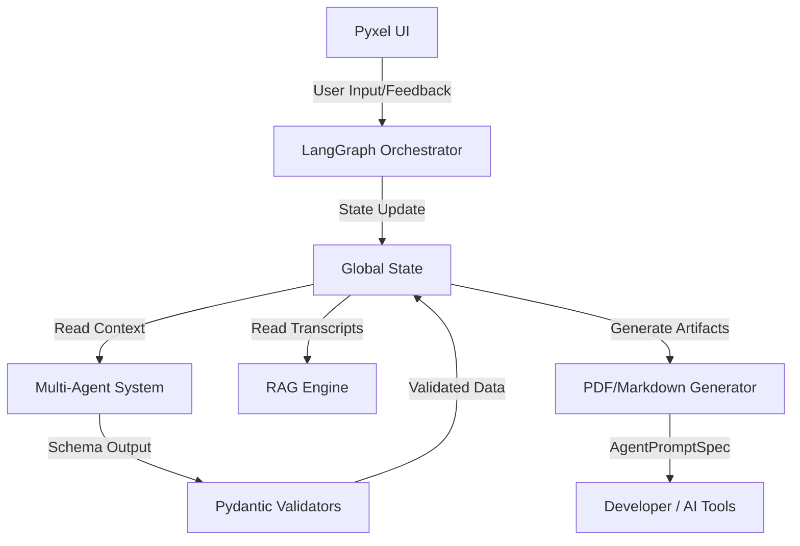

# System Architecture for The JTC 2.0 (Remastered Edition)

## 1. Summary
"The JTC 2.0" is a cutting-edge multi-agent simulation platform designed to accelerate new business creation within Traditional Japanese Companies (JTCs). The system simulates internal corporate politics, facilitates rigorous customer-problem fit analysis, and automatically generates comprehensive specifications for Minimum Viable Products (MVPs). This remastered version drastically reduces AI hallucination by enforcing strict Pydantic schemas across a sequential "Chain of Thought" workflow. The ultimate output is a perfect, deterministic prompt specification (`AgentPromptSpec.md`) that can be used directly by autonomous AI coding agents (such as Cursor or Windsurf) to generate UI.

## 2. System Design Objectives
The primary design objectives of the JTC 2.0 Remastered Edition are:
- **Zero Hallucination:** Implement a strict, schema-driven approach (using Pydantic with `extra="forbid"`) to guarantee that the AI agents follow a deterministic and logical "Chain of Thought" without skipping critical business validation steps.
- **Seamless Integration with Existing Architecture:** Extend the current multi-agent LangGraph orchestrator and UI (Pyxel) to accommodate the new business models (Value Proposition Canvas, Mental Model Diagrams, Customer Journeys, etc.) without rewriting the core framework.
- **De-identification of Criticism:** Maintain the Pyxel-based retro UI to decouple harsh agent feedback from the user's emotional attachment, ensuring psychological safety during the "Gekizume" (harsh feedback) simulations.
- **Executable Outputs:** Shift the final system output from direct API-based UI generation (e.g., v0.dev) to generating universal, perfectly structured Markdown prompts (`AgentPromptSpec`) that can drive any modern AI code generator.
- **Human-in-the-Loop (HITL) Governance:** Interleave human feedback gates at crucial validation steps, using generated PDF artifacts and visual "Approval Stamp" (Hanko) animations to provide clear progress indicators and opportunities for course correction.
- **Scalability and Observability:** Ensure the system leverages strict type hinting, robust testing, and full observability through LangSmith tracing to monitor multi-agent interactions and prevent infinite loops or token wastage.

## 3. System Architecture
The system employs a modular, event-driven architecture orchestrated by LangGraph, integrating various AI models, a vector store for RAG, and a Pyxel frontend.

### Boundary Management and Separation of Concerns
1. **Frontend (Pyxel UI):** Strictly handles user interaction and visual feedback (e.g., the Hanko stamp). It does not contain any business logic or LLM orchestration.
2. **Orchestrator (LangGraph):** Manages the state machine and the routing of information between agents. It acts as the single source of truth for the workflow.
3. **Domain Models (Pydantic):** All data passed between nodes must conform to strict Pydantic schemas. This layer ensures data integrity and forces the "Chain of Thought."
4. **Agents (LLM Wrappers):** Each agent has a single, well-defined role (e.g., CPO, Hacker, Hustler) and operates only on the schemas provided to it. Agents cannot bypass the schema requirements.
5. **Data Layer (RAG/Vector Store):** Handles the ingestion and retrieval of user interview transcripts securely.


```mermaid
graph TD
    UI[Pyxel UI] -->|User Input/Feedback| Orchestrator[LangGraph Orchestrator]
    Orchestrator -->|State Update| State[Global State]
    State -->|Read Context| Agents[Multi-Agent System]
    Agents -->|Schema Output| Validators[Pydantic Validators]
    Validators -->|Validated Data| State
    State -->|Read Transcripts| RAG[RAG Engine]
    State -->|Generate Artifacts| Outputs[PDF/Markdown Generator]
    Outputs -->|AgentPromptSpec| EndUser[Developer / AI Tools]
```

## 4. Design Architecture
The file structure focuses on a clear separation between core logic, domain models, and agents.

```ascii
.
├── src/
│   ├── agents/             # Logic for specialized agents (Virtual Customer, 3H)
│   ├── core/               # LangGraph orchestration, settings, nodes
│   ├── data/               # RAG ingestion and vector store management
│   ├── domain_models/      # Strict Pydantic schemas
│   ├── tools/              # External integrations (Tavily, etc.)
│   ├── ui/                 # Pyxel interfaces and visual effects
│   └── main.py             # Application entry point
```

### Domain Models Extension Strategy
The new schema objects extend the existing domain objects additively. The existing `GlobalState` will be augmented to include the new models as optional fields or integrated into the phased progression.
- `ValuePropositionCanvas` builds upon the initial problem definition in the `LeanCanvas`.
- `MentalModelDiagram` and `AlternativeAnalysis` enrich the `Persona` model.
- `CustomerJourney` and `SitemapAndStory` translate the abstract business logic into concrete user flows.
- `ExperimentPlan` and `AgentPromptSpec` replace the legacy direct API call models, acting as the final, comprehensive outputs derived from the accumulated context.

## 5. Implementation Plan
The development will be executed in 6 distinct, sequential cycles.

### Cycle 01: Core Domain Models & Schemas Setup
Define all new Pydantic models (ValuePropositionCanvas, MentalModelDiagram, AlternativeAnalysis, CustomerJourney, SitemapAndStory, ExperimentPlan, AgentPromptSpec) in `src/domain_models/`. Ensure `extra="forbid"` is enforced. Extend the existing `GlobalState` to hold these new objects.

### Cycle 02: Phase 1 & 2 Workflow Integration (CPF)
Implement Step 1 through Step 5 of the new workflow in the LangGraph setup (`src/core/nodes.py` and `graph.py`). Integrate the generation of the Value Proposition Canvas and related early-stage validation artifacts. Introduce the first HITL gate.

### Cycle 03: Phase 3 Workflow Integration (PSF)
Implement Step 6 and Step 7. Focus on generating the Mental Model, Customer Journey, and Sitemap/Wireframes. Ensure the outputs from Cycle 2 are correctly passed as context to the agents generating these new models. Implement the second HITL gate.

### Cycle 04: Virtual Customer & 3H Review Agents
Implement Step 8 through Step 10. Develop the new prompt logic for the Virtual Customer and the 3H Review Agents (Hacker, Hipster, Hustler). Ensure these agents strictly adhere to the context generated in the previous cycles and do not hallucinate new features.

### Cycle 05: Output Generation & AgentPromptSpec
Implement Step 11 through Step 13. Develop the logic to aggregate all previously generated context and output the final `AgentPromptSpec.md` and `ExperimentPlan`. Update the Builder Agent's role to focus on this output rather than direct API calls.

### Cycle 06: UI Updates & PDF Artifact Generation
Implement the new Pyxel visual effects (the "Hanko" approval stamp) and the background generation of PDF artifacts. Integrate these visual cues with the HITL gates to provide a cohesive and engaging user experience. Ensure LangSmith tracing is fully functional.

## 6. Test Strategy
Testing will focus on deterministic outputs and strict schema validation, ensuring zero side-effects during execution.

### Cycle 01 Testing
- **Unit Tests:** Verify that all new Pydantic models reject invalid data and extra fields. Check that validation rules (e.g., string lengths) are strictly enforced.

### Cycle 02 Testing
- **Integration Tests:** Mock the LLM responses to return valid JSON matching the new schemas. Verify that the LangGraph state updates correctly after Steps 1-5 and that the HITL gate interrupts the flow as expected.

### Cycle 03 Testing
- **Integration Tests:** Continue testing the state progression through Phase 3, ensuring context from Phase 2 is correctly passed to the prompts. Mock LLM calls and verify the `MentalModelDiagram` and `SitemapAndStory` objects are correctly instantiated.

### Cycle 04 Testing
- **Unit & Integration Tests:** Test the specific prompt generation logic for the Virtual Customer and 3H agents. Ensure that specific criteria (like budget constraints or technical limitations) trigger the expected negative feedback or revisions in the mocked responses.

### Cycle 05 Testing
- **E2E Tests:** Run a complete, mocked workflow from start to finish. Verify that the final `AgentPromptSpec.md` and `ExperimentPlan` files are generated in a temporary directory and contain the aggregated information correctly formatted.

### Cycle 06 Testing
- **Unit Tests:** Test the PDF generation logic in isolation using mock data to ensure layouts render correctly without requiring actual LLM calls.
- **Manual/UAT Tests:** Verify the Pyxel UI animations (Hanko stamp) trigger at the correct workflow stages and that the interface remains responsive.