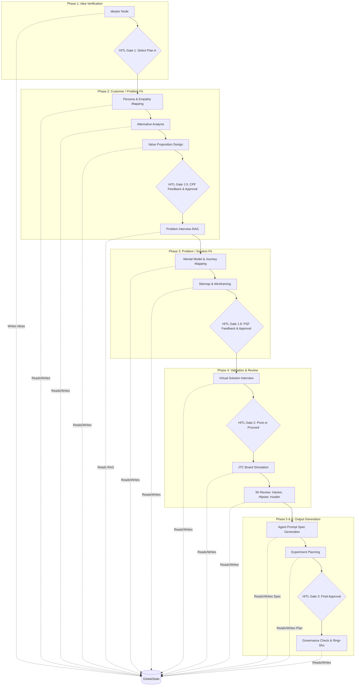

# SYSTEM ARCHITECTURE

## 1. Summary
The JTC 2.0 (Remastered Edition) is an advanced, paradigm-shifting multi-agent simulation system meticulously designed to streamline, elevate, and accelerate the new business creation process within Traditional Japanese Companies (JTCs). By employing a rigorous simulation platform powered by state-of-resolving Large Language Models (LLMs), the system maps the entrepreneurial journey from Customer-Problem Fit (CPF) to Problem-Solution Fit (PSF). It eliminates logical leaps, ensuring a structured progression without hallucinations. The ultimate system output has been redefined to generate a flawless prompt specification document (`AgentPromptSpec.md`) alongside a comprehensive MVP Experiment Plan. These artefacts are primed for seamless ingestion by any autonomous AI coding agent, such as Cursor, Windsurf, or Google Antigravity, thereby functioning as an ultimate, future-proof requirements definition engine.

## 2. System Design Objectives

The core objectives of The JTC 2.0 (Remastered Edition) system design revolve around addressing the profound challenges faced by intrapreneurs within Traditional Japanese Companies (JTCs). Navigating the convoluted corridors of corporate innovation often results in the premature death of highly promising business ideas due to rigid internal politics, a lack of customer-centric validation, and the sheer inertia of existing operational paradigms. Consequently, the primary goal of this architecture is to establish a safe, highly realistic, and rigorously structured simulation environment where new ideas can be pressure-tested against both virtual corporate stakeholders and simulated market realities before any actual capital or political goodwill is expended.

A foundational constraint of this system is the absolute necessity to eliminate AI hallucinations and logical leaps. In conventional generative AI applications, models often jump prematurely from a vague problem statement to a highly detailed but fundamentally flawed solution. To counteract this, our design strictly enforces a "Schema-Driven Generation" approach. Every single step of the cognitive process—from empathising with the persona to defining the final application architecture—is governed by strict Pydantic models. This ensures that the AI's Chain of Thought is explicitly documented, structurally validated, and logically coherent. The AI is structurally prohibited from suggesting a technical feature unless it directly addresses a validated customer pain point identified in preceding analytical steps. This constraint ensures that the output is not just plausible, but strategically sound and empirically justifiable based on the ingested context.

Another paramount objective is to decouple the system from any specific proprietary UI generation API. While earlier iterations relied directly on external services like v0.dev to produce interface code, this system aims to be universally applicable and resilient against the rapid churn of frontend development tools. Therefore, the goal is to produce an exceptionally detailed, universally understood Markdown specification (`AgentPromptSpec.md`). This document must contain all necessary context—ranging from the underlying psychological mental models of the target user to strict routing rules and component states—so that any modern AI coding assistant can accurately implement the Minimum Viable Product (MVP). This objective ensures the longevity and adaptability of the system.

Furthermore, the system is constrained by the necessity to maintain psychological safety for the user. Corporate critique, even when simulated, can be demoralising. To mitigate this, the architecture mandates the preservation of the "Pyxel" retro 16-colour RPG graphical user interface. This specific design choice serves a crucial psychological function: it de-identifies the critique. By presenting harsh feedback from virtual executives (like the Finance Manager or Sales Manager) as pixelated dialogue within a gamified environment, the user can process the information objectively without personal defensiveness. This constraint is non-negotiable, as it directly impacts user engagement and the effectiveness of the learning experience.

Success criteria for this architecture are rigorously defined. Firstly, the system must successfully execute the entire workflow from the initial Idea Verification phase through to the Output Generation phase without a single validation error in the Pydantic schemas. Secondly, the generated `AgentPromptSpec.md` must be sufficiently detailed that a human developer or an AI coding agent can reproduce the intended MVP without requiring any supplementary contextual clarification. Thirdly, the system must demonstrate additive integration with the existing legacy codebase. It must effectively reuse existing domain models, such as the `GlobalState` and `MVP` definitions, extending them intelligently rather than replacing them outright. Finally, the system must successfully generate intermediate PDF artefacts, complete with the iconic digital "approval" stamp (Hanko), effectively simulating the traditional JTC bureaucratic process while providing tangible checkpoints for Human-in-the-Loop (HITL) feedback. Ultimately, the system design must prove that rigorous software engineering principles and advanced AI orchestration can harmoniously coexist to foster genuine corporate innovation.

## 3. System Architecture

The architecture of The JTC 2.0 (Remastered Edition) is built upon a robust, multi-agent orchestration framework utilising LangGraph. This architecture is specifically designed to handle complex, multi-step cognitive workflows that require state persistence, iterative refinement, and human intervention. At its core, the system models the innovation journey as a directed acyclic graph (with controlled cyclic loops for refinement), where each node represents a distinct phase of business validation, and the edges define the strict schema-driven transitions between these phases. This approach ensures that the systemic flow of information is both predictable and auditable.

The primary orchestrator is the LangGraph engine, which manages a unified `GlobalState` object. This state object acts as the central repository for all contextual data generated throughout the simulation. As the workflow progresses through the nodes—from the `ideator_node` to the `spec_generation_node`—each specialized AI agent interacts with this state. Crucially, agents do not communicate directly with one another in an unstructured manner. Instead, they read the required context from the `GlobalState`, perform their designated cognitive tasks (constrained by their specific system prompts), and output a strictly typed Pydantic object, which is then merged back into the state. This design paradigm effectively decouples the agents, allowing for independent scaling, testing, and modification of individual cognitive steps without disrupting the entire workflow.


```mermaid
graph TD
    subgraph Phase 1: Idea Verification
        A[Ideator Node] --> B{HITL Gate 1: Select Plan A}
    end

    subgraph Phase 2: Customer / Problem Fit
        B --> C[Persona & Empathy Mapping]
        C --> D[Alternative Analysis]
        D --> E[Value Proposition Design]
        E --> F{HITL Gate 1.5: CPF Feedback & Approval}
        F --> G[Problem Interview RAG]
    end

    subgraph Phase 3: Problem / Solution Fit
        G --> H[Mental Model & Journey Mapping]
        H --> I[Sitemap & Wireframing]
        I --> J{HITL Gate 1.8: PSF Feedback & Approval}
    end

    subgraph Phase 4: Validation & Review
        J --> K[Virtual Solution Interview]
        K --> L{HITL Gate 2: Pivot or Proceed}
        L --> M[JTC Board Simulation]
        M --> N[3H Review: Hacker, Hipster, Hustler]
    end

    subgraph Phase 5 & 6: Output Generation
        N --> O[Agent Prompt Spec Generation]
        O --> P[Experiment Planning]
        P --> Q{HITL Gate 3: Final Approval}
        Q --> R[Governance Check & Ringi-Sho]
    end

    State[(GlobalState)]

    A -.->|Writes Ideas| State
    C -.->|Reads/Writes| State
    D -.->|Reads/Writes| State
    E -.->|Reads/Writes| State
    G -.->|Reads RAG| State
    H -.->|Reads/Writes| State
    I -.->|Reads/Writes| State
    K -.->|Reads/Writes| State
    M -.->|Reads/Writes| State
    N -.->|Reads/Writes| State
    O -.->|Reads/Writes Spec| State
    P -.->|Reads/Writes Plan| State
    R -.->|Reads/Writes| State
```

**Explicit Rules on Boundary Management and Separation of Concerns:**

1.  **Strict State Encapsulation:** The `GlobalState` is the sole source of truth. Individual nodes or agents must never maintain their own parallel states or cache domain data internally. All read operations must pull from the most current `GlobalState`, and all write operations must return data that the LangGraph orchestrator then merges into the state. This rule prevents state synchronization bugs and ensures that the workflow can be paused, serialized, and resumed seamlessly.
2.  **Schema-First Data Boundaries:** Every transition between major phases (e.g., from Customer-Problem Fit to Problem-Solution Fit) must be mediated by a rigorously defined Pydantic model with `extra="forbid"`. An agent responsible for generating the UI Sitemap must not attempt to alter the Persona definition. The inputs and outputs of every LangGraph node are strictly bound to these schemas, ensuring that errors are caught at the boundary before they propagate downstream.
3.  **UI/Logic Decoupling:** The backend cognitive engine (LangGraph and the LLMs) must remain entirely agnostic of the presentation layer. The Pyxel retro UI serves merely as a passive observer and renderer of the `GlobalState`. The backend must never generate Pyxel-specific drawing commands or coordinate data. Instead, it emits generic event objects or state updates, which the UI layer independently interprets to render the pixelated dialogue, visual layout, and the iconic dynamic red "approval" stamp (Hanko) animations.
4.  **External Integration Isolation:** All interactions with external services, such as the Tavily Search API or the LLM endpoints, must be encapsulated within dedicated service classes or tools (e.g., within `src/tools/`). Business logic nodes must never instantiate HTTP clients directly. They must rely on dependency injection or factory methods to access these services. This ensures that external dependencies can be easily mocked during testing and that network failures do not leak unhandled exceptions into the core simulation workflow.
5.  **Human-in-the-Loop (HITL) Gatekeeping:** User feedback must be channelled explicitly through designated HITL gates. When the system halts for approval, the user's input is ingested, validated, and explicitly logged within the `GlobalState` before the workflow is allowed to resume. The system must not accept out-of-band modifications to the state while a node is actively processing data.

## 4. Design Architecture

The design architecture of The JTC 2.0 (Remastered Edition) is firmly rooted in Domain-Driven Design (DDD) principles, meticulously crafted to ensure high cohesion and low coupling. Given the complexity of simulating both corporate governance and the entrepreneurial journey, the codebase is structured to clearly delineate between the core business logic, the definition of domain entities, the orchestration of the workflow, and the external interfaces. This structure is paramount for maintaining scalability and facilitating future enhancements without compromising the integrity of the existing systems.

**File Structure Overview**
```ascii
.
├── src/
│   ├── agents/             # Intelligent Agent Implementations (Ideator, CPO, Personas, Builder)
│   ├── core/               # Core Orchestration and Configuration
│   │   ├── nemawashi/      # Consensus Building Logic (Existing)
│   │   ├── simulation.py   # LangGraph Workflow Definition
│   │   ├── nodes.py        # LangGraph Node Functions
│   │   └── config.py       # Pydantic Settings and Configuration
│   ├── data/               # RAG Engine and Data Ingestion
│   ├── domain_models/      # Pydantic Schemas (The Core Domain)
│   │   ├── enums.py        # Shared Enumerations
│   │   ├── state.py        # GlobalState Definition
│   │   ├── mvp.py          # Existing MVP Models
│   │   ├── canvas.py       # (NEW) ValuePropositionCanvas, MentalModelDiagram, etc.
│   │   └── spec.py         # (NEW) AgentPromptSpec, ExperimentPlan
│   ├── tools/              # External API Integrations (Tavily, LLM wrappers)
│   ├── ui/                 # Pyxel Renderer and Visual Elements
│   └── main.py             # CLI Entry Point
├── tests/                  # Comprehensive Test Suite (Unit, Integration, UAT)
├── dev_documents/          # Project Specifications and Architectural Prompts
└── pyproject.toml          # Dependency and Linter Configuration
```

**Core Domain Pydantic Models and Extension Strategy**

The foundation of the system rests upon the `src/domain_models/` directory. The existing architecture successfully utilized models like `GlobalState` and `MVP` to manage the lifecycle of a business idea. The remastering process mandates a strictly additive extension of these models to incorporate the new, rigorous Chain of Thought requirements without breaking existing functionality.

We will introduce new schema definitions, such as `canvas.py` and `spec.py`, which will house the complex structures defined in the `ALL_SPEC.md` document. For example, the `ValuePropositionCanvas` model will rigorously define the `CustomerProfile` and `ValueMap`, ensuring that every pain point has a corresponding pain reliever. The `MentalModelDiagram` will codify the underlying psychological towers that drive user behaviour. These new schemas are not isolated; they will be integrated into the existing `GlobalState` defined in `state.py`.

The `GlobalState` class will be expanded to include optional fields for these new models (e.g., `value_proposition: ValuePropositionCanvas | None = None`, `agent_prompt_spec: AgentPromptSpec | None = None`). This additive approach ensures backwards compatibility; nodes that operate on the older, simpler paradigms can continue to function, while the new LangGraph nodes will incrementally populate these highly structured fields as the workflow progresses.

**Class and Function Definitions Overview**

The intelligence of the system resides within the `src/agents/` and `src/core/nodes.py` modules. The `Virtual Customer` agent, for instance, will be implemented as a class that inherits from a base `Agent` protocol, equipped with specific prompt templates that forcibly inject the newly defined `MentalModelDiagram` and `AlternativeAnalysis` into its context window. This guarantees that the agent's feedback is grounded in the established persona.

The `Builder Agent` will undergo a significant role transformation. Previously tasked with directly calling external UI generation APIs, its logic will be rewritten to focus on data aggregation and formatting. It will implement functions designed to extract the `UserStory`, `Sitemap`, and `StateMachine` data from the `GlobalState` and compile them into the final, comprehensive `AgentPromptSpec` markdown string.

Furthermore, the `ui/` layer will be enhanced with a new service, perhaps `pdf_generator.py`, responsible for listening to state changes at the Human-in-the-Loop gates. When a new canvas model (like the `CustomerJourney`) is successfully validated and added to the state, this service will translate the Pydantic model into a visually formatted PDF document. Simultaneously, the core Pyxel loop will be updated to trigger the dynamic red "approval" stamp (Hanko) animation, visually signalling the successful completion of a rigorous validation phase. This clean separation ensures that the complex PDF generation logic does not clutter the game loop, maintaining the performance and responsiveness of the retro interface.

## 5. Implementation Plan

The development of The JTC 2.0 (Remastered Edition) is strategically decomposed into exactly six sequential implementation cycles. This phased approach guarantees that foundational schemas and basic workflows are solidly established and thoroughly verified before more complex agent orchestrations and final output generation mechanisms are introduced. This strategy minimizes integration risks and provides clear, testable milestones throughout the project lifecycle.

### Cycle 01: Foundational Schema and State Extension
The primary objective of the first implementation cycle is to establish the rigorous, schema-driven foundation upon which the entire remastered workflow will operate. This phase is strictly focused on data modeling and state management; no complex agent logic or LangGraph node definitions will be implemented here. The goal is to define the exact data structures (`pydantic.BaseModel` with `extra="forbid"`) required to eliminate AI hallucinations globally across the system.

We will define new modules to house the explicit schemas demanded by `ALL_SPEC.md`. In `src/domain_models/canvas.py`, we will define:
*   `ValuePropositionCanvas` (encompassing `CustomerProfile` and `ValueMap`)
*   `MentalModelDiagram` (encompassing `MentalTower`)
*   `AlternativeAnalysis` (encompassing `AlternativeTool`)
*   `CustomerJourney` (encompassing `JourneyPhase` and evaluating `-5` to `5` emotion scores)

Simultaneously, we will create `src/domain_models/spec.py` to house the output-oriented models:
*   `SitemapAndStory` (encompassing `Route` and `UserStory`)
*   `ExperimentPlan` (encompassing `MetricTarget` for AARRR metrics)
*   `AgentPromptSpec` (encompassing `StateMachine` states: success, loading, error, empty)

Crucially, the interface boundary for integration is `src/domain_models/state.py`. We will extend `GlobalState` additively. New fields (e.g., `value_proposition`, `mental_model`, `agent_prompt_spec`) will be added as `Optional` types, initialized to `None`. This guarantees backwards compatibility with existing logic while laying the groundwork for subsequent cycles. The cycle concludes when the entire suite of models validates successfully via unit tests.

### Cycle 02: Core Verification Nodes and HITL Gates (Phase 1 & 2)
Building upon the solid schema foundation, Cycle 02 implements the initial nodes for Phase 1 (Idea Verification) and Phase 2 (Customer/Problem Fit), effectively covering Steps 1 through 4 and the first major HITL gates from the spec.

First, we will implement **Step 1: `ideator_node`**. Utilizing the Tavily Search API, this node will generate 10 "Good Crazy" LeanCanvas models. We will implement **HITL Gate 1**, pausing the LangGraph state to allow the user to select the "Plan A".

Next, we implement the sequential Chain of Thought:
*   **Step 2: `persona_node`** - Generates the high-resolution `Persona` and Empathy Map.
*   **Step 3: `alternative_analysis_node`** - Evaluates existing tools to output the `AlternativeAnalysis` schema (identifying the "10x Value").
*   **Step 4: `vpc_node`** - Receives the Alternative Analysis as explicit input to structurally align Pain Relievers with specific Pains, outputting the `ValuePropositionCanvas`.

A critical architectural component introduced here is the integration boundary for **HITL Gate 1.5 - CPF Feedback**. We will configure the LangGraph orchestrator to `interrupt` the workflow after Step 4. We will create a `pdf_generator_service` that reads the validated models from `GlobalState` and outputs them as a formatted PDF to the local file system. Simultaneously, the Pyxel UI (polling the state) will detect the phase completion and trigger the visual "Approval" (Hanko) stamp animation. The node will resume only upon receiving structured string feedback from the user.

### Cycle 03: RAG Integration and Problem/Solution Fit (Phase 3)
Cycle 03 bridges the gap to Problem/Solution Fit by implementing Steps 5 through 7 and their corresponding HITL gates. It grounds the AI's conceptual assumptions with real-world data and translates them into structural UI mapping.

First, we implement **Step 5: `transcript_ingestion_node`**. This integrates the existing RAG engine (LlamaIndex). The CPO agent will query the vectorized user transcripts to perform a strict "Mom Test" fact-check against the `ValuePropositionCanvas` generated in Cycle 02. Contradictions will be logged in the state.

Following validation, we build the cognitive mapping nodes:
*   **Step 6: `mental_model_journey_node`** - Synthesizes the Persona, VPC, and RAG findings into the `MentalModelDiagram` and `CustomerJourney` schemas. The prompt must strictly enforce the linkage between customer actions and the underlying psychological `MentalTower`.
*   **Step 7: `sitemap_wireframe_node`** - Identifies the "worst pain phase" from the journey to output the `SitemapAndStory` schema, defining the `UserStory` and required application routes without generating any final UI code.

The cycle concludes with the implementation of **HITL Gate 1.8 - PSF Feedback**. Following the established pattern from Cycle 02, the LangGraph will interrupt, the PDF generator will output the Mental Model and Sitemap, the Pyxel UI will display the "Approval" stamp, and the system will wait for user refinement of the features and story before proceeding to the adversarial simulation phase.

### Cycle 04: Advanced Agent Validation and Review (Phase 4)
Cycle 04 implements Phase 4 (Validation & Review), executing Steps 8 through 10. This transforms the system into a rigorous corporate stress-testing environment by instantiating specialized adversarial agents.

The core implementation begins with **Step 8: `virtual_customer_node`**. We will engineer the `Virtual Customer` agent prompt to strictly adopt the Persona and Mental Model stored in the `GlobalState`. The agent will critique the Sitemap based on the switching costs defined in the Alternative Analysis. We will implement **HITL Gate 2**, where the user reviews this feedback to either pivot or proceed.

Next, we integrate the existing simulation engine for **Step 9: `jtc_simulation_node`** (The JTC Board), where the virtual Finance and Sales Managers interrogate the unit economics and viability.

This is followed by the new **Step 10: `3h_review_node`**. We will instantiate three distinct agents: Hacker (technical feasibility), Hipster (UX friction), and Hustler (unit economics).

A mandatory architectural requirement for this cycle is the implementation of Observability and Circuit Breakers. We will enable LangSmith tracing to monitor these complex multi-agent interactions. We will build strict moderation logic (`max_turns` and regex-based repetitive phrase detection) to forcibly terminate loops (e.g., agents endlessly agreeing), summarize findings, and safely advance the workflow to prevent API exhaustion and infinite hangs.

### Cycle 05: Output Specification Generation (Phase 5)
Cycle 05 overhauls the system's output mechanism, shifting the Builder Agent away from direct v0.dev API calls towards generating a universal technical specification. This implements Step 11.

We will build the new **Step 11: `spec_generation_node`**. The Builder Agent's logic will be rewritten to focus on data aggregation and "subtraction thinking" (removing non-essential features). It will ingest the entire `GlobalState` context (Persona, VPC, Journey, Sitemap, 3H Review feedback) and synthesize it into the definitive `AgentPromptSpec` Pydantic model.

The interface boundary here requires sophisticated prompt engineering to guarantee the output is universally applicable to any AI coding assistant (Cursor, Windsurf, etc.). The agent must explicitly output the `StateMachine` (loading, success, error, empty), strict routing constraints, validation rules, and crucially, an accurate Mermaid flowchart syntax block defining state transitions. This step finalizes the core technical deliverable, ensuring the generated requirements definition document is robust, unambiguous, and entirely free of logical hallucinations.

### Cycle 06: Experiment Planning, Governance, and Final UI Polish (Phase 6)
The final cycle, Cycle 06, implements Phase 6, executing Steps 12, 13, and the final review gates. This ensures the system produces actionable real-world execution plans and satisfies simulated corporate governance requirements.

We begin with **Step 12: `experiment_planning_node`**. This node processes the final solution to generate the `ExperimentPlan` schema, detailing actionable AARRR metrics, the riskiest assumption, and clear pivot conditions.

Following this, we implement **Step 13: `governance_node`**. This leverages existing logic to format the entire journey into a formal Japanese "Ringi-Sho" approval document, updating the `GlobalState`.

The culmination of the system is the implementation of **HITL Gate 3 - Final Output FB**. We finalize the `pdf_generator_service` to compile both the `AgentPromptSpec.md` and the `EXPERIMENT_PLAN.md` into highly polished markdown documents and corresponding PDFs, saving them directly to the user's local directory. The Pyxel UI logic will be updated to trigger the final, most prominent "Approval" stamp animation, signalling the successful conclusion of the JTC simulation workflow. Exhaustive End-to-End (E2E) integration testing will be conducted in "Mock Mode" to guarantee the entire 14-step workflow (Steps 1-13 + HITL gates) executes flawlessly without schema validation failures.

## 6. Test Strategy

The testing strategy for The JTC 2.0 (Remastered Edition) is designed to be as rigorous and structured as the application code itself. Given the inherent unpredictability of LLMs, our testing philosophy relies heavily on deterministic unit testing of the Pydantic schemas, comprehensive mocking of external API calls to guarantee side-effect-free execution during CI/CD, and strategic end-to-end (E2E) testing to validate the complex state transitions within the LangGraph orchestrator.

### Cycle 01 Test Strategy: Foundational Schema and State Extension
The testing focus for Cycle 01 is entirely on the structural integrity and validation logic of the newly introduced Pydantic domain models. We must guarantee that it is impossible to instantiate an invalid state or a logically flawed canvas within the system.

We will develop a comprehensive suite of unit tests utilizing the `pytest` framework. For every new model defined in `src/domain_models/canvas.py` and `src/domain_models/spec.py` (e.g., `ValuePropositionCanvas`, `MentalModelDiagram`, `AgentPromptSpec`), we will write explicit tests covering both standard valid instantiations and deliberately malformed inputs. We will test the bounds of string lengths, the enforcement of required fields, and the strict rejection of undefined attributes due to the `extra="forbid"` configuration.

Crucially, we must test the custom validation logic. For example, we will create test cases that intentionally supply a `CustomerJourney` where the `emotion_score` falls outside the permitted -5 to 5 range, asserting that the correct `ValidationError` is raised. We will verify that the `GlobalState` can successfully serialize and deserialize these complex nested models, ensuring data persistence mechanisms will function correctly in later phases. These tests will be executed entirely in memory, requiring no external API calls, ensuring lightning-fast execution and absolute determinism. This phase establishes the impenetrable data boundary upon which all subsequent logic relies.

### Cycle 02 Test Strategy: Core Verification Nodes and Hitl Gates (Phase 1 & 2)
Testing Cycle 02 introduces the complexity of LLM interactions and asynchronous state pauses. The primary goal is to verify that the LangGraph nodes can process inputs and successfully transition the state, without actually incurring the cost or variability of hitting real OpenAI or Tavily endpoints during routine automated testing.

We will heavily employ `unittest.mock` to intercept and substitute all external API calls. For the `persona_node` and `vpc_node`, we will mock the LLM response generation function to return pre-defined, perfectly formatted JSON strings that adhere strictly to our Pydantic schemas. The unit tests will then assert that the nodes correctly parse these mocked responses, instantiate the domain models, and accurately update the `GlobalState` object.

The testing of the Human-in-the-Loop (HITL) gates requires a specialized approach. We will simulate the interruption of the LangGraph execution. We will write integration tests that trigger the node, verify that execution halts and enters a "waiting for input" state, and check that the appropriate PDF generation function is called. To prevent file system side-effects and clutter during test execution, all PDF generation tests will utilize Python's `tempfile` module or an in-memory file system representation. We will then programmatically inject a mocked user feedback string into the state and assert that the graph execution resumes correctly, processing the simulated feedback appropriately.

### Cycle 03 Test Strategy: RAG Integration and Problem/Solution Fit (Phase 3)
Cycle 03 testing must address the complexities of vector database operations and the synthesis of highly complex, multi-faceted data models. The strategy involves isolating the RAG retrieval logic from the LLM synthesis logic to pinpoint potential points of failure accurately.

For the RAG integration, we will avoid requiring actual customer transcripts or local vector stores during automated testing. Instead, we will mock the `LlamaIndex` retrieval interface. We will define mock vector search results—both supportive and contradictory to the tested Value Proposition. We will then test the `transcript_ingestion_node` and the CPO agent's fact-checking logic to ensure they correctly interpret these mocked retrieval results and flag contradictions appropriately within the state.

Testing the `mental_model_journey_node` requires verifying complex prompt construction. Since this node synthesizes multiple large contexts, we will write tests that assert the generated prompt string correctly includes the Persona, VPC, and RAG findings before it is sent to the mocked LLM. We will verify that the resulting `CustomerJourney` accurately links to the defined `MentalTowers`. The `sitemap_wireframe_node` will be tested similarly, ensuring that the mocked LLM output correctly identifies the worst pain phase and translates it into a valid `SitemapAndStory` structure. As in Cycle 02, all file I/O operations related to the HITL gate PDF generation will be strictly confined to temporary directories, guaranteeing zero side-effects on the host development environment.

### Cycle 04 Test Strategy: Advanced Agent Validation and Review (Phase 4)
Testing the adversarial multi-agent interactions in Cycle 04 is the most challenging aspect of the quality assurance process. The strategy must ensure that agents behave according to their distinct personas and that the orchestration engine correctly manages complex, potentially infinite conversational loops without hanging the test suite or consuming excessive resources.

We will unit test the `Virtual Customer` agent by providing it with carefully crafted, mocked `GlobalState` contexts. We will assert that the prompt generated for the agent strictly enforces its persona and the defined switching costs. We will mock the LLM to return both highly positive and aggressively negative feedback, testing the system's ability to parse and record these diverse reactions accurately.

To test the multi-agent `3H Review` (Hacker, Hipster, Hustler) and the simulated JTC Board, we must validate the circuit breaker and moderation logic. We will construct tests that mock the LLM to intentionally generate repetitive or non-productive conversational loops (e.g., repeatedly outputting "I agree, let's proceed" without finalizing the required schema). We will assert that the system correctly identifies this pattern, triggers the circuit breaker mechanism, gracefully terminates the loop, and advances the workflow state without raising unhandled exceptions or causing indefinite hangs. This ensures the system remains robust and cost-effective even when the underlying AI behaves unpredictably.

### Cycle 05 Test Strategy: Output Specification Generation (Phase 5)
The testing strategy for Cycle 05 is laser-focused on the quality, completeness, and formatting of the final system output. The critical imperative is to ensure that the Builder Agent's transformation of the entire aggregated context into the final `AgentPromptSpec` is flawless, deterministic, and perfectly formatted for external AI tools.

We will construct highly complex, mocked `GlobalState` objects that represent a fully completed, perfectly validated journey through all preceding phases. We will then execute the `spec_generation_node` against this state, mocking the final LLM call to return a comprehensive JSON structure representing the `AgentPromptSpec`.

The unit tests will rigorously evaluate the resulting specification. We will assert the presence and correctness of the `StateMachine` definition, ensuring all required states (loading, success, error, empty) are populated. We will validate that the generated routing constraints and validation rules are present and logically consistent with the input context. Crucially, we will implement specific assertions to verify the structural integrity of the generated Mermaid flowchart syntax, ensuring it correctly maps the state transitions without syntax errors that would break external rendering engines. By meticulously verifying every attribute of the output model, we guarantee the reliability of the system's ultimate deliverable.

### Cycle 06 Test Strategy: Experiment Planning, Governance, and Final UI Polish (Phase 6)
The final testing cycle comprehensively validates the operational outputs and ensures the end-to-end user experience operates flawlessly. This strategy involves validating the generation of business-critical documents and performing full-system integration tests to simulate a complete user journey.

We will unit test the `experiment_planning_node` by verifying that the generated `ExperimentPlan` contains valid AARRR metrics and clearly defined pivot conditions based on mocked LLM responses. For the `governance_node`, we will assert that the final Ringi-Sho document correctly aggregates data from the entire lifecycle, ensuring financial metrics and approval histories are accurately represented.

Finally, we will construct an extensive suite of End-to-End (E2E) integration tests. These tests will utilize a specialized "Mock Mode" that simulates the entire LangGraph workflow from command-line invocation to the generation of the final Markdown files. In this mode, all LLM API calls, Tavily searches, and Pyxel UI rendering commands will be comprehensively mocked. We will programmatically inject pre-defined user feedback at every simulated HITL gate. The success criterion for these E2E tests is the flawless execution of the entire 14-step workflow, resulting in the correct generation of all required PDF and Markdown files within a designated temporary output directory, without a single schema validation failure or unhandled exception. This guarantees the holistic stability and reliability of the remastered architecture.