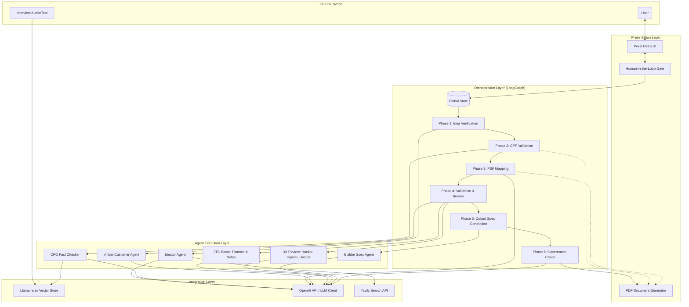

# System Architecture: The JTC 2.0 (Remastered Edition)

## 1. Summary

The "JTC 2.0 (Remastered Edition)" represents a multi-agent simulation platform designed to modernise and streamline the creation of new businesses within traditional Japanese enterprises. The previous architecture, although capable of simulating political resistance and generating initial Minimum Viable Products (MVPs), suffered from artificial intelligence "hallucinations" and an over-reliance on a single UI generation application programming interface (API).

This Remastered Edition refines the core methodology, adopting a rigorous, schema-driven approach that completely eliminates contextual leaps. It achieves this by forcing the Language Learning Model (LLM) to populate Pydantic models in a sequential "Chain of Thought" pipeline. The ultimate objective is no longer the direct deployment of code via v0.dev, but the generation of an impeccable "AgentPromptSpec.md" and a precise "Experiment Plan". These artefacts are universally compatible with autonomous coding agents such as Cursor, Windsurf, or Google Antigravity. Consequently, the JTC 2.0 platform functions as an enduring, universally applicable requirements definition engine.

The architecture strictly maintains the "脱同一化" (De-identification) strategy via a Pyxel-based retro user interface, adding visual "Approval" (Ringi-sho stamp) mechanisms at key transition gates to enhance user engagement.

## 2. System Design Objectives

The core objectives of the JTC 2.0 Remastered architecture revolve around predictability, strict type enforcement, and user psychological safety.

Firstly, the system must categorically eliminate AI hallucinations. Large Language Models frequently skip essential logical steps when tasked with generating complex systems from rudimentary ideas. To counteract this, the system enforces a strict "Customer Problem Fit" (CPF) to "Problem Solution Fit" (PSF) pipeline. Every node within the LangGraph orchestrator must output data that conforms exactly to tightly constrained Pydantic `BaseModel` schemas with `extra="forbid"`. This configuration guarantees that the LLM cannot invent unsupported features or hallucinate data fields. By validating every intermediate artefact—from the Empathy Map to the Value Proposition Canvas and the Customer Journey—the system ensures a mathematically sound progression of ideas.

Secondly, the system must remain completely agnostic to the final code generation tool. The previous iteration was tightly coupled to the v0.dev API, leading to potential vendor lock-in and reduced flexibility. The Remastered Edition pivots to a strategy of generating a universal standard specification. The system must aggregate all validated business logic, mental models, and user journeys into a comprehensive Markdown document (`MVP_PROMPT_SPEC.md`). This document must be structured to provide maximum context to any external, third-party AI coding assistant. This approach significantly increases the longevity and utility of the JTC 2.0 platform.

Thirdly, the system must safeguard the user's emotional wellbeing through a strategy of "De-identification". Innovation within traditional corporate structures often involves harsh, personal criticism. The JTC 2.0 platform simulates this environment, but it must ensure the user does not take the AI's rejections personally. To achieve this, the architecture deliberately retains the 16-colour, low-resolution Pyxel graphical user interface. This retro aesthetic abstracts the brutal feedback from the "Virtual Customer" and "JTC Board" agents, framing the experience as a role-playing game. Furthermore, the system must introduce a new Human-in-the-Loop (HITL) approval mechanism. When a complex schema is successfully generated, the system must render an animated "Approval Stamp" (Hanko) in the Pyxel interface, whilst simultaneously exporting a high-resolution PDF for the user to review. This gamification of the bureaucratic process creates a sense of accomplishment and progression.

Finally, the system must ensure rigorous observability. Given the complexity of the multi-agent debates (such as the 3H Review and the JTC Board Simulation), the risk of infinite loops or excessive token consumption is high. The architecture must mandate the use of LangSmith for complete trace integration. Additionally, robust circuit breakers must be implemented to monitor the dialogue state, detecting repetitive patterns and forcing termination if agents reach a deadlock. This is critical for controlling operational costs and maintaining system stability.

## 3. System Architecture

The overarching system architecture relies on LangGraph to orchestrate a complex, multi-stage workflow. The architecture is divided into clear boundary layers to ensure the Separation of Concerns (SoC).

At the core is the **Orchestration Layer** (LangGraph), which dictates the sequential execution of the six primary phases. It manages the `GlobalState`, passing strictly validated Pydantic models between the various agent nodes. The state is immutable during execution and is only updated via clearly defined state reducers.

Beneath the Orchestration Layer is the **Agent Execution Layer**. This layer contains the specific AI personas (Ideator, Virtual Customer, Finance Manager, Sales Manager, Hacker, Hipster, Hustler, and Builder). These agents do not possess direct access to the global state; instead, they receive specific, scoped contexts. Crucially, they are explicitly instructed to never generate ideas from scratch. They must strictly inherit the output of previous nodes. For instance, the Virtual Customer agent can only critique the product based on the precise `MentalModelDiagram` and `AlternativeAnalysis` generated in the prior phase.

The **Integration Layer** manages external API communications. This includes the OpenAI client for LLM inference, the Tavily client for market research, and the local Vector Store (LlamaIndex) for retrieving customer interview transcripts. All external calls must be wrapped in generic, decoupled interfaces.

The **Presentation Layer** consists of the Pyxel-based User Interface and the PDF Document Generator. The Pyxel UI operates asynchronously, rendering the simulation state and providing the Human-in-the-Loop feedback mechanism. The Document Generator converts the complex Pydantic models into readable Markdown and PDF formats for user review.

**Boundary Management Rules:**
1. **Strict Dependency Injection**: Agents must not instantiate external clients (e.g., LLM APIs, Search APIs) directly. All dependencies must be passed via interfaces during node creation.
2. **State Isolation**: The Pyxel UI must never directly modify the `GlobalState`. It strictly reads from the state to render visuals and sends specific command objects back to the Orchestration Layer to trigger state transitions (e.g., proceeding through a HITL gate).
3. **No Direct I/O in Nodes**: Graph nodes must not write directly to the file system. All file operations (e.g., generating PDFs or the `AgentPromptSpec.md`) must be handled by a dedicated `FileService` utilizing atomic operations to prevent corruption.


```mermaid
graph TD
    subgraph "External World"
        User(User)
        Transcripts[Interview Audio/Text]
    end

    subgraph "Presentation Layer"
        PyxelUI[Pyxel Retro UI]
        PDFGen[PDF Document Generator]
        HITLGate[Human-in-the-Loop Gate]
    end

    subgraph "Integration Layer"
        RAG[LlamaIndex Vector Store]
        LLM[OpenAI API / LLM Client]
        Search[Tavily Search API]
    end

    subgraph "Orchestration Layer (LangGraph)"
        GlobalState[(Global State)]
        Phase1[Phase 1: Idea Verification]
        Phase2[Phase 2: CPF Validation]
        Phase3[Phase 3: PSF Mapping]
        Phase4[Phase 4: Validation & Review]
        Phase5[Phase 5: Output Spec Generation]
        Phase6[Phase 6: Governance Check]
    end

    subgraph "Agent Execution Layer"
        IdeatorAgent[Ideator Agent]
        CPOAgent[CPO Fact Checker]
        VirtualCustomer[Virtual Customer Agent]
        JTCBoard[JTC Board: Finance & Sales]
        Review3H[3H Review: Hacker, Hipster, Hustler]
        BuilderAgent[Builder Spec Agent]
    end

    User <--> PyxelUI
    PyxelUI <--> HITLGate
    HITLGate --> GlobalState
    Transcripts --> RAG

    GlobalState --> Phase1
    Phase1 --> IdeatorAgent
    IdeatorAgent --> Search
    IdeatorAgent --> LLM

    Phase1 --> Phase2
    Phase2 --> CPOAgent
    CPOAgent --> RAG
    CPOAgent --> LLM

    Phase2 --> Phase3
    Phase3 --> LLM

    Phase3 --> Phase4
    Phase4 --> VirtualCustomer
    Phase4 --> JTCBoard
    Phase4 --> Review3H
    VirtualCustomer --> LLM
    JTCBoard --> LLM
    Review3H --> LLM

    Phase4 --> Phase5
    Phase5 --> BuilderAgent
    BuilderAgent --> LLM

    Phase5 --> Phase6
    Phase6 --> PDFGen
    Phase6 --> LLM

    Phase2 -.-> PDFGen
    Phase3 -.-> PDFGen

```

## 4. Design Architecture

The project structure is designed around Domain-Driven Design (DDD) principles, segregating domain logic from infrastructure and presentation concerns.

```ascii
.
├── src/
│   ├── agents/
│   │   ├── base.py
│   │   ├── personas.py
│   │   ├── ideator.py
│   │   ├── cpo.py
│   │   ├── virtual_customer.py  # New
│   │   ├── review_3h.py         # New
│   │   └── builder.py           # Refactored
│   ├── core/
│   │   ├── config.py
│   │   ├── constants.py
│   │   ├── exceptions.py
│   │   ├── factory.py
│   │   ├── graph.py             # LangGraph definitions
│   │   ├── nodes.py             # Individual node implementations
│   │   ├── simulation.py
│   │   └── services/
│   │       ├── file_service.py  # Atomic operations
│   │       └── pdf_service.py   # New
│   ├── data/
│   │   └── rag.py
│   ├── domain_models/
│   │   ├── common.py
│   │   ├── canvas_models.py     # New models (VPC, Journey, etc.)
│   │   ├── enums.py
│   │   ├── lean_canvas.py
│   │   ├── state.py             # Extended GlobalState
│   │   └── validators.py
│   ├── ui/
│   │   ├── renderer.py
│   │   └── components/          # Pyxel UI modules
│   └── main.py
```

### Domain Models Extension Strategy

The core integration requirement is the seamless addition of the new schema models without compromising the integrity of the existing `GlobalState`. The existing `src/domain_models/state.py` defines `GlobalState`. We will extend this object by appending the newly required fields while preserving the existing ones.

The new schemas will be housed in a dedicated module, such as `src/domain_models/canvas_models.py`. These include:

1.  **ValuePropositionCanvas**: Encompasses `CustomerProfile` and `ValueMap`.
2.  **MentalModelDiagram**: Comprises multiple `MentalTower` instances.
3.  **AlternativeAnalysis**: Tracks `AlternativeTool` and calculates switching costs.
4.  **CustomerJourney**: Defines a list of `JourneyPhase` objects.
5.  **SitemapAndStory**: Maps application routing via `Route` and specifies the `UserStory`.
6.  **ExperimentPlan**: Outlines `MetricTarget` objects for the AARRR funnel.
7.  **AgentPromptSpec**: The ultimate output model, defining the `StateMachine` and validation rules.

All new models will inherit from `pydantic.BaseModel` and mandate `model_config = ConfigDict(extra="forbid")`.

Within `src/domain_models/state.py`, the `GlobalState` will be updated to include Optional fields for these new models:

```python
class GlobalState(BaseModel):
    # ... existing fields ...
    value_proposition: ValuePropositionCanvas | None = None
    mental_model: MentalModelDiagram | None = None
    alternative_analysis: AlternativeAnalysis | None = None
    customer_journey: CustomerJourney | None = None
    sitemap_and_story: SitemapAndStory | None = None
    experiment_plan: ExperimentPlan | None = None
    agent_prompt_spec: AgentPromptSpec | None = None
```

This additive approach ensures that previous test suites relying on `GlobalState` will not break, as the new fields are optional until explicitly populated by the new pipeline phases.

## 5. Implementation Plan

The project is rigorously divided into exactly six sequential implementation cycles. Each cycle delivers a complete, testable increment of functionality.

### Cycle 1: Domain Models and Configuration Baseline

**Objective:** Establish the foundational schema and environment necessary for the Remastered pipeline, ensuring absolute type safety.

**Tasks:**
1.  Implement the new Pydantic models (`ValuePropositionCanvas`, `MentalModelDiagram`, `AlternativeAnalysis`, `CustomerJourney`, `SitemapAndStory`, `ExperimentPlan`, `AgentPromptSpec`) in `src/domain_models/canvas_models.py`.
2.  Configure all models with `extra="forbid"` and implement strict field validators (e.g., ensuring `emotion_score` in `JourneyPhase` is between -5 and 5).
3.  Update the `GlobalState` in `src/domain_models/state.py` to seamlessly incorporate these new models as Optional fields.
4.  Enhance `src/core/config.py` to mandate LangSmith configuration. The environment variables `LANGCHAIN_TRACING_V2` and `LANGCHAIN_API_KEY` must be validated.
5.  Create a robust `FileService` capable of cross-platform atomic writes to prevent file corruption during generation.

### Cycle 2: Phase 1 & 2 - Ideation to Customer Problem Fit (CPF)

**Objective:** Construct the initial pipeline phases that move an idea from conception to a validated problem space using strict Chain of Thought.

**Tasks:**
1.  Refactor the existing Ideator agent to output ideas that align with the required context format.
2.  Implement the `persona_node` to generate a high-resolution Persona and Empathy Map based on the chosen idea.
3.  Develop the `alternative_analysis_node` to forcefully evaluate existing workarounds and explicitly calculate the "10x Value" threshold.
4.  Construct the `vpc_node` to map the Pain/Gain profile against the proposed solutions.
5.  Integrate the `transcript_ingestion_node` (existing RAG) and connect it to a refactored CPO Agent to fact-check the generated VPC against real interview data.
6.  Implement the first Human-in-the-Loop (HITL) pause mechanism, halting the graph execution to await user feedback on the CPF artifacts.

### Cycle 3: Phase 3 - Problem Solution Fit (PSF) Mapping

**Objective:** Translate the validated problem into a precise behavioral model and functional specification without jumping straight to user interfaces.

**Tasks:**
1.  Develop the `mental_model_journey_node`. This node takes the validated persona and generates the internal "Mental Towers".
2.  Implement the logic to map these towers into a chronological `CustomerJourney`, explicitly identifying the phase with the highest "Pain".
3.  Construct the `sitemap_wireframe_node`. This node must extract a single, core `UserStory` from the highest-pain journey phase and translate it into a textual, structural wireframe (excluding visual design).
4.  Implement the second HITL gate, allowing the user to review the journey and textual wireframes, providing instructions to cut unnecessary features (subtraction thinking).

### Cycle 4: Phase 4 - Validation and 3H Review Simulation

**Objective:** Subject the strictly defined specifications to aggressive, multi-agent critique to validate both business viability and technical feasibility.

**Tasks:**
1.  Create the `Virtual Customer` agent. This agent must be instantiated using the previously generated `Persona` and `MentalModelDiagram` as its core system prompt. It will aggressively critique the wireframes.
2.  Integrate the existing `JTC Board Simulation` (Finance and Sales managers) to review the `AlternativeAnalysis` for Return on Investment (ROI) and market cannibalization.
3.  Develop the `3H Review Agents` (Hacker, Hipster, Hustler).
4.  Orchestrate the `3h_review_node`. Ensure the Hacker focuses on technical debt, the Hipster on UX friction, and the Hustler on unit economics.
5.  Implement circuit-breaker logic utilizing `Settings` parameters to detect and terminate infinite debate loops or excessive token usage during these simulations.

### Cycle 5: Phase 5 & 6 - Output Generation and UI Integration

**Objective:** Finalize the artifact generation and integrate the Pyxel-based approval rendering.

**Tasks:**
1.  Transform the `Builder Agent`. Instead of calling the v0.dev API, it must now consume the entire context (VPC, Journey, 3H Feedback) and populate the `AgentPromptSpec` Pydantic model.
2.  Develop the `experiment_planning_node` to generate the `ExperimentPlan` detailing the AARRR metrics and pivot conditions.
3.  Construct the Markdown formatting service to translate the `AgentPromptSpec` and `ExperimentPlan` into beautifully formatted Markdown documents (`MVP_PROMPT_SPEC.md`, `EXPERIMENT_PLAN.md`).
4.  Integrate the Pyxel UI modifications. Implement the visual "Approval Stamp" animation that triggers when each HITL gate is successfully passed.
5.  Implement the PDF generation pipeline to convert the intermediate Pydantic canvases into human-readable PDFs for the user to review during HITL pauses.

### Cycle 6: Final Refinement, Observability, and UAT

**Objective:** Polish the system, ensure strict compliance with architectural constraints, and validate the end-to-end user experience.

**Tasks:**
1.  Conduct a comprehensive review of all LangGraph nodes to ensure `NodeExecutor.execute()` wrappers are correctly implemented for consistent error boundaries.
2.  Verify that all dynamically created functions use `functools.partial` to prevent late-binding closure bugs.
3.  Audit the `FileService` usage to confirm all Markdown and PDF outputs utilize secure, atomic filesystem writes.
4.  Execute the comprehensive User Acceptance Test (UAT) suite utilizing the Marimo notebook (`UAT_AND_TUTORIAL.py`).
5.  Generate the final test execution log (`test_execution_log.txt`) as Proof of Work, ensuring `pytest`, `ruff`, and `mypy` run entirely without errors.

## 6. Test Strategy

The testing strategy prioritizes strict isolation and side-effect-free execution, ensuring the massive LangGraph structure can be validated thoroughly without incurring excessive API costs or corrupting local filesystems.

### Cycle 1: Domain Models Testing

**Strategy:** Unit testing focused entirely on Pydantic schema validation.
**Execution:** Tests will instantiate all new canvas models using both valid and intentionally invalid data sets. We will explicitly test boundary conditions (e.g., lists exceeding maximum lengths, string constraints). Critically, we will assert that passing extraneous fields raises `pydantic.ValidationError` due to the `extra="forbid"` configuration. No external APIs or file I/O are required.

### Cycle 2: CPF Pipeline Integration

**Strategy:** Isolated node testing utilizing heavily mocked dependencies.
**Execution:** We will use `unittest.mock.patch` to mock the LLM client (`src.core.llm.LLMFactory.get_llm`). We will inject predetermined JSON strings that perfectly match the expected Pydantic schemas. The test will execute the `ideator_node`, `persona_node`, and `vpc_node` sequentially, verifying that the output of one node is correctly appended to the `GlobalState` and correctly ingested by the subsequent node.

### Cycle 3: PSF Mapping and Graph Flow

**Strategy:** State reducer and transition testing.
**Execution:** We will test the LangGraph state transitions. By mocking the LLM responses to simulate different HITL feedback inputs, we will verify that the graph routes to the correct subsequent nodes. We will utilize temporary directories (`tempfile.TemporaryDirectory`) to safely test the intermediate output of the textual wireframes, ensuring no permanent files are written during the test suite execution.

### Cycle 4: Multi-Agent Simulation Validation

**Strategy:** Testing circuit breakers, token limits, and agent prompt injection.
**Execution:** We will mock the LLM to return specific phrase patterns designed to trigger the circuit breakers (e.g., simulating a deadlock where agents continuously output "I disagree"). We will assert that the simulation safely aborts and raises the appropriate custom exception. We will also inspect the mocked LLM calls to ensure the Virtual Customer agent correctly receives the previously generated `MentalModelDiagram` in its system prompt.

### Cycle 5: Output Generation and File I/O

**Strategy:** Testing the `FileService` and rendering logic.
**Execution:** We will utilize temporary files and `unittest.mock` to simulate concurrent write attempts to the `MVP_PROMPT_SPEC.md` file. We will assert that the `FileService` successfully utilizes file locking (e.g., `fcntl.flock`) to prevent partial writes. The Markdown formatting logic will be unit-tested to ensure it correctly sanitizes any HTML characters generated by the LLM using `bleach.clean` to prevent injection attacks.

### Cycle 6: End-to-End System UAT

**Strategy:** Executable tutorials and full pipeline simulation.
**Execution:** The primary testing artifact will be the Marimo notebook (`tutorials/UAT_AND_TUTORIAL.py`). This notebook will be executed in a "Mock Mode" where a special mock LLM class returns pre-defined, successful schema responses for the entire 14-step workflow. The test will verify that the graph runs from start to finish, that all required Pydantic models are populated in the final state, and that the final specification files exist in the designated output directory. This confirms the system operates seamlessly as a single, cohesive unit.
