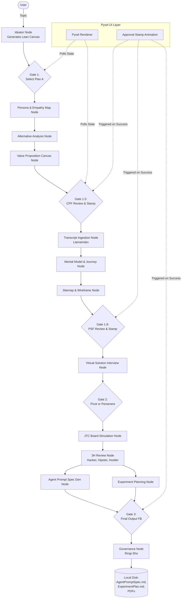

    ## 1. Summary
    The JTC 2.0 is an advanced multi-agent simulation platform designed to accelerate and validate new business creation within Traditional Japanese Companies (JTCs). The Remastered Edition elevates the platform from a simple UI generation tool to a rigorous, schema-driven "requirements definition engine." By enforcing a strict Chain of Thought process through Pydantic models—ranging from Empathy Maps to Alternative Analyses, Value Proposition Canvases, Mental Model Diagrams, Customer Journeys, and Sitemap/User Stories—the system entirely eliminates AI hallucinations. The ultimate output is no longer a direct API call to a UI generator, but rather a perfect, universal `AgentPromptSpec.md` and an `ExperimentPlan`, capable of driving any modern autonomous AI coding agent (e.g., Cursor, Windsurf) to build exactly what the validated customer needs.

## 2. System Design Objectives

The architectural design of The JTC 2.0 (Remastered Edition) is driven by several critical objectives aimed at ensuring robustness, accuracy, and enterprise readiness. These principles guide the technical implementation of all agents and data structures.

Firstly, **Hallucination Elimination via Schema-Driven Generation**. The primary constraint in previous iterations was the AI's tendency to jump from high-level abstract ideas straight to concrete solution features without logical grounding. To counter this, the new architecture mandates strict, incremental generation using `pydantic.BaseModel` configured with `extra="forbid"`. Each LangGraph node produces a specific, validated artefact (e.g., `ValuePropositionCanvas`, `CustomerJourney`). The output of one node becomes the strict input of the next. This unbroken chain of Pydantic schemas mathematically guarantees that every proposed feature traces back to a validated customer pain point, preventing the AI from hallucinating unneeded functionality.

Secondly, **Universal Agent Output over Vendor Lock-in**. Previously, the system was tightly coupled to specific UI generation APIs like v0.dev. This design objective shifts the paradigm to act as a universal requirements engine. The system's final output must be `AgentPromptSpec.md`—a comprehensive, structured Markdown file containing site maps, state machines, user stories, and Mermaid flowcharts. This decoupling ensures the platform remains future-proof, generating outputs that can be fed into any state-of-the-art coding agent (such as Cursor, Windsurf, or Google Antigravity).

Thirdly, **Additive Evolution and Component Reuse**. The system must integrate the new "Fitness Journey" workflow (Customer/Problem Fit to Problem/Solution Fit) seamlessly into the existing architecture. Existing core elements—such as the LangGraph state orchestration within `GlobalState`, the RAG ingestion mechanism for interview transcripts inside the `transcript_ingestion_node`, the Nemawashi influence network analysis, and the Pyxel-based retro UI renderer—must be preserved and safely extended, not rewritten from scratch. New nodes will be smoothly inserted into the existing `StateGraph` in `src/core/graph.py`, and new Pydantic models will be added to `src/domain_models/` without breaking the current simulation logic.

Fourthly, **Human-in-the-Loop (HITL) and Gamified Observability**. Enterprise business validation is not fully automatable; human judgment is essential. The architecture requires clear interruption points (HITL Gates) where human users can review the generated schemas (presented as generated PDFs) and provide steering feedback. To maintain the psychological safety of the user during harsh AI reviews from agents like the Virtual Customer, the Pyxel 16-colour retro UI is maintained. A new "Approval Stamp" (赤いハンコ) mechanic is introduced: upon successful validation of a schema at a HITL gate, a satisfying stamp animation plays on the Pyxel screen, turning a tedious review process into a gamified, rewarding experience.

Finally, **Strict Boundary Management and Performance Optimization**. The system must strictly separate concerns: data models (`domain_models`), AI agent logic (`agents`), state orchestration (`core.graph`), and presentation (`ui`). Furthermore, infinite loops during agent debates or API usage must be prevented using strict circuit breakers, hard limits on LangGraph recursion depths, and LangSmith tracing for full observability. Memory safety is paramount; unbound lists are restricted, and large transcript data must be handled via lazy iterators or batched chunking. The continuous integration of these objectives ensures that the software architecture remains robust, scalable, and entirely resilient to the unpredictable nature of generative artificial intelligence models operating within enterprise environments. This structured, methodical approach significantly mitigates execution risks, aligning the technical output precisely with the strategic business goals defined by the human operators during the initial project phases.

## 3. System Architecture

The architecture relies on LangGraph for state orchestration, Pydantic for data validation, and Pyxel for the user interface. The core flow is a sequential pipeline of multi-agent nodes, interrupted by defined Human-in-the-Loop (HITL) gates.

### Boundary Management and Separation of Concerns
1.  **State Management (`GlobalState`)**: Acts as the single source of truth for the entire application. All data passed between agents must exist within `GlobalState` and adhere to strict Pydantic schemas. Agents do not communicate directly with one another; they read from and write to the state object.
2.  **Agent Nodes (`src/agents/`)**: Pure functions (or small isolated classes) that receive the current state, invoke an LLM, parse the output into a specific Pydantic model, and return a state update dictionary. They contain no UI rendering or database connection logic.
3.  **UI/Renderer (`src/ui/`)**: The Pyxel simulation loop is strictly decoupled from the LangGraph execution. It polls the state (or receives events) to render visuals. It cannot mutate the state directly except through explicitly defined user input mechanisms at HITL gates.
4.  **Domain Models (`src/domain_models/`)**: Contain all business logic validations (e.g., ensuring a `CustomerJourney` has a `worst_pain_phase` and that phases are ordered correctly). They do not know about LLMs, HTTP requests, or LangGraph.

### Data Flow and System Components
The system executes a comprehensive "Fitness Journey" workflow. Initially, the user inputs a topic via the command line. The `ideator_node` queries Tavily for market trends and generates ideas, and the user selects one (Gate 1). The system then invokes the `persona_node` to generate a Persona and Empathy Map. This is followed by the `alternative_analysis_node` to evaluate current solutions. Next, the `vpc_node` constructs a Value Proposition Canvas to ensure Customer/Problem Fit.

Crucially, real-world data is injected via `transcript_ingestion_node` (RAG) using LlamaIndex, which the Virtual Customer and CPO agents use to validate the generated schemas against reality. The system then invokes the `mental_model_journey_node` to construct the user's belief towers and map their Customer Journey to locate the deepest pain point. A Sitemap and User Story are generated in the `sitemap_wireframe_node` for Problem/Solution Fit.

The JTC Board simulation (`jtc_simulation_node`) and the 3H Review (`3h_review_node`) then aggressively stress-test the concept from business, technical, and UX perspectives. Finally, the system generates the ultimate `AgentPromptSpec.md` and `ExperimentPlan.md`. This clear demarcation of boundaries allows developers to maintain, extend, and independently test each sub-component without risking the stability of the orchestrating graph or introducing subtle timing bugs into the user interface rendering layer. The separation also facilitates parallel development cycles, drastically reducing the overall time to market.


```mermaid
graph TD
    User([User]) --> |Topic| Ideator[Ideator Node<br>Generates Lean Canvas]
    Ideator --> HITL1{Gate 1:<br>Select Plan A}

    HITL1 --> Persona[Persona & Empathy Map Node]
    Persona --> AltAnalysis[Alternative Analysis Node]
    AltAnalysis --> VPC[Value Proposition Canvas Node]

    VPC --> HITL1_5{Gate 1.5:<br>CPF Review & Stamp}

    HITL1_5 --> RAG[Transcript Ingestion Node<br>LlamaIndex]
    RAG --> MentalModel[Mental Model & Journey Node]
    MentalModel --> Sitemap[Sitemap & Wireframe Node]

    Sitemap --> HITL1_8{Gate 1.8:<br>PSF Review & Stamp}

    HITL1_8 --> VirtualCust[Virtual Solution Interview Node]
    VirtualCust --> HITL2{Gate 2:<br>Pivot or Persevere}

    HITL2 --> JTC[JTC Board Simulation Node]
    JTC --> ThreeH[3H Review Node<br>Hacker, Hipster, Hustler]

    ThreeH --> SpecGen[Agent Prompt Spec Gen Node]
    ThreeH --> ExpPlan[Experiment Planning Node]

    SpecGen --> HITL3{Gate 3:<br>Final Output FB}
    ExpPlan --> HITL3

    HITL3 --> Gov[Governance Node<br>Ringi-Sho]
    Gov --> FileSystem[(Local Disk:<br>AgentPromptSpec.md,<br>ExperimentPlan.md,<br>PDFs)]

    subgraph "Pyxel UI Layer"
        UI[Pyxel Renderer]
        Stamp[Approval Stamp Animation]
    end

    UI -.-> |Polls State| HITL1
    UI -.-> |Polls State| HITL1_5
    Stamp -.-> |Triggered on Success| HITL1_5
    Stamp -.-> |Triggered on Success| HITL1_8
    Stamp -.-> |Triggered on Success| HITL3
```

## 4. Design Architecture

The system extends the existing codebase by introducing new Pydantic models and LangGraph nodes, while preserving the existing `GlobalState` structure as the central anchor.

### File Structure Overview
```ascii
.
├── src/
│   ├── agents/
│   │   ├── ideator.py          # Existing: Generates LeanCanvas
│   │   ├── personas.py         # Extended: Virtual Customer logic
│   │   ├── cpo.py              # Existing: Mom Test validation
│   │   ├── three_h.py          # NEW: Hacker, Hipster, Hustler review logic
│   │   ├── spec_builder.py     # NEW: Generates AgentPromptSpec & ExperimentPlan
│   │   └── ...
│   ├── core/
│   │   ├── graph.py            # Extended: Adding new nodes and HITL gates
│   │   ├── simulation.py       # Existing: JTC Board execution
│   │   ├── pdf_generator.py    # NEW: Utility to generate PDF reports
│   │   └── ...
│   ├── data/
│   │   └── rag.py              # Existing: Transcript ingestion
│   ├── domain_models/
│   │   ├── common.py
│   │   ├── state.py            # Extended: GlobalState incorporates new schemas
│   │   ├── canvas_models.py    # NEW: ValuePropositionCanvas, AlternativeAnalysis
│   │   ├── journey_models.py   # NEW: MentalModelDiagram, CustomerJourney
│   │   ├── spec_models.py      # NEW: SitemapAndStory, ExperimentPlan, AgentPromptSpec
│   │   └── ...
│   └── ui/
│       ├── renderer.py         # Extended: Pyxel UI
│       ├── stamps.py           # NEW: Approval stamp animation logic
│       └── ...
```

### Core Domain Pydantic Models & Integration

The new schema objects will be carefully integrated into the existing `src/domain_models/state.py` within the `GlobalState` object. To prevent unnecessary bloat and to support the sequential progression of the workflow, these new fields will be typed as `Optional` and instantiated sequentially as the LangGraph transitions through the nodes.

1.  **`ValuePropositionCanvas`**: Extends the business logic by linking a `CustomerProfile` (detailing Customer Jobs, Pains, and Gains) with a `ValueMap` (detailing Products, Pain Relievers, and Gain Creators) to calculate and validate a `fit_evaluation` string.
2.  **`MentalModelDiagram`**: Defines `MentalTower` objects representing underlying customer beliefs and their associated cognitive tasks. This model strictly maps the psychological reasons why users behave the way they do in specific scenarios.
3.  **`AlternativeAnalysis`**: Defines `AlternativeTool` entities that represent existing solutions in the market. It calculates the `switching_cost` and asserts a `ten_x_value` proposition required to persuade a user to switch.
4.  **`CustomerJourney`**: A sequential list of `JourneyPhase` objects. Crucially, it must identify exactly one `worst_pain_phase` which subsequently becomes the primary target for the MVP specification.
5.  **`SitemapAndStory`**: Replaces the old direct API UI generation logic. It contains explicit `Route` definitions mapping paths to purposes, and a strict `UserStory` linked exclusively to the aforementioned `worst_pain_phase`.
6.  **`ExperimentPlan`**: Contains `MetricTarget` objects to rigorously define AARRR (Acquisition, Activation, Retention, Referral, Revenue) metrics and hard pivot conditions for real-world testing.
7.  **`AgentPromptSpec`**: The ultimate aggregation structure. It encapsulates the sitemap, the core user story, routing constraints, a `StateMachine` for frontend UI states (Loading, Success, Error, Empty), and Mermaid flowcharts representing the application logic.

**Integration into `GlobalState`**:
```python
class GlobalState(BaseModel):
    # ... existing fields (phase, topic, generated_ideas, messages, transcripts, etc.) ...

    # New Remastered Fields
    value_proposition: ValuePropositionCanvas | None = None
    alternative_analysis: AlternativeAnalysis | None = None
    mental_model: MentalModelDiagram | None = None
    customer_journey: CustomerJourney | None = None
    sitemap_and_story: SitemapAndStory | None = None
    experiment_plan: ExperimentPlan | None = None
    agent_prompt_spec: AgentPromptSpec | None = None
```
The modularity provided by these distinct files guarantees that changes to one specific data model do not inadvertently trigger regression failures across unrelated components of the platform. This encapsulation simplifies ongoing maintenance.

## 5. Implementation Plan

The development is strictly divided into exactly 6 sequential implementation cycles to ensure stable, iterative progress and continuous integration.
### Cycle 01: Core Domain Schemas & State Extension

To ensure the absolute integrity of our data layer, the first cycle is devoted entirely to establishing the Pydantic schemas that will enforce the schema-driven generation architecture. We begin by creating `src/domain_models/canvas_models.py`. This file must define `ValuePropositionCanvas`, breaking it down into `CustomerProfile` and `ValueMap`. The `CustomerProfile` must explicitly list `customer_jobs`, `pains`, and `gains` as strongly typed string lists, ensuring that the foundational user research is captured accurately. The `ValueMap` must parallel this with `products_and_services`, `pain_relievers`, and `gain_creators`, establishing a direct link between what the product offers and what the customer needs. A custom `@model_validator` will be implemented here to ensure the `fit_evaluation` logically connects the profile to the map, rejecting any generative output where the pain relievers do not address the stated pains.

Simultaneously, we define the `AlternativeAnalysis` schema to capture competitive market forces. This requires defining an `AlternativeTool` class tracking `financial_cost`, `time_cost`, and `ux_friction`. The parent `AlternativeAnalysis` model will use these individual tool evaluations to synthesize an aggregate `switching_cost` and a compelling `ten_x_value` proposition. This forces the LLM to justify why a user would ever leave their current, familiar toolset, grounding the business model in economic reality rather than speculative optimism.

Next, we create `src/domain_models/journey_models.py`. This introduces the deeply psychological component via the `MentalModelDiagram`, constructed from individual `MentalTower` instances representing core beliefs and the cognitive tasks that flow from them. The `CustomerJourney` model will rely on `JourneyPhase` definitions, tracking emotional scores (-5 to 5) and specific pain points at each touchpoint. A critical validation step here is ensuring that exactly one phase is flagged as the `worst_pain_phase`, as this singular point of friction dictates the entire MVP scope for the remainder of the simulation.

The final schema file, `src/domain_models/spec_models.py`, translates the validated business logic into actionable technical specifications. It defines `SitemapAndStory`, containing strict `Route` paths and `UserStory` definitions. The overarching `AgentPromptSpec` will encapsulate these alongside a strict `StateMachine` definition for UI interactions (Loading, Success, Error, Empty), leaving no room for the final coding agent to hallucinate arbitrary loading screens or missing error boundaries.

Finally, the core `GlobalState` located in `src/domain_models/state.py` must be updated. We will introduce optional fields for each of these new canvases (`value_proposition`, `mental_model`, etc.). By making them `Optional`, we allow the state to organically build up and accumulate context as the LangGraph transitions from node to node. We will utilize Pydantic's `ConfigDict(extra="forbid")` globally across these models to strictly prevent any hallucinated metadata from contaminating the workflow. This rigorous, strongly-typed foundation is an absolutely non-negotiable prerequisite for the Remastered Edition's success.

### Cycle 02: CPF (Customer/Problem Fit) Nodes & PDF Generation

Building upon the solid data foundation established in Cycle 01, this cycle focuses on operationalizing the Customer/Problem Fit (CPF) generation nodes and establishing the critical Human-in-the-Loop (HITL) visual feedback mechanisms that characterize the Remastered workflow.

We start by implementing the `persona_node` within `src/agents/personas.py`. This node will extract the `selected_idea` (the `LeanCanvas` object) from the `GlobalState`, format it into a specialized prompt instructing the LLM to think deeply about demographics and psychographics, and invoke the LLM using LangChain's `with_structured_output` method, binding the output directly to our `Persona` schema. This ensures the output is immediately parseable and validated.

Following this, the `alternative_analysis_node` is constructed. This function assesses the generated persona's current methodologies, prompting the LLM to populate the `AlternativeAnalysis` schema. The prompt will explicitly instruct the AI to calculate the UX friction and financial switching costs associated with moving away from legacy tools like Excel or pen-and-paper. The AI must logically justify the `ten_x_value` required to overcome this friction.

The core business logic of this cycle culminates in the `vpc_node`, which synthesizes the outputs of the previous two nodes to generate the `ValuePropositionCanvas`. This node is mathematically constrained to ensure that every proposed 'Pain Reliever' explicitly addresses a documented 'Pain'. If the LLM generates a feature that doesn't solve a stated problem, the Pydantic validator from Cycle 01 will reject it, forcing a regeneration and maintaining the purity of the Chain of Thought.

Crucially, we must facilitate comfortable human oversight. To achieve this, we will develop `src/core/pdf_generator.py`, a utility service leveraging a library such as ReportLab or PyFPDF. This service will ingest the populated Pydantic models from the state and compile them into highly readable, visually structured PDF documents, saving them to a local `/outputs/canvas/` directory so the user can review the AI's reasoning offline or share it with stakeholders.

Simultaneously, we integrate the first HITL gate (Gate 1.5) into the primary LangGraph definition in `src/core/graph.py`. We achieve this by adding `vpc_node` to the `interrupt_after` configuration of the `StateGraph.compile()` method, pausing the execution engine entirely.

To manage the psychological aspect of the simulation and provide dopamine-driven feedback, we update the Pyxel interface in `src/ui/stamps.py`. We will implement a visual rendering routine that draws a large, red "Approval" (承認) hanko stamp animation on the screen. This animation will be triggered via an event listener specifically when the LangGraph successfully resumes execution from Gate 1.5, gamifying the tedious business validation process and providing the user with immediate, satisfying visual confirmation that the CPF phase is complete.

### Cycle 03: PSF (Problem/Solution Fit) Nodes & Integration

Cycle 03 bridges the vast conceptual gap between understanding the customer's core problem and proposing a concrete software solution, an phase known as Problem/Solution Fit (PSF). This involves deeply psychological modeling and strict wireframe bounding to prevent feature creep and scope bloat.

We will implement the `mental_model_journey_node`. This sophisticated node requires a highly advanced prompt engineering strategy. It must ingest the previously validated `ValuePropositionCanvas` and `Persona` from the state, and instruct the LLM to deduce the underlying cognitive architectures—the 'Towers of Belief'—that subconsciously drive the persona's behavior. Once these towers are constructed via the `MentalModelDiagram` schema, the node sequentially builds the `CustomerJourney`. The most critical technical constraint applied here is that the LLM must evaluate the emotional scores across all `JourneyPhase` objects and algorithmically designate the single phase with the lowest score as the `worst_pain_phase`.

With the pain precisely localized, we implement the `sitemap_wireframe_node`. This node receives the `worst_pain_phase` and uses it as an absolute boundary constraint. The system prompt will forcefully forbid the LLM from generating any `Route` or `UserStory` that does not directly, immediately mitigate this specific pain. The output is strictly bound to the `SitemapAndStory` schema. This fundamentally replaces the legacy system's direct, unconstrained calls to third-party UI generation APIs, ensuring the resulting MVP is intensely focused.

Furthermore, this cycle requires integrating the existing Retrieval-Augmented Generation (RAG) capabilities to anchor the AI in reality. The `transcript_ingestion_node` in `src/data/rag.py` processes raw interview audio files (e.g., PLAUD transcripts). The vector embeddings retrieved from the local LlamaIndex vector store must be passed directly into the context window of the `mental_model_journey_node`. This grounds the psychological profiling in empirical data, ensuring that the belief towers and journey phases reflect actual customer quotes rather than AI assumptions or general industry averages.

Finally, we configure the second major HITL gate (Gate 1.8) in the LangGraph. The graph execution will automatically interrupt after the sitemap generation. As in Cycle 02, the `pdf_generator.py` service will compile these new, complex schemas into a visual PDF format. The Pyxel UI will be ready to deploy another satisfying Approval Stamp animation once the user validates the proposed solution scope, confirms that the `worst_pain_phase` is accurate, and authorizes the graph to proceed into the grueling adversarial review phases.

### Cycle 04: Virtual Customer Validation & Review Nodes

This cycle introduces the rigorous, multi-agent adversarial review systems designed to aggressively stress-test the proposed product specifications before they are finalized into markdown. It acts as the ultimate filter against poor business models, high-friction UX, and unfeasible engineering requests.

We first construct the `virtual_customer_node`. This agent is conceptually unique within the platform; instead of acting as a generic helpful assistant, its system prompt is dynamically constructed directly from the serialized `Persona` and `MentalModelDiagram` objects residing in the `GlobalState`. The agent is presented with the `SitemapAndStory` and is explicitly instructed to ruthlessly critique the switching costs and the perceived 10x value from the strict, biased perspective of that specific persona. The LLM's output must definitively state whether the persona would realistically adopt the solution, abandoning their current workflows.

This feedback leads directly into HITL Gate 2, the "Pivot or Persevere" decision point. The LangGraph will pause, presenting the Virtual Customer's harsh, de-identified critique to the human user via the terminal or UI. The user must explicitly type a command to either proceed with the current architecture (Persevere) or pivot, which would roll back the state and require a return to the ideation phase, saving the enterprise from investing in a doomed product.

Assuming perseverance, the state transitions into the existing `jtc_simulation_node` (the JTC Board). The legacy board members (the Finance Manager and Sales Manager) will be updated to consume the much richer context provided by the `AlternativeAnalysis` and `ValuePropositionCanvas`. This allows them to formulate much more precise, data-backed, and devastating criticisms regarding internal market cannibalization, customer acquisition costs, and overall ROI.

Following the JTC board, we implement the entirely new `3h_review_node`. This utilizes a parallel processing pattern (or a sequential sub-graph, depending on LangGraph constraints) to invoke three distinct personas simultaneously: The Hacker, The Hipster, and The Hustler. The Hacker evaluates the `SitemapAndStory` for technical debt, security risks, and unnecessary architectural complexity. The Hipster evaluates the UX flow against the `CustomerJourney` for cognitive friction and accessibility. The Hustler evaluates the unit economics against the `AlternativeAnalysis`. Their combined, highly specialized critiques are appended as `DialogueMessage` objects to the `debate_history` array in the `GlobalState`, creating a comprehensive, multi-faceted audit trail of the product's viability prior to final spec generation.

### Cycle 05: Output Specification Generation

Cycle 05 represents the ultimate culmination of the entire simulation workflow. It takes the thoroughly debated, heavily scrutinized, and mathematically linked data structures and compiles them into the final, actionable artifacts required by modern AI coding agents (like Cursor, Windsurf, or Google Antigravity).

We will completely overhaul the legacy Builder Agent, transforming it into the new `spec_generation_node`. This node operates on the core principle of "subtractive thinking." It ingests the massive `GlobalState` context—specifically the `ValuePropositionCanvas`, the `CustomerJourney` (hyper-focusing on the `worst_pain_phase`), the `SitemapAndStory`, and the critical, limiting feedback accumulated during the adversarial 3H Review. The LLM is instructed to synthesize this data, strip away any feature creep requested by the user that doesn't solve the core pain, and output a perfect `AgentPromptSpec` Pydantic model.

This resulting model will explicitly define the routing constraints (e.g., SSR vs Client boundaries in Next.js), the core user story, the validation rules (e.g., utilizing Zod schemas for forms), and importantly, a structured `StateMachine` detailing the exact UI component behaviors for loading, success, error, and empty states. It must also generate valid Mermaid syntax for a flowchart representing the core application logic.

Concurrently, we implement the `experiment_planning_node`. This node focuses exclusively on real-world validation post-MVP launch. It generates an `ExperimentPlan` schema that defines the specific AARRR (Acquisition, Activation, Retention, Referral, Revenue) metrics required to mathematically prove Product-Market Fit. It must establish concrete numerical targets and define the exact pivot conditions—the specific analytical criteria that would dictate an immediate cessation of the project if the MVP fails to perform.

A final HITL gate (Gate 3) is implemented immediately after these generations to allow the user a final review of the specifications.

The core technical challenge of this cycle is the final serialization and file I/O logic. We must write robust Python code utilizing the `pathlib` module to extract the string data from the Pydantic models in the `GlobalState` and format them into professional, clean Markdown files. The system will programmatically generate `AgentPromptSpec.md` and `ExperimentPlan.md`, meticulously injecting the generated Mermaid syntax and JSON schemas into appropriate code blocks within the Markdown files, and saving them securely to the local file system for the user to consume and deploy.

### Cycle 06: Observability, Refinement, & Final UAT

The final cycle focuses entirely on stabilizing the complex graph system, ensuring enterprise-grade observability, mitigating the inherent risks of LLM stochasticity, and finalizing the user experience for seamless adoption by internal innovation teams.

A primary, non-negotiable requirement is the strict enforcement of LangSmith tracing. We must ensure that the `LANGCHAIN_TRACING_V2` environment variables are correctly handled and prioritized within `src/core/config.py`. Because our LangGraph passes extremely complex, deeply nested Pydantic models through multiple nodes, we must ensure that the serialization mechanisms utilized by LangSmith do not crash when encountering custom objects or iterators. Full observability is critical for debugging context loss during the lengthy Chain of Thought process, allowing developers to see exactly where an agent hallucinated or dropped a constraint.

To protect against runaway API costs and infinite loops, we must implement robust, fail-safe circuit breakers. Within the adversarial `3h_review_node` and the `virtual_customer_node`, agents may occasionally enter recursive argumentative loops, endlessly debating a feature. We will implement strict `max_turns` counters within the `GlobalState` and write explicit moderator logic within the LangGraph nodes. If the turn limit is reached, or if specific deadlock phrases (e.g., "I respectfully disagree again") are detected in the LLM output via regex, the moderator will forcefully terminate the debate, synthesize a neutral conclusion, and force the graph to proceed safely.

The Pyxel UI requires final architectural polish. We must ensure that the execution of the LangGraph, which can be computationally intensive and blocking due to network calls, does not freeze the Pyxel rendering loop. The stamp animations must trigger fluidly based on state change events, providing a responsive and gamified feel.

Finally, we conduct exhaustive end-to-end (E2E) testing. We will finalize the `tutorials/UAT_AND_TUTORIAL.py` Marimo notebook. This involves writing comprehensive Mock Mode configurations utilizing `unittest.mock` to completely stub out Tavily, OpenAI, and LlamaIndex network calls, replacing them with static JSON strings. We will verify that a full "Fitness Journey" can execute completely in a CI pipeline without API keys in under 10 seconds, successfully generating all expected Markdown and PDF files, proving the Remastered architecture is completely sound, deterministic, and ready for deployment.


## 6. Test Strategy

Testing must guarantee that the strict Pydantic chains hold true and that external APIs (LLMs) do not introduce flakiness or side effects. This strategy is also divided into 6 distinct cycles mirroring the implementation phases.
### Cycle 01: Core Domain Schemas & State Extension

The testing strategy for Cycle 01 focuses entirely on the structural integrity of the newly defined Pydantic domain models. Because these schemas form the absolute foundation of the system's anti-hallucination capabilities, our unit tests must be exceptionally rigorous and cover all edge cases.

We will utilize the `pytest` framework to create a comprehensive suite of unit tests located in `tests/unit/domain_models/`. For every new model—such as `ValuePropositionCanvas`, `CustomerJourney`, and `MentalModelDiagram`—we will write instantiation tests. These tests will attempt to initialize the objects using valid data dictionaries to ensure normal operations succeed.

Crucially, we must extensively test the failure conditions. We will write tests that deliberately inject extra, undefined fields into the instantiation dictionaries to verify that Pydantic's `extra="forbid"` configuration throws the expected `ValidationError`. This is the primary defense against LLM hallucination. We will also test the custom `@model_validator` methods. For instance, we will construct a `CustomerJourney` with phases that are out of logical sequence, possess emotional scores outside the -5 to 5 bounds, or lack a designated `worst_pain_phase`, asserting that the validation logic correctly intercepts and rejects these malformed structures immediately.

Furthermore, we must test the updates to `GlobalState`. We will write tests confirming that the optional fields initialize correctly to `None` and can be subsequently populated with valid canvas objects during simulated state transitions without violating the overall state schema or triggering recursion errors.

### Cycle 02: CPF (Customer/Problem Fit) Nodes & PDF Generation

In Cycle 02, the testing focus shifts to the individual LangGraph nodes responsible for generating the Customer/Problem Fit data. Since these nodes rely heavily on external LLM calls, our primary challenge is isolating the internal logic from network latency and stochastic API responses to ensure the CI pipeline remains fast and deterministic.

We will rely heavily on Python's `unittest.mock` library. For the `persona_node` and `vpc_node`, we will write unit tests that utilize `@patch` to intercept the LangChain `invoke` calls. We will configure these mocks to return predefined, static JSON strings that perfectly comply with the `Persona` and `ValuePropositionCanvas` Pydantic schemas. By passing a dummy `GlobalState` into the node function and asserting the modified state returned, we can definitively prove that the node logic correctly parses the LLM output and mutates the state according to our architectural rules without needing an actual OpenAI connection.

Integration testing will be applied to the `pdf_generator.py` service. To avoid cluttering the repository with test artifacts or encountering permission errors during automated CI runs, we will strictly use the `pytest.TempPathFactory` fixture. The tests will invoke the PDF generation service, pointing the output to the temporary directory. We will then assert that the `.pdf` file was successfully created, that its file size is strictly greater than zero bytes, and that no unhandled exceptions (such as missing font errors) were raised by the underlying PDF rendering library (e.g., ReportLab or FPDF2).

### Cycle 03: PSF (Problem/Solution Fit) Nodes & Integration

Cycle 03 testing is critical because it validates the "Chain of Thought" data inheritance across multiple sequential nodes. The `mental_model_journey_node` must consume the outputs of the Cycle 02 nodes to function correctly, meaning tests must span larger sections of the graph.

We will write integration tests that string together multiple node executions. We will seed the `GlobalState` with the mock outputs from the CPF phase (a valid Persona and VPC). We will then mock the LLM call for the `mental_model_journey_node` and assert that the prompt successfully extracted and stringified the required prerequisite data. We will also assert that the node successfully extracts the `worst_pain_phase` string and attaches it correctly to the state object for the next node to consume.

Subsequently, we will test the `sitemap_wireframe_node`. The crucial assertion here is that the generated `UserStory` within the `SitemapAndStory` object explicitly references or aligns with the exact string designated as the `worst_pain_phase` in the previous step, proving that the constraints hold across node boundaries.

Testing the RAG integration is also paramount for this cycle. In `tests/unit/test_rag.py`, we will mock the `LlamaIndex` vector store retrieval mechanism. We will configure the mock to return specific, predetermined text chunks (e.g., a quote about supply chain issues). We will then execute the node and assert that the retrieved text chunks were correctly injected into the prompt context for the LLM, mathematically proving that the psychological modeling is grounded in the provided empirical data rather than hallucinated facts.

### Cycle 04: Virtual Customer Validation & Review Nodes

The testing strategy for Cycle 04 is designed to validate the complex, multi-agent conversational dynamics and the safety mechanisms built to control them, specifically focusing on infinite loop prevention and context window management.

For the `virtual_customer_node`, our unit tests must ensure that the agent accurately assumes the dynamically assigned persona. We will mock the LLM to return both positive ("I will buy this") and overwhelmingly negative ("The switching costs are too high") feedback. The assertions will verify that the LangGraph correctly parses this varied feedback, appends it to the `debate_history` in the state, and correctly triggers the routing logic for the Pivot/Persevere decision.

The `3h_review_node` presents a significant testing challenge due to its potential for infinite conversational loops between agents. We will write unit tests that deliberately force the mocked Hacker, Hipster, and Hustler agents to return conflicting advice that repeatedly triggers the internal retry logic. We will configure a test scenario where the agents fail to reach consensus within the predefined `max_turns` limit. The absolute critical assertion for this test is that the node's circuit breaker logic successfully activates, forcefully terminating the debate, logging a warning, and returning a safe fallback state rather than causing a stack overflow or exhausting the mocked API rate limits.

Finally, we will write integration tests for HITL Gate 2. By executing the compiled LangGraph with a mocked interrupt event, we will verify that the execution pauses correctly, preserves its state checkpoint in memory, allows inspection of the state containing the Virtual Customer's critique, and resumes successfully down the correct edge (Pivot or Persevere) based on the injected mock user command.

### Cycle 05: Output Specification Generation

Cycle 05 testing ensures that the final translation from abstract Pydantic data models to concrete, human-readable Markdown specifications is flawless, syntactically correct, and ready for consumption by external tools like Cursor.

We will write comprehensive integration tests for the `spec_generation_node`. We will construct a massive, fully populated mock `GlobalState` that includes a valid `ValuePropositionCanvas`, a `CustomerJourney` (with a defined pain phase), a `SitemapAndStory`, and an extensive `debate_history` string array. We will execute the node (mocking the final synthesis LLM call to return a valid schema) and assert that the resulting `AgentPromptSpec` object contains all required structural elements. Specifically, we will write regex-based assertions to verify that the `mermaid_flowchart` string field actually contains valid Mermaid syntax (e.g., checking for the presence of `stateDiagram-v2` or `graph TD` headers).

The file I/O operations will be tested rigorously using End-to-End simulation techniques within isolated test environments. Using `pytest` fixtures to manage temporary directories, we will execute the final serialization logic. The tests will assert that `AgentPromptSpec.md` and `ExperimentPlan.md` are created successfully. We will then programmatically open these generated files within the test function and parse their contents to verify that the Python serialization logic correctly formatted the Markdown headers (e.g., `# 🗺️ Sitemap`), bullet points, and code blocks without introducing formatting errors, escaping issues, or omitting critical data fields like the Zod validation rules.

### Cycle 06: Observability, Refinement, & Final UAT

The final cycle testing focuses on holistic system verification, observability validation, and ensuring the interactive UAT tutorials function flawlessly for end-users and CI environments alike.

To test the observability configuration, we will write tests that temporarily override the OS environment variables to enforce `LANGCHAIN_TRACING_V2=true`. We will execute a localized portion of the LangGraph and utilize mock transport layers to intercept and capture the outbound trace payloads destined for LangSmith. The assertions will verify that the JSON payloads contain the deeply nested Pydantic schemas without raising serialization exceptions, confirming that our complex data models are fully compatible with LangSmith's backend monitoring infrastructure.

The pinnacle of our testing strategy is the full End-to-End (E2E) verification via the `tutorials/UAT_AND_TUTORIAL.py` Marimo notebook script. We will write an automated test script that executes this notebook headlessly in "Mock Mode". This test relies on an extensive suite of `unittest.mock` patches covering every single external API call—OpenAI chat completions, Tavily web searches, and LlamaIndex embedding generation.

The E2E test will trigger the notebook execution and meticulously monitor its progress through the cell outputs. The test must assert that the entire "Fitness Journey" completes from start to finish within a strict time limit (e.g., under 15 seconds), without raising any exceptions or freezing. The final, ultimate assertion will check the local temporary file system to confirm the presence, size, and structural validity of the final `AgentPromptSpec.md` and PDF artifacts, mathematically proving that the Remastered architecture is sound, functional, and ready for human utilization.
