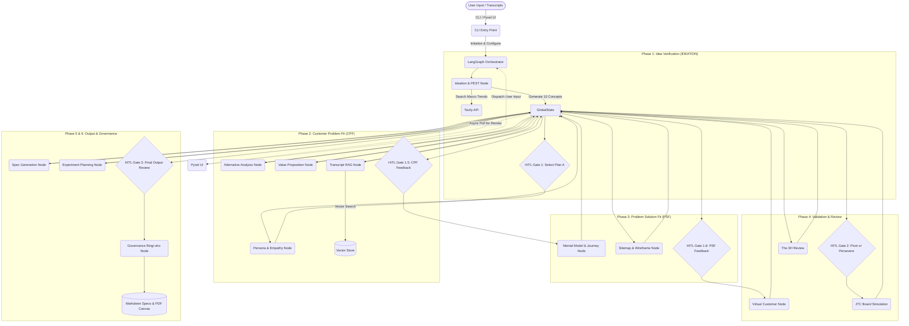

# System Architecture

## 1. Summary

The JTC 2.0 (Remastered Edition) is a paradigm-shifting multi-agent system designed to accelerate the business creation process within Traditional Japanese Companies (JTC). By fusing the rigorous principles of "Startup Science" with the nuanced realities of corporate politics, this system offers an unprecedented simulation platform for intrapreneurs. The primary purpose is to help users validate new business ideas through rigorous Customer-Problem Fit (CPF) and Problem-Solution Fit (PSF) processes before pitching them to real stakeholders.

To eliminate AI hallucinations and ensure a grounded, logical progression, the system enforces a strict Schema-First Development approach using Pydantic. By implementing a Chain of Thought pipeline, it forces the AI to construct ideas incrementally—moving logically from macro environmental analysis down to micro-level feature specifications. Ultimately, the system produces a complete, execution-ready "Agent Prompt Spec" that can be handed over to any autonomous coding agent to instantly generate a Minimum Viable Product (MVP).

The architecture is carefully orchestrated through LangGraph, balancing a complex web of interactions across specialized AI agents. To maintain user psychological safety amidst potentially harsh automated feedback, a gamified "Retro RPG" UI powered by Pyxel serves as the primary interface. This architectural blend of rigorous business logic, strict data schemas, and a decoupled, de-identified presentation layer ensures an robust, scalable, and highly engaging user experience.

## 2. System Design Objectives

### Core Goals and Strategic Imperatives

The primary objective of the JTC 2.0 system is to fundamentally redefine how business ideas are conceptualized, validated, and formalized within traditional corporate environments. By leveraging the power of Large Language Models (LLMs) and multi-agent orchestration, the system aims to compress the typical months-long business validation cycle into a matter of minutes, while simultaneously increasing the rigor and objective quality of the output.

First and foremost, the system is designed with **Hallucination Elimination** as a non-negotiable directive. In traditional LLM applications, especially those generating long-form business plans or software specifications, AI models are prone to logical leaps and generating plausible-sounding but fundamentally ungrounded features. JTC 2.0 counters this by providing a perfectly grounded, step-by-step reasoning framework. The system ensures that generated ideas and solutions are strictly derived from validated premises and empirical data (such as ingested customer transcripts). The AI cannot simply invent a feature; it must trace that feature back to a specific customer pain point, which in turn must be traced back to a validated persona and a demonstrable market gap. This objective is achieved through the meticulous application of the "Chain of Thought" methodology, materialized at the system level.

Secondly, the objective of **Schema-Driven Generation** forms the bedrock of the system's reliability. We utilize Pydantic models extensively to enforce absolute structural integrity and data validation across all agent interactions and outputs. The AI is not permitted to output free-text narratives when structural data is required. By forcing the LLM to output data that perfectly conforms to rigorous schemas (e.g., Value Proposition Canvas, Mental Model Diagram), we ensure that downstream agents and system components receive predictable, typed, and validated inputs. This objective significantly reduces parsing errors and ensures the programmatic stability of the entire pipeline.

A critical shift in this Remastered Edition is the objective to produce a **Universally Executable Output**. Previous iterations relied on direct, proprietary API integrations (such as v0.dev) to generate User Interfaces. This approach, while demonstrative, created a vendor lock-in and limited the flexibility of the final output. The new objective is to decouple the business validation logic from the specific UI generation tool. Therefore, the system is designed to synthesize all validated insights, features, and constraints into a comprehensive, universally compatible markdown specification—the `AgentPromptSpec.md`. This artifact acts as the ultimate handover document, empowering the user to employ any modern autonomous AI coding tool (like Cursor, Windsurf, or specialized GitHub Actions) to generate the MVP according to their specific stack preferences.

Furthermore, the system must achieve **Seamless Integration of New Requirements**. The architecture must be robust enough to incorporate new, advanced domain models—such as the Value Proposition Canvas, Mental Model Diagram, Alternative Analysis, Customer Journey, and Sitemap & Story structures—without disrupting the established multi-agent workflows (like the JTC Board Simulation or the 3H Review). This requires a highly modular design where context is passed fluidly between nodes, and where the core state object (the `GlobalState`) can cleanly aggregate these new dimensions of business analysis.

Finally, maintaining a **Decoupled User Experience** is vital for the psychological safety of the user. The business validation process, especially the simulated "Gekizume" (harsh feedback) from virtual corporate stakeholders, can be confronting. By maintaining a strict separation between the backend LangGraph orchestration engine and the frontend Pyxel interface—presented as a 16-color Retro RPG—the system achieves "De-identification." The user experiences the brutal feedback as a game mechanic rather than a personal attack, ensuring they remain engaged in the iterative improvement process rather than becoming defensive.

### Constraints and Operational Boundaries

To achieve these objectives reliably, the system operates under strict constraints.

1. **Single Source of Truth:** All Pydantic domain models must explicitly forbid extra fields (using `model_config = ConfigDict(extra="forbid")`). This constraint strictly enforces schema validation and prevents the LLM from hallucinating extraneous attributes that could pollute the state or cause unpredictable behavior in downstream nodes. If the LLM generates a field not explicitly defined in the schema, the validation must fail, triggering a retry mechanism rather than silently accepting corrupted data.
2. **Performance under Load and Cost Management:** The system must efficiently manage multi-agent token usage. Multi-agent debates (like the JTC Board or the 3H Review) have the potential to spiral into infinite, unproductive loops, consuming massive amounts of API tokens. Therefore, the system is constrained by strict circuit breakers, hard iteration limits (`max_turns`), and semantic moderators that monitor the debate for consensus or deadlock, forcing a termination and progression when necessary.
3. **Maintainability and Code Quality:** The architecture must adhere strictly to modern Python standards. This includes utilizing dependency injection to decouple components, comprehensive static typing checked by `mypy` in strict mode, and aggressive linting. To prevent the creation of unmaintainable "God functions"—a common issue when AI assists in coding—the system is constrained by a strict cyclomatic complexity limit (`ruff` max-complexity of 10).
4. **Resilient API Handling:** External LLM and search API interactions are inherently unreliable due to network latency, rate limits, or transient service degradation. The system must employ robust, intelligent retry logic (utilizing the `tenacity` library with exponential backoff) to gracefully recover from these failures, ensuring that a transient error does not crash a long-running business simulation.

### Success Criteria

The ultimate measure of the system's success is its ability to reliably guide a user from a nebulous concept to an execution-ready blueprint. Specifically, the system will be considered successful when it flawlessly executes all 6 sequential implementation phases, transforming a raw business topic into a comprehensive `AgentPromptSpec.md` and a rigorously reasoned `ExperimentPlan.md`. Furthermore, success dictates that all LangGraph node transitions maintain absolute state integrity without data corruption, that the system generates accurate, schema-compliant outputs at each Human-in-the-Loop (HITL) intervention gate, and that the automated test suite achieves high coverage, proving that all new domain models integrate perfectly with the existing architecture.

## 3. System Architecture

The JTC 2.0 system is architected as a sophisticated, event-driven state machine, orchestrated by LangGraph. It is designed to cleanly separate the complex, non-deterministic reasoning of Large Language Models from the deterministic, structured flow of the business application and the decoupled presentation layer.

### Core Architectural Components

The architecture relies on several foundational pillars acting in concert:

1. **The LangGraph Orchestrator (The Execution Engine):** This is the central nervous system of the application. LangGraph manages the `GlobalState` object, which acts as the single source of truth for the entire simulation. The orchestrator controls the flow of execution through the 6 strict phases (Ideation, CPF, PSF, Validation, Output, and Governance). It defines the nodes (discrete units of work, often an LLM call or a data transformation) and the edges (the conditional logic dictating the transition from one node to the next). Crucially, the orchestrator handles the state serialization required for checkpointing and implements the Human-in-the-Loop (HITL) interrupts, allowing the system to pause, request user feedback, and resume seamlessly.
2. **Specialized AI Agents (The Simulation Actors):** A suite of distinct, carefully prompted personas driven by LLMs. These include the Ideator, the CPO (Chief Product Officer, focused on fact-based validation), the Virtual Customer, the 3H Reviewers (Hacker for technical feasibility, Hipster for UX, Hustler for business viability), and the JTC Board Members (Finance and Sales). To prevent context bleed and hallucination, each agent is strictly constrained by carefully engineered system prompts. Furthermore, they do not have free access to the entire state; they are provided only with the specific Pydantic schemas relevant to their task, ensuring their reasoning is focused and grounded in the validated data produced by previous steps.
3. **Data Ingestion Engine (Secure RAG Pipeline):** To ground the simulation in reality, the system includes a robust Retrieval-Augmented Generation (RAG) pipeline. This engine is responsible for parsing, chunking, and vectorizing raw customer interview transcripts. It provides factual context to the CPO and Virtual Customer agents, ensuring that their feedback and validations are rooted in actual market data rather than AI assumptions. The RAG pipeline is designed with strict path validation and memory-safe processing to handle large document sets securely.
4. **The Pyxel Frontend (The Decoupled Interface):** A 16-color, retro-style graphical interface running in the main application thread. Its primary role is to provide a gamified, de-identified user experience. The UI is completely decoupled from the business logic; it polls the LangGraph state asynchronously to render visual updates, dialogue boxes, and animations (such as the dynamic "Approval" stamp) without blocking the backend execution. User inputs captured by Pyxel are dispatched back to the LangGraph orchestrator to resume paused workflows.

### Boundary Management and Separation of Concerns

A critical architectural principle of JTC 2.0 is the strict enforcement of boundaries to ensure modularity, testability, and maintainability. This separation prevents the creation of tightly coupled "God Classes" and ensures that modifications in one domain do not cause cascading failures in another.

- **Domain Models (`src/domain_models/`):** These are pure Pydantic schemas defining the shape of the data. They contain structural definitions and data validation logic only. They must not contain business logic, API calls, or dependencies on external services. They represent the "What" of the system.
- **Core Services (`src/core/`):** This layer encapsulates the business logic, configuration management, LLM interaction wrappers, graph definitions, and utility functions. It operates on the Domain Models but is entirely agnostic to the User Interface. It represents the "How" of the backend operations.
- **Agents (`src/agents/`):** This module defines the behavior, tools, and specific prompts for the various AI personas. Agents process specific inputs from the `GlobalState` and return structured updates. They are isolated reasoning units.
- **User Interface (`src/ui/`):** The Pyxel frontend. Its sole responsibility is rendering state and capturing user input. It must not contain business logic or attempt to directly mutate the `GlobalState`. **Crucially, Pyxel mandates execution within the main application thread.** Therefore, the LangGraph orchestrator must be invoked asynchronously or within a separate thread (e.g., `ThreadPoolExecutor`). The UI will communicate with the core engine via a thread-safe `state_getter()` callback, polling the `GlobalState` snapshot to trigger animations or visual updates without blocking the underlying LLM network requests.

### Data Flow and LLM Self-Correction Loop

The execution flow represents a strict forward progression through the defined phases. Backward phase jumps are generally prohibited to maintain the integrity of the Chain of Thought, though iterative refinement within a phase (via HITL feedback) is fully supported.

To guarantee the "Hallucination Elimination" objective, the data flow incorporates an **LLM Self-Correction Loop**. When an agent relies on `with_structured_output` for strict Pydantic parsing, the LLM execution is wrapped in a `tenacity` `@retry` block. If the LLM generates a hallucinated field or violates a custom validator, a `pydantic.ValidationError` is raised. The system catches this error, dynamically appends the exact error message to the prompt, and forces the LLM to correct its own schema violation in the subsequent attempt before the LangGraph node is permitted to update the `GlobalState`.


```mermaid
graph TD
    User([User Input / Transcripts]) -->|CLI / Pyxel UI| CLI(CLI Entry Point)
    CLI -->|Initialize & Configure| Graph(LangGraph Orchestrator)

    subgraph "Phase 1: Idea Verification (IDEATION)"
        Graph --> Node1(Ideation & PEST Node)
        Node1 -->|Search Macro Trends| Tavily(Tavily API)
        Node1 -->|Generate 10 Concepts| State[GlobalState]
        State --> HITL1{HITL Gate 1: Select Plan A}
    end

    subgraph "Phase 2: Customer Problem Fit (CPF)"
        HITL1 --> Node2(Persona & Empathy Node)
        Node2 --> State
        State --> Node3(Alternative Analysis Node)
        Node3 --> State
        State --> Node4(Value Proposition Node)
        Node4 --> State
        State --> Node5(Transcript RAG Node)
        Node5 -->|Vector Search| LlamaIndex[(Vector Store)]
        Node5 --> State
        State --> HITL15{HITL Gate 1.5: CPF Feedback}
    end

    subgraph "Phase 3: Problem Solution Fit (PSF)"
        HITL15 --> Node6(Mental Model & Journey Node)
        Node6 --> State
        State --> Node7(Sitemap & Wireframe Node)
        Node7 --> State
        State --> HITL18{HITL Gate 1.8: PSF Feedback}
    end

    subgraph "Phase 4: Validation & Review"
        HITL18 --> Node8(Virtual Customer Node)
        Node8 --> State
        State --> HITL2{HITL Gate 2: Pivot or Persevere}
        HITL2 --> Node9(JTC Board Simulation)
        Node9 --> State
        State --> Node10(The 3H Review)
        Node10 --> State
    end

    subgraph "Phase 5 & 6: Output & Governance"
        State --> Node11(Spec Generation Node)
        Node11 --> State
        State --> Node12(Experiment Planning Node)
        Node12 --> State
        State --> HITL3{HITL Gate 3: Final Output Review}
        HITL3 --> Node13(Governance Ringi-sho Node)
        Node13 --> FinalOutput[(Markdown Specs & PDF Canvas)]
    end

    State -.->|Async Poll for Render| UI(Pyxel UI)
    UI -.->|Dispatch User Input| Graph
```

### Security and Observability Considerations

Security is built into the architecture via strict path validation for file generation (preventing path traversal attacks) and robust validation of all environment variables and API keys upon system initialization.

Observability is paramount for debugging the complex multi-agent interactions. The architecture mandates the integration of LangSmith tracing. This allows developers to monitor token consumption, trace the exact prompts and responses generated at each node, debug the Pydantic model conversion processes, and identify the root causes of any agent deadlocks or infinite loops during simulated debates.

## 4. Design Architecture

### File Structure Overview

The directory structure is organized to strictly enforce the separation of concerns outlined in the system architecture, ensuring a highly maintainable and scalable codebase.

```ascii
.
├── src/
│   ├── agents/                   # LLM Persona definitions and interaction logic
│   │   ├── ideator.py            # Phase 1: Generates initial Lean Canvas concepts
│   │   ├── personas.py           # Phase 4: Virtual Customer and internal stakeholders
│   │   └── reviewers.py          # Phase 4: The 3H Reviewers (Hacker, Hipster, Hustler)
│   ├── core/                     # Application core logic and orchestration
│   │   ├── config.py             # Centralized Pydantic-based settings management
│   │   ├── exceptions.py         # Custom domain-specific exception classes
│   │   ├── graph.py              # LangGraph state machine definition and compilation
│   │   ├── llm.py                # Wrapper for LLM interactions, handling retries and parsing
│   │   └── constants.py          # Centralized configuration strings and default values
│   ├── data/                     # External data integration and persistence
│   │   ├── rag.py                # LlamaIndex vector store implementation
│   │   └── document_parser.py    # Parsers for ingesting PLAUD transcripts
│   ├── domain_models/            # Pure Pydantic schemas (The single source of truth)
│   │   ├── common.py             # Shared utility models and base classes
│   │   ├── lean_canvas.py        # Core business idea representation
│   │   ├── persona.py            # Customer demographic and psychographic models
│   │   ├── state.py              # The GlobalState object managed by LangGraph
│   │   └── extended_models.py    # (New) VPC, MentalModel, Journey, Spec, Experiment plans
│   ├── tools/                    # Integrations with external APIs and utilities
│   │   ├── tavily_client.py      # Market research search execution
│   │   └── pdf_generator.py      # Utility for exporting canvases to visual PDFs
│   ├── ui/                       # The Pyxel frontend presentation layer
│   │   ├── app.py                # Main Pyxel application loop
│   │   └── renderer.py           # Drawing logic for state visualization and animations
│   └── main.py                   # CLI entry point and initialization sequence
├── tests/                        # Comprehensive test suite (Unit, Integration, E2E)
│   ├── domain_models/            # Schema validation tests
│   ├── core/                     # Business logic and graph execution tests
│   └── agents/                   # Prompt and agent behavior validation
├── dev_documents/                # Project documentation and specifications
│   ├── ALL_SPEC.md               # Raw requirements
│   ├── USER_TEST_SCENARIO.md     # UAT Master Plan
│   └── system_prompts/           # Architectural and prompt design docs
├── tutorials/                    # Interactive verification
│   └── UAT_AND_TUTORIAL.py       # Single Marimo notebook for User Acceptance Testing
└── pyproject.toml                # Dependency management and strict linter configurations
```

### Core Domain Pydantic Models Structure and Typing

The robustness of JTC 2.0 relies entirely on its strongly typed, schema-driven domain models. All models utilize Pydantic's `BaseModel` with strict configuration to prevent hallucination.

**Existing Core Foundations:**
- `LeanCanvas`: Represents the structural foundation of a business idea, capturing the problem, solution, unique value proposition, and customer segments.
- `Persona` & `EmpathyMap`: Define the target customer, detailing demographics, goals, frustrations, and what they say, think, do, and feel.
- `GlobalState`: The overarching container that holds the entire context of the LangGraph execution, including the current phase, generated ideas, and selected targets.

**New Extended Domain Models (The Fitness Journey Suite):**
To fulfill the Remastered Edition's requirement for a rigorous, Chain of Thought validation process without logical leaps, we introduce a suite of highly inter-dependent models.

1.  **ValuePropositionCanvas (`ValuePropositionCanvas`)**: Validates the critical fit between the `CustomerProfile` (customer jobs, pains, and gains) and the proposed `ValueMap` (products/services, pain relievers, and gain creators). It includes an explicit `fit_evaluation` string to force the LLM to articulate the reasoning behind the match.
2.  **Alternative Analysis (`AlternativeAnalysis`)**: Evaluates the competitive landscape by listing `AlternativeTool`s (e.g., existing SaaS, Excel, manual processes). It explicitly models the `switching_cost` and forces the definition of a `ten_x_value`—the compelling reason a user would endure the friction of changing their habits.
3.  **Mental Model Diagram (`MentalModelDiagram`)**: Maps the underlying psychological drivers of the persona. It defines `MentalTower`s—representing core beliefs and values (e.g., "I must not waste time")—and maps specific cognitive tasks and proposed software features to these towers, ensuring all functionality serves a fundamental psychological need.
4.  **Customer Journey (`CustomerJourney`)**: Traces the temporal, step-by-step experience of the user. It consists of multiple `JourneyPhase`s, detailing touchpoints, actions, and an `emotion_score`. Crucially, it identifies the `worst_pain_phase`, pinpointing exactly where the MVP must focus its value delivery.
5.  **Sitemap & Story (`SitemapAndStory`)**: Translates the conceptual validated problems into concrete software architecture. It defines the application's `Route`s (URLs, purposes, protection status) to build the `sitemap`. It then synthesizes the journey's worst pain point into a single, highly focused `UserStory` (As a... I want to... So that...) with explicit acceptance criteria.
6.  **Experiment Plan (`ExperimentPlan`)**: Defines the go-to-market strategy for testing the MVP in reality. It identifies the `riskiest_assumption`, the `experiment_type` (e.g., Wizard of Oz, Landing Page), the initial `acquisition_channel`, and the specific `aarrr_metrics` required to determine Product-Market Fit.
7.  **Agent Prompt Spec (`AgentPromptSpec`)**: The ultimate output. This model aggregates the sitemap, the core user story, strict validation rules, and defines a robust `StateMachine` (success, loading, error, empty states). It is designed to be cleanly serialized into Markdown, ready for ingestion by Cursor, Windsurf, or similar AI coding agents.

### Integration Points and State Evolution

The integration of these new models is purely additive, designed to extend the `GlobalState` without breaking existing workflows. The `GlobalState` schema is expanded to include these models as optional properties, populated sequentially as the LangGraph execution progresses.

```python
class GlobalState(BaseModel):
    model_config = ConfigDict(extra="forbid")

    # Existing core fields...
    phase: Phase = Phase.IDEATION
    topic: str = ""
    selected_idea: LeanCanvas | None = None
    target_persona: Persona | None = None

    # New integration points for the Fitness Journey:
    vpc: ValuePropositionCanvas | None = None
    alternative_analysis: AlternativeAnalysis | None = None
    mental_model: MentalModelDiagram | None = None
    customer_journey: CustomerJourney | None = None
    sitemap_and_story: SitemapAndStory | None = None
    experiment_plan: ExperimentPlan | None = None
    agent_prompt_spec: AgentPromptSpec | None = None
```

This design enforces the Chain of Thought. The execution is sequential: a node cannot generate the `SitemapAndStory` until the `CustomerJourney` exists within the `GlobalState`. Each node retrieves the specifically required antecedent models from the state, formats them into its LLM prompt as immutable context, and generates the next required Pydantic model. If validation fails at any node due to hallucinated fields or missing data, the system relies on `tenacity` retries to correct the output before updating the `GlobalState`.

## 5. Implementation Plan

The development and deployment of the JTC 2.0 Remastered Edition are strictly divided into exactly 6 sequential implementation cycles. This highly modular, additive approach ensures systematic progress, rigorous validation at each step, and prevents overwhelming architectural complexity by isolating concerns. **Crucially, this plan explicitly maps the 14 execution steps defined in the `ALL_SPEC.md` "Fitness Journey Workflow" onto the 6 implementation cycles to eliminate any implementation ambiguity.**

### Cycle 1: Schema Foundations and Domain Model Implementation (Step 0)
**Primary Objective:** Establish the rigorous structural backbone required to eliminate AI hallucinations by implementing the comprehensive suite of new Pydantic models.
**Detailed Tasks:**
- Define and implement the complete set of new Pydantic models in `src/domain_models/extended_models.py` (or integrated appropriately). This includes `ValuePropositionCanvas`, `AlternativeAnalysis`, `MentalModelDiagram`, `CustomerJourney`, `SitemapAndStory`, `ExperimentPlan`, and `AgentPromptSpec`.
- Enforce strict validation rules on all models. This includes setting `model_config = ConfigDict(extra="forbid")` universally, and implementing custom validators for string lengths, logical consistency (e.g., ensuring a journey has sequential phases), and type constraints.
- Update the central `GlobalState` model to include these new schemas as optional fields, ready to be populated by the LangGraph execution engine.
- Configure the environment and ensure the linter (`ruff`) and type checker (`mypy`) are passing strictly.
**Outcome:** A robust, fully typed data layer capable of supporting complex, multi-stage agent reasoning without the risk of schema degradation or context loss.

### Cycle 2: Phase 2 Core - Customer Problem Fit Engine (Steps 2-5)
**Primary Objective:** Build the analytical engine that rigorously verifies whether the proposed business idea solves a problem worth solving, grounded in reality and data.
**Detailed Tasks:**
- **Step 2:** Refine the existing `persona_node` to enforce the output into the stricter Pydantic models with the required `EmpathyMap`.
- **Step 3:** Implement the `alternative_analysis_node`. This node consumes the `selected_idea` to deduce realistic alternative solutions and explicitly calculates the switching costs versus the proposed 10x value.
- **Step 4:** Implement the `vpc_node` (Value Proposition Canvas). This critical node forces the LLM to map the customer's pains to the solution's specific relievers.
- **Step 5:** Integrate the `transcript_ingestion_node`. The RAG pipeline must be strictly attached here to ensure the CPO agent utilizes factual vector data to evaluate the preceding CPF models ("The Mom Test").
- Establish **HITL Gate 1.5** (CPF Feedback), configuring LangGraph's `interrupt_after` to pause execution. Implement the `pdf_generator.py` service to visually export the CPF documents.
**Outcome:** The LangGraph orchestrator successfully executes Steps 2 through 5, utilizing factual RAG context to validate the core problem logic.

### Cycle 3: Phase 3 Core - Problem Solution Fit Engine (Steps 6-7)
**Primary Objective:** Translate the validated CPF problems into actionable psychological models and concrete, minimalist software architecture to achieve Problem-Solution Fit.
**Detailed Tasks:**
- **Step 6:** Implement the `mental_model_journey_node`. This complex step forces the AI to construct the `MentalModelDiagram` and map the sequential `CustomerJourney`, culminating in the explicit identification of the "worst pain point."
- **Step 7:** Implement the `sitemap_wireframe_node`. Based precisely on the Step 6 output, this node must generate a strict `SitemapAndStory`, defining the information architecture and the core user story while aggressively eliminating non-essential features (feature bloat).
- Establish **HITL Gate 1.8** (PSF Feedback) for user intervention and refinement.
- Extend the PDF generation service to render the new Mental Models and Customer Journeys visually during the interrupt phase.
**Outcome:** The system flawlessly maps deep psychological needs to concrete software architecture (Steps 6-7) before any coding considerations are made.

### Cycle 4: Phase 4 Validation - Multi-Agent Simulation (Steps 8-10)
**Primary Objective:** Subject the refined software architecture to brutal, simulated market scrutiny and expert evaluation via multi-agent debate to ensure ultimate viability.
**Detailed Tasks:**
- **Step 8:** Enhance the `virtual_customer_node`. Crucially, inject the `MentalModelDiagram` generated in Step 6 into the Virtual Customer's system prompt to enforce grounded, realistic feedback regarding switching costs.
- Establish **HITL Gate 2** (Pivot or Persevere), forcing the user to make a deliberate decision based on the Virtual Customer's simulated market response.
- **Step 9:** Execute the `jtc_simulation_node`. The "New Employee" agent must defend the PSF architecture against the "Finance Manager" and "Sales Manager" within the `GlobalState`.
- **Step 10:** Implement the `3h_review_node`. Create distinct prompts for the Hacker (technical debt), Hipster (UX friction), and Hustler (unit economics) to review the wireframes against the established CPF context. Implement the circuit breakers to prevent infinite token loops.
**Outcome:** A rigorous, multi-faceted defense simulation executing Steps 8 through 10, exposing critical weaknesses in the architecture before any MVP generation.

### Cycle 5: Phase 5 & 6 Core - Specification & GTM Planning (Steps 11-12)
**Primary Objective:** Synthesize the entire Chain of Thought context into the final, universally actionable markdown artifacts, explicitly deprecating the fragile, direct v0.dev API generation method.
**Detailed Tasks:**
- **Step 11:** Implement the `spec_generation_node`. This node must aggregate the entire context payload from the `GlobalState` and meticulously format it into the highly structured, LLM-optimized `AgentPromptSpec.md` format (including the Mermaid state machine requirements).
- **Step 12:** Implement the `experiment_planning_node` to autonomously generate the pragmatic, Go-To-Market `ExperimentPlan.md`, detailing exactly how the user should test the MVP using AARRR metrics.
- Establish **HITL Gate 3** for the final review of these output documents before generation.
**Outcome:** The system successfully shifts its output paradigm, generating universally compatible markdown specifications (Steps 11-12) ready for ingestion by Cursor or Windsurf.

### Cycle 6: Governance, Integration, and UI Polish (Steps 13 & System Finalization)
**Primary Objective:** Implement the final Governance check, complete the Pyxel UI integration, and guarantee total system stability across the entire 14-step workflow.
**Detailed Tasks:**
- **Step 13:** Implement the `governance_node` to execute the final JTC corporate check, summarizing the business validation into the formal Ringi-sho (approval document) format within the state.
- **UI Integration:** Polish the Pyxel frontend polling loops. Implement the dynamic, animated "Approval" stamp mechanic to visually trigger upon the successful generation of the PDF canvas models at each HITL gate.
- **E2E Validation:** Execute exhaustive End-to-End (E2E) testing across the complete 14-step workflow using the `tutorials/UAT_AND_TUTORIAL.py` Marimo notebook to ensure flawless state transitions and UI responsiveness.
**Outcome:** A fully integrated, rigorously tested, gamified enterprise business accelerator completing all 14 sequential steps of the 'Fitness Journey Workflow'.

## 6. Test Strategy

The testing strategy is paramount to ensure the absolute reliability of the system and to guarantee that the multi-agent logic operates predictably without introducing side-effects or accruing excessive API costs during CI/CD pipelines.

### Cycle 1 Strategy (Domain Models & Schemas)
- **Objective:** Verify structural integrity and validation rules of the newly created Pydantic models. This is the foundation upon which the entire system rests, and any flaw here will propagate unpredictably downstream.
- **Unit Testing:** We will instantiate every single new Pydantic model (`ValuePropositionCanvas`, `CustomerJourney`, `AlternativeAnalysis`, `MentalModelDiagram`, `SitemapAndStory`, `ExperimentPlan`, and `AgentPromptSpec`) with comprehensive sets of both perfectly valid and intentionally flawed invalid data. This exhaustive testing ensures the schemas correctly enforce the business rules defined in the `ALL_SPEC.md`.
- **Validation Checks:** We will explicitly and programmatically verify that `pydantic.ValidationError` is raised correctly in the following critical scenarios: missing required fields (ensuring the LLM cannot skip mandatory outputs), attempting to inject extra hallucinated fields (rigorously verifying the effectiveness of the `extra="forbid"` configuration rule), violating strict type constraints (e.g., passing a string where an integer `emotion_score` is expected), and failing custom logic validators (e.g., a title being too short, or a journey lacking sequential progression).
- **Execution Strategy for Side-Effect Free Testing:** Since Pydantic models are pure, standalone Python objects containing absolutely no external dependencies, API calls, or file I/O operations, these unit tests can be executed instantly and synchronously. There is no need for complex mocking or stubbing frameworks at this cycle. This guarantees a blazing-fast test suite execution that provides immediate feedback to developers without any risk of polluting the environment or incurring external costs. The test suite will serve as the definitive executable specification of the domain models.

### Cycle 2 Strategy (CPF Nodes & API Simulation)
- **Objective:** Rigorously verify node state transitions, LLM JSON parsing resilience, and the system's ability to gracefully handle malformed AI outputs during the Customer Problem Fit phase.
- **Unit Testing the Nodes:** The core challenge here is testing the LangGraph nodes (like `alternative_analysis_node` and `vpc_node`) without making actual, expensive, and non-deterministic API calls to OpenAI or Anthropic. We will use the `unittest.mock.patch` utility extensively on the core LLM client (specifically, functions like `src.core.llm.LLMClient.generate_structured`). We will configure these mocks to return predefined, perfectly valid JSON strings representing the expected `AlternativeAnalysis` and `ValuePropositionCanvas` outputs. The primary assertion is verifying that the nodes correctly parse this mocked JSON payload, instantiate the respective Pydantic models without throwing validation errors, and subsequently update the `GlobalState` accurately with the new models.
- **Testing Resiliency:** We must also test the error paths. We will configure the mock LLM to intentionally return malformed JSON, missing brackets, or unexpected extra fields. We will assert that the system's `tenacity` retry logic engages correctly, catches the `ValidationError`, and gracefully recovers or fails safely without crashing the main application loop.
- **Integration Testing the Interrupts:** We will test the crucial LangGraph HITL (Human-in-the-Loop) interrupt mechanism. We will simulate a full graph execution up to Phase 2, ensure it pauses correctly at Gate 1.5, assert the state is frozen correctly, programmatically inject a mock user feedback string into the state, and assert that the graph resumes execution correctly, passing the feedback to the next node.
- **Execution Strategy for Side-Effect Free Testing:** Strict enforcement of API mocking is mandatory. Absolutely no external network requests to any LLM provider are permitted during the execution of this test suite. This strict isolation prevents unintended side-effects, guarantees deterministic test results regardless of network connectivity, and completely eliminates the API token costs associated with continuous integration testing.

### Cycle 3 Strategy (PSF Nodes & Artifact Generation)
- **Objective:** Verify the rigorous Chain of Thought context inheritance and the safety of the PDF artifact generation mechanisms. The system must prove it can build complex psychological models based purely on the data validated in previous phases.
- **Unit Testing Context Inheritance:** Similar to Cycle 2, we will employ mocked LLM outputs to simulate the generation of the highly complex `MentalModelDiagram` and `SitemapAndStory` structures. However, the critical assertion here goes beyond simple parsing. We must ensure the nodes correctly extract and utilize the specific context inherited from the Phase 2 CPF models (like the `Persona` and `ValuePropositionCanvas`) located within the `GlobalState`. The tests will verify that the prompts sent to the mock LLM correctly contain the serialized data from the previous phases, proving that the Chain of Thought is unbroken.
- **Integration Testing Artifact Generation:** We will rigorously verify the new PDF generation utility introduced in this phase. We will provide it with heavily populated, complex mocked Pydantic data representing a detailed `CustomerJourney` and execute the generation function. We will verify the function completes successfully and creates a file of the expected size and format.
- **Execution Strategy for Side-Effect Free Testing:** Generating files during testing is a notorious source of state pollution and flaky tests. To guarantee execution without side-effects, we will utilize Python's `tempfile.TemporaryDirectory()` context manager extensively within our `pytest` fixtures. We will enforce that all generated PDF files, logs, and artifacts are written exclusively to this isolated temporary directory. We will assert that the directory and all its contents are automatically and aggressively deleted after the test teardown sequence, leaving the local file system completely pristine and ready for the next test run.

### Cycle 4 Strategy (Validation Nodes & Multi-Agent Orchestration)
- **Objective:** Verify the complex, multi-turn interactions between differing AI personas and rigorously test the safety thresholds designed to prevent runaway simulation costs.
- **Unit Testing Multi-Agent Dialogue:** We will thoroughly mock the multi-agent dialogue sequences occurring in the `virtual_customer_node` and the `3h_review_node`. We will ensure that the simulated Virtual Customer and the specific 3H Reviewers (Hacker, Hipster, Hustler) accurately reference highly specific properties from the `GlobalState` (like the `switching_cost` from the `AlternativeAnalysis`) in their simulated, mocked responses. We will test the prompt engineering by asserting the correct context variables are injected into the LLM payload.
- **Safety Threshold and Circuit Breaker Testing:** This is critical for system stability. We will rigorously test the circuit breaker and semantic moderator logic. We will construct mock responses that intentionally simulate an infinite loop of disagreement or a stubborn, unresolvable deadlock between the Hacker (demanding technical purity) and the Hustler (demanding speed to market). We will assert that the system's moderator agent correctly identifies the looping conversation, forcefully terminates the debate loop, and forces a progression to the next node, or raises a controlled `SimulationTimeoutException`, well before the hard `max_turns` limit is catastrophically breached.
- **Execution Strategy for Side-Effect Free Testing:** We will strictly mock all LangChain and LangGraph LLM execution environments. This is paramount to prevent accidental, massive token consumption caused by runaway debate simulations during automated testing. The entire multi-agent orchestration must be verifiable using deterministic, offline mock data, ensuring the test suite remains fast and completely free of variable API costs.

### Cycle 5 Strategy (Output Generation & Markdown Formatting)
- **Objective:** Verify the final, critical aggregation and serialization of all validated data into the universally compatible output artifacts, ensuring perfect formatting for downstream AI coders.
- **Integration Testing the Pipeline:** We will execute a fully mocked version of the entire LangGraph workflow from Phase 1 straight through to Phase 5. We will verify the seamless execution of the `spec_generation_node` and the `experiment_planning_node`. The primary and most complex assertions in this cycle must focus on parsing the final generated `AgentPromptSpec.md` and `ExperimentPlan.md` files. We must ensure they are formatted perfectly according to the required schema, that the Mermaid diagrams are syntactically correct, and crucially, that they accurately contain all the synthesized, validated data derived from the earlier mocked phases (e.g., ensuring the `core_user_story` perfectly matches the pain point identified in Phase 3).
- **Execution Strategy for Side-Effect Free Testing:** As with Phase 3, we will rigidly utilize `pytest` fixtures with `tempfile.TemporaryDirectory()` context managers to handle all file output testing, ensuring complete cleanup post-test. We will employ advanced string matching algorithms and complex regex assertions within our tests to thoroughly validate the complex markdown structure and ensure no formatting errors degrade the output's utility for downstream AI coding agents.

### Cycle 6 Strategy (Integration, E2E, & Mock Mode Validation)
- **Objective:** Guarantee total end-to-end system reliability, UI synchronicity, and absolute compatibility with automated CI/CD environments.
- **E2E Testing via Comprehensive Mock Mode:** To support rapid, continuous integration without incurring exorbitant API costs or facing rate limits, we will implement and rigorously test a complete "Mock Mode" execution path. By setting the specific environment variable `MOCK_MODE=true`, the entire system architecture must seamlessly bypass all actual LLM network invocations. Instead, it must return deterministic, pre-configured Pydantic mock models directly from a local fixture repository. We will test the entire 14-step LangGraph workflow end-to-end in this mode to ensure all state transitions, complex data handoffs between nodes, HITL interrupts, and final artifact generations execute flawlessly and deterministically.
- **UI State Synchronization Testing:** While direct, pixel-perfect automated testing of the Pyxel graphical canvas is notoriously complex and brittle, we will ensure the underlying state callbacks and event dispatchers are heavily unit-tested. We will verify that updates to the `GlobalState` accurately trigger the correct render events. Furthermore, we will provide the comprehensive Marimo notebook (`tutorials/UAT_AND_TUTORIAL.py`) to facilitate structured, highly reproducible manual User Acceptance Testing (UAT) for the final visual verification of the "Approval" animations and overall user experience.
- **Execution Strategy for Side-Effect Free Testing:** We will ensure the `MOCK_MODE` override completely isolates the JTC 2.0 system from the public internet. This architecture guarantees fast, perfectly reproducible, side-effect-free, and absolutely zero-cost execution in automated CI pipelines, allowing for aggressive continuous deployment practices without risk.