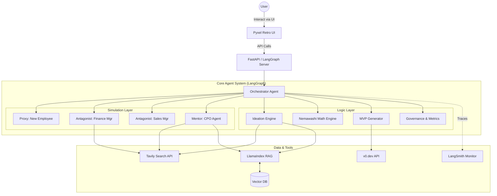

# System Architecture: The JTC 2.0

## 1. Summary

The **JTC 2.0** is a paradigm-shifting Enterprise Business Development Accelerator that fuses the rigorous methodology of "Startup Science" with the complex organizational dynamics of Traditional Japanese Companies (JTCs). It is designed to be more than just a chat interface; it is a comprehensive simulation and execution environment that guides users through the perilous journey of intrapreneurship.

The system utilizes a sophisticated **Multi-Agent Architecture** powered by **LangGraph** to orchestrate workflows between specialized agents (Persona Agents). These agents simulate key organizational roles—such as the conservative Finance Manager, the aggressive Sales Manager, and the mentoring CPO (Chief Product Officer)—to subject business ideas to realistic "Gekizume" (harsh feedback) sessions.

To prevent "armchair theories," the system enforces **Reality Injection** via **LlamaIndex** and **Vector Databases**. User interviews and raw field data (transcripts from PLAUD NOTE, etc.) are ingested to ground decision-making in primary information. **Tavily** provides real-time external market data to validate assumptions.

The User Interface is a deliberate departure from modern SaaS, utilizing **Pyxel** to render a **Retro RPG-style environment**. This "Gamification" and the use of a **Proxy Agent** (a "New Employee" character) create a psychological buffer ("De-identification"), allowing users to objectively view their business plans being critiqued without taking personal offense.

Finally, the system bridges the gap between ideation and execution by integrating with **v0.dev** to automatically generate **Minimum Viable Product (MVP)** frontends, and uses mathematical models (**French-DeGroot**) to simulate and navigate the "Nemawashi" (consensus-building) process essential for JTC decision-making.

## 2. System Design Objectives

### 2.1. Reality-Grounded Innovation
- **Goal**: Prevent the generation of plausible but hallucinatory business plans.
- **Mechanism**: Enforce the "Mom Test" by requiring primary data injection (interview transcripts) before proceeding to solution design.
- **Success Criteria**: 100% of "Burning Needs" identified must be traceable to specific user quotes in the Vector DB.

### 2.2. Psychological Safety via Gamification
- **Goal**: Enable users to accept harsh, critical feedback without emotional shutdown.
- **Mechanism**: Use a Proxy Model where a digital avatar takes the blame. Render the "meeting from hell" as an RPG boss battle.
- **Success Criteria**: Users continue the "Pivot" loop at least 3 times on average without abandoning the session.

### 2.3. Autonomy within Governance
- **Goal**: Automate the tedious parts of startup validation while keeping humans in the loop for critical decisions.
- **Mechanism**: LangGraph `interrupt` patterns at 4 key Decision Gates (Idea Verification, CPF, PSF, PMF).
- **Success Criteria**: The system never proceeds past a gate without explicit user approval.

### 2.4. Speed to Execution
- **Goal**: Reduce the time from "Idea" to "Code" to near zero.
- **Mechanism**: Direct integration with v0.dev to generate React/Tailwind code for MVPs.
- **Success Criteria**: Generate a deployable frontend prototype within 10 minutes of finalizing the Solution feature set.

## 3. System Architecture

The system is built on a modular, event-driven architecture using **LangGraph** as the central orchestrator.

### 3.1. High-Level Diagram



### 3.2. Data Flow
1.  **Input**: User provides initial prompts or uploads interview transcripts via Pyxel UI.
2.  **Processing**:
    -   **Orchestrator** routes tasks to specific sub-graphs.
    -   **RAG Engine** indexes documents into Vector DB.
    -   **Agents** retrieve context, search the web (Tavily), and debate (Simulation).
3.  **Decision**: The flow pauses at **Human-in-the-Loop (HITL)** gates.
4.  **Output**: Validated Lean Canvas, Strategic Advice, Nemawashi Maps, or Generated MVP Code.

## 4. Design Architecture

### 4.1. File Structure

```ascii
.
├── dev_documents/          # Documentation & Prompts
├── src/
│   ├── agents/             # Agent Definitions
│   │   ├── base.py         # Base Agent Class
│   │   ├── personas.py     # Finance, Sales, CPO, Proxy Agents
│   │   └── tools.py        # Tool Definitions (Tavily, v0, etc.)
│   ├── core/               # Core System Logic
│   │   ├── config.py       # Configuration & Env Vars
│   │   ├── graph.py        # LangGraph StateGraph Definition
│   │   ├── state.py        # Pydantic State Models
│   │   └── llm.py          # LLM Client Factory
│   ├── data/               # Data Layer
│   │   ├── loader.py       # LlamaIndex Document Loaders
│   │   └── vector_store.py # Vector DB Interface
│   ├── domain/             # Business Logic / Models
│   │   ├── lean_canvas.py  # Lean Canvas Data Model
│   │   ├── nemawashi.py    # French-DeGroot Logic
│   │   └── metrics.py      # AARRR / Financial Metrics
│   ├── ui/                 # User Interface
│   │   ├── assets/         # Images, Sprites
│   │   ├── renderer.py     # Pyxel Render Logic
│   │   └── main_window.py  # Main Game Loop
│   ├── utils/
│   │   └── logger.py
│   └── main.py             # Entry Point
├── tests/                  # Test Suite
├── .env.example
├── pyproject.toml
└── README.md
```

### 4.2. Key Data Models (Pydantic Preview)

-   **GlobalState**: The central context object passed through the LangGraph.
    -   `current_phase`: Enum (Ideation, Verification, Solution, PMF)
    -   `lean_canvas`: `LeanCanvas` object
    -   `interview_data`: List[Transcript]
    -   `nemawashi_status`: Matrix[float] (Influence weights)
    -   `mvp_spec`: `MVPSpec` object
    -   `messages`: List[BaseMessage]

-   **LeanCanvas**:
    -   `problem`: List[str]
    -   `customer_segments`: List[str]
    -   `unique_value_prop`: str
    -   `solution`: str
    -   `status`: Enum (Draft, Verified, Pivot)

## 5. Implementation Plan

The project is divided into **6 Sequential Cycles**.

### CYCLE 01: Foundation & Ideation
-   **Objective**: Establish the LangGraph skeleton and implement the Idea Verification phase.
-   **Features**:
    -   Project setup (poetry/uv, dependencies).
    -   LangGraph state definition.
    -   "Ideator Agent" implementation using Tavily to generate 10 Lean Canvas drafts.
    -   **Gate 1**: User selection of "Plan A".
-   **Deliverables**: A CLI-based workflow that generates ideas and accepts user selection.

### CYCLE 02: JTC Simulation (The Meeting)
-   **Objective**: Implement the "Gekizume" simulation and Proxy Model.
-   **Features**:
    -   Develop Persona Agents (Finance, Sales, New Employee).
    -   Implement the Debate Sub-graph.
    -   **Pyxel UI**: Create the basic "Meeting Room" scene and connect it to the Agent outputs.
    -   "De-identification" mechanism (User watches, doesn't participate directly).
-   **Deliverables**: A Pyxel window showing agents debating the user's Plan A.

### CYCLE 03: Real World Connection
-   **Objective**: Connect to Reality via RAG and the CPO Agent.
-   **Features**:
    -   LlamaIndex setup for ingesting interview transcripts.
    -   Vector DB implementation.
    -   **Gate 2**: "Riskiest Assumption" identification.
    -   **CPO Agent**: "Roof Phase" implementation (mentoring based on facts).
    -   Scenario: Ingesting a "Mom Test" transcript to pivot the plan.
-   **Deliverables**: System accepts text files, indexes them, and CPO uses them to refute Finance/Sales agents.

### CYCLE 04: Consensus Building (Nemawashi)
-   **Objective**: Mathematical simulation of organizational politics.
-   **Features**:
    -   Implement **French-DeGroot Model** algorithm.
    -   Define "Influence Matrix" and "Self-Confidence" parameters for agents.
    -   "Nomikai" (Drinking Party) simulation logic to alter parameters.
    -   Generate a "Nemawashi Map" (Who to talk to first).
-   **Deliverables**: A visualization or report showing how opinion dynamics shift over time.

### CYCLE 05: MVP Generation
-   **Objective**: Automated solution construction.
-   **Features**:
    -   **Gate 3**: Feature pruning ("One Feature, One Value").
    -   **v0.dev Integration**: Tool definition to call v0 API.
    -   Prompt engineering for converting "Solution" spec to UI code.
    -   Displaying the generated URL in Pyxel or console.
-   **Deliverables**: System generates a valid v0.dev URL for the proposed solution.

### CYCLE 06: Governance & Finalization
-   **Objective**: Business validation and final packaging.
-   **Features**:
    -   **Gate 4**: AARRR Metrics & Pivot Decision.
    -   Financial Projection Tools (LTV, CAC calculation via Tavily data).
    -   Automated "Approval Document" (Ringi-sho) generation.
    -   Final System integration and Polish.
-   **Deliverables**: Full end-to-end flow from Idea to Approval Doc + MVP.

## 6. Test Strategy

### 6.1. Unit Testing
-   **Tools**: `pytest`, `pytest-cov`.
-   **Focus**:
    -   Individual Agents: Ensure they respond correctly to prompts and maintain persona.
    -   Logic Engines: Verify French-DeGroot math and Financial calculations.
    -   Parsers: Ensure Pydantic models correctly parse LLM outputs.

### 6.2. Integration Testing
-   **Focus**:
    -   LangGraph State Transitions: Verify the graph moves correctly between nodes (e.g., Ideation -> Selection -> Simulation).
    -   Tool Calling: Mock Tavily and v0.dev APIs to ensure correct request formatting.
    -   RAG Pipeline: Verify documents are indexed and retrieved correctly.

### 6.3. User Acceptance Testing (UAT)
-   **Format**: `marimo` notebooks.
-   **Scenarios**:
    -   **Scenario 1 (Ideation)**: Generate 10 ideas, select 1, verify state update.
    -   **Scenario 2 (Simulation)**: Run a debate, check for "Finance" objections.
    -   **Scenario 3 (Pivot)**: Inject negative interview data, verify CPO suggests a pivot.
    -   **Scenario 4 (MVP)**: Generate a UI from a finalized plan.
